# First dip in AWS: Hosting a Static Site in AWS for $0-$2/month

If you read up on data breaches for any length of time, you’re going to come across breaches that were due to an exposed Amazon S3 bucket. In general, think of an S3 bucket as a flat data repository in the cloud. It’s generally used for storing database data connected to webapps, and if improperly secured can lead to data leakage. BUT… if what you want to host is publicly accessible anyway, an S3 bucket can also be used for generic online storage, as well as statically hosted websites.

To get started, you’ll need a free [AWS account](https://aws.amazon.com/premiumsupport/knowledge-center/create-and-activate-aws-account/).

First, don’t be overwhelmed by the amount of dashboards in AWS. All we’re going to deal with is S3. To get to S3, log in to AWS —> Services —> S3

[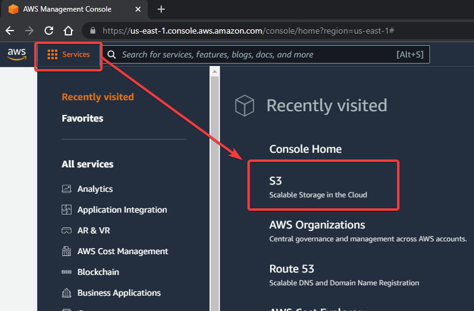](images/09c6067d-8d25-4880-ba7c-91c3b198e390_776x509.png)

Next, create a new bucket. A “bucket” just means a place where you’re going to dump files for a specific project.

[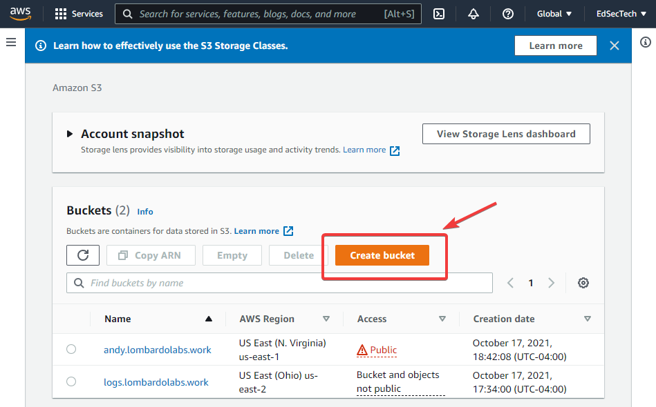](images/9dab975f-2ae0-41c1-b23e-0fa8d5551126_949x590.png)

There are 3 things you’ll need to do when setting up the bucket.

1. Give it a name. If you’re planning to attach your static site to a specific domain name, give your bucket the exact domain name you’re planning to use. If you don’t have a name yet, it can be purchased through Amazon Route 53. Our sample bucket is going to be called site.edtechirl.com.
2. Pick a region. the region will be us-east-1 because it’s geographically closest to me. Generally, geography is the best decision maker for picking a region, but some regions support different features. If you start building tools with multiple parts, you’ll want to read up on regions.
3. Allow public access. UNCHECK the box for Block all access, and make sure everything is unchecked. Public access is blocked by default (see previous note about data breaches due to insecure S3 buckets…).
4. Acknowledge you’re making the bucket public.

   [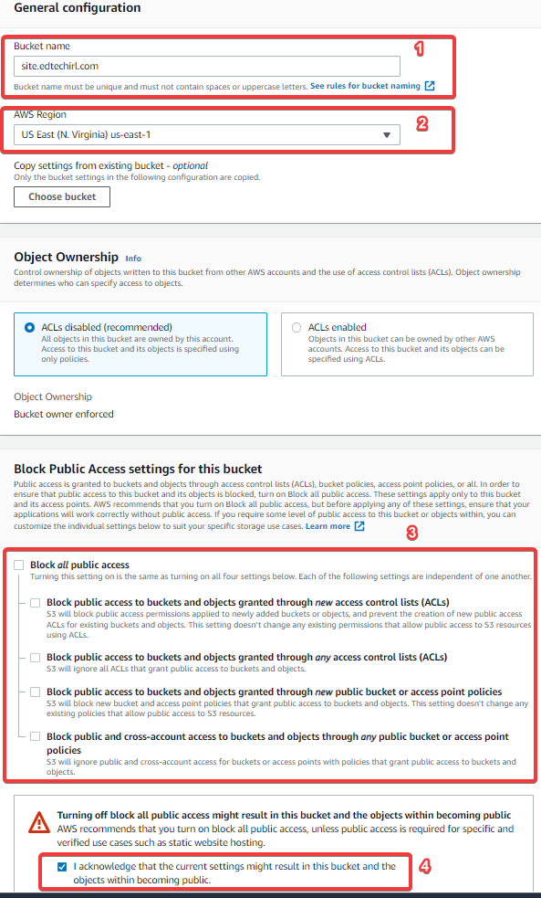](images/7d38386d-1d97-4cb2-8c06-7b2e5d772f2b_593x983.png)

Now that your bucket is created, you’ll need something to put in it. Since we’re making a static website, you’ll need an HTML file. If you have one handy, great. If not, copy the text below into notepad and save it as index.html.

> `<html>`
>
> `Is there a hole in my bucket???`
>
> `</html>`

Back in AWS S3, click on “Upload”

[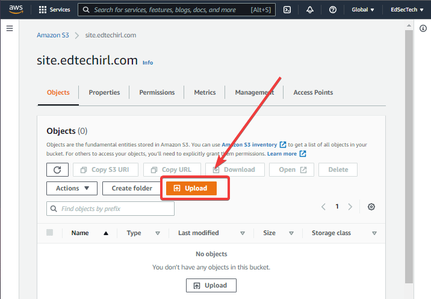](images/5f97b883-f90a-4be8-a4c3-dbd30a186c1d_716x496.png)

Select “Add files” and upload your index.html file. There’s no need to adjust additional permissions or properties.

[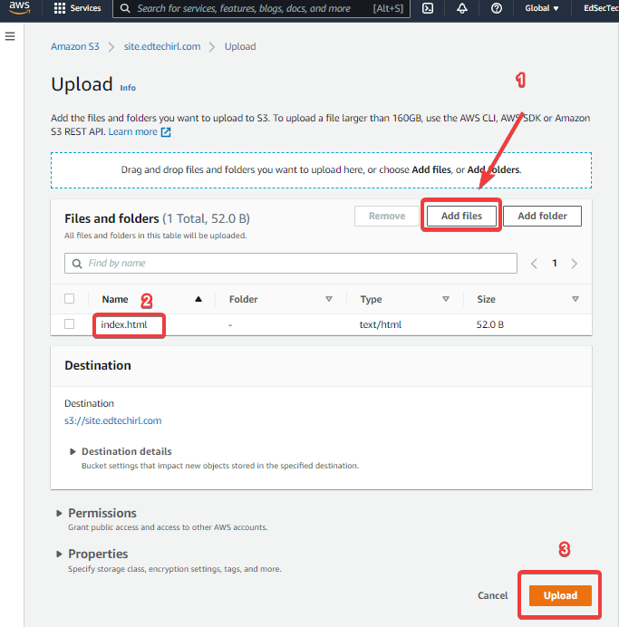](images/ddb010cd-f532-4e66-874e-4ac7bda6e98c_683x692.png)

Once your file is uploaded, it should be listed under the objects list for your bucket (#1 below). Before you can view the file, you’ll need to click on the Properties tab (#2)

[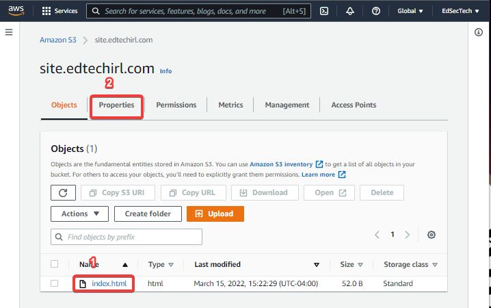](images/5c40e981-ced7-4b7f-9d5c-886164d8433b_718x450.png)

Scroll to the bottom of the Properties tab and select “Edit” next to “Static Website Hosting” and then Enable static hosting and enter the name of your index file, and save changes.

[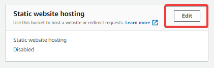](images/8cc85108-3892-41ce-a5e6-cc84c0d8c0f7_421x135.png)

[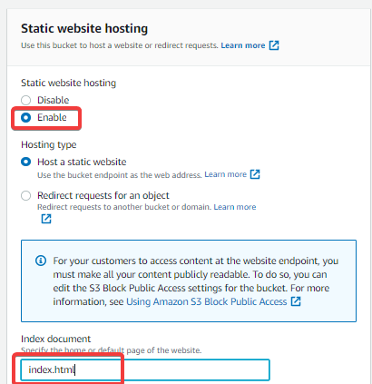](images/8107dabf-6c99-4dcb-8b82-6a0fc5d3ac9f_410x423.png)

At this point, there is a website address posted in the Static Website Hosting section of the page. If you click on it, you should get a big ol’ 403 FORBIDDEN message. That’s because right now your bucket is set to “CAN be public,” but isn’t actually set to public. AWS really wants to make sure you don’t accidentally expose your bucket. To fix that, we need to change one more policy.

From the main bucket screen, click on the “Permissions” tab then “Edit” under Bucket Policy.

[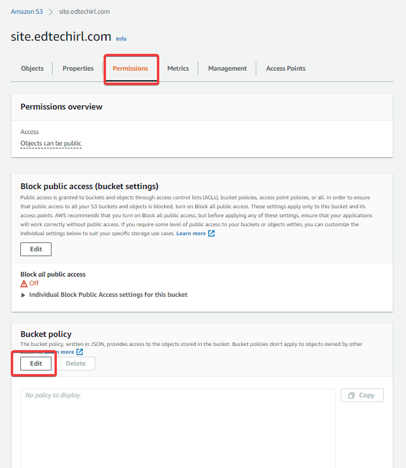](images/5af35a67-c627-4dd3-ab07-26cad923e6a3_678x782.png)

In the “Bucket policy” edit window, either copy/paste or manually set the JSON file to have the following settings. For the “Resource” line, you’ll want the bucket ARN that is located right above the policy window. In this case, it’s `arn:aws:s3:::site.edtechirl.com`

To make everything in the bucket public, add a /\* at the end like below:

> `{`
>
> `"Version": "2012-10-17",`
>
> `"Statement": [`
>
> `{`
>
> `"Sid": "PublicReadGetObject",`
>
> `"Effect": "Allow",`
>
> `"Principal": "*",`
>
> `"Action": "s3:GetObject",`
>
> `"Resource": "arn:aws:s3:::site.edtechirl.com/*"`
>
> `}`
>
> `]`
>
> `}`

Once edited, click “Save Changes.”

[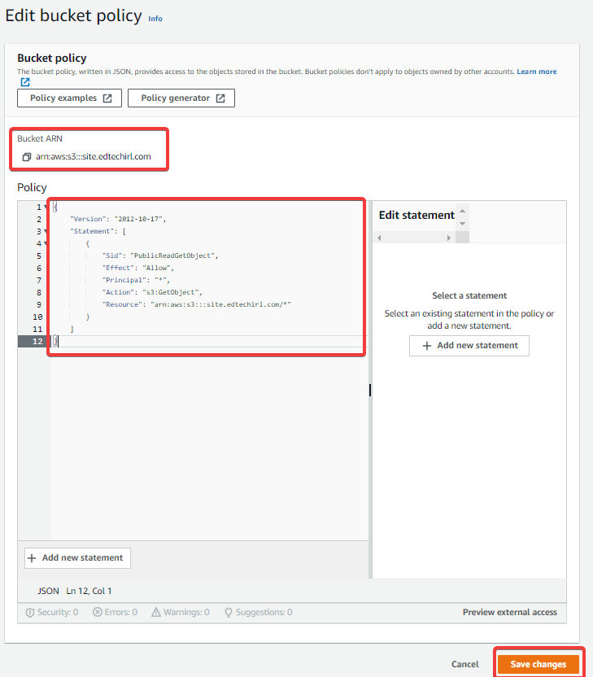](images/0942ebd0-9d7b-4183-ba55-982f66d13677_729x832.png)

Next, go back to your main page for this bucket. It should now say “Publicly accessible” highlighted in red immediately below your bucket name. This is a very good sign.

Finally, click on the html file you uploaded to your objects, and find the “Object URL” from the properties tab. This is the address for your website. In our case, it’s https://s3.amazonaws.com/site.edtechirl.com/index.html

[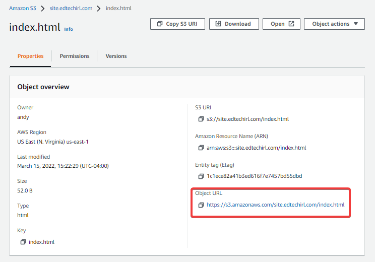](images/09b5abdf-67fa-4b30-9110-58d9a7915df4_744x520.png)

Visiting the Object URL should now take you to the html file you prepared and uploaded to the bucket:

[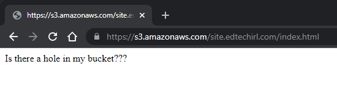](images/f73a8a84-741a-418b-94ea-8725dce83878_550x169.png)

Now that the bucket is created and policies are applied appropriately, anything you add to the bucket can now be publicly shared and accessed. This could be something like a simple one page website (like [andy.lombardolabs.work](http://andy.lombardolabs.work)), or you could use it as a staging area for files or software you need to be able to download remotely. Pricing for S3 is based on amount of storage and access to the bucket. At the Free Tier, you can store up to 5GB, and process up to 20,000 GET requests and 2,000 PUT, COPY, POST, or LIST requests. For pricing beyond the free tier, check out the [AWS S3 pricing info page](https://aws.amazon.com/s3/pricing/). For the sample we just produced, you’re looking at paying $0/month.

To give your project an extra bit of personalization, you can add AWS Route 53 services to give your site your own domain name. For personal projects, the .click domain is currently $3/YEAR and gives you everything you need to get practice with DNS. If you want to harness the power of the cloud, you can tap into AWS Cloudfront and distribute your site to AWS’s Content Delivery Network (CDN). A big perk of doing this is you can house your site in an S3 bucket, connect it to a personal domain, and add HTTPS encryption to your site with a free SSL/TSL certificate managed by AWS. Between services from S3, Route 53, and Cloudfront, my personal static website routinely costs less than $2/month.
