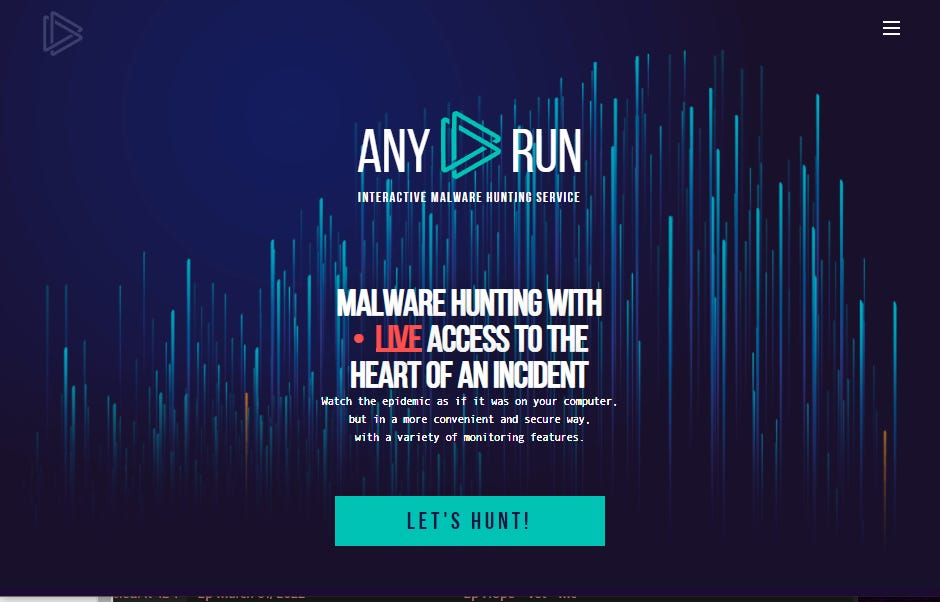

# Dynamically Investigating Malware for Beginners

I \*LOVE\* Any Run (<https://any.run/>).  I found it when looking for a cloud-based sandbox to execute code or visit malicious sites with just to see what happens. Any Run certainly does this, but it also does the heavy lifting of analyzing the urls and files you upload and checking against known indicators of compromise (IOCs) and common tactics, techniques, and procedures (TTPs). It also does it quickly, efficiently, and pops out an easy to read report.

There is a free version that does everything a beginner would need. However, I have opted for the paid version for one reason: protecting my user data.  
The free version of Any Run treats anything you upload to it as public data for researchers or other Any Run users to access. If you're only ever uploading hinky files or URLs, that's fine, but consider the following example:

> A school principal sends you an email saying they got a suspcious email with a PDF attachment called "Important List.pdf" from a gmail account they don't know. It sure looks like phishing, so you open the list in your free Any Run account, and it's actually an email from the school nurse who's home on quarantine for Covid exposure, and she wanted to make sure someone had a copy of her list of all students who receive medications at school with the first name, last name, phone number, medication, and dosage all listed in the pdf. It's now gone from a suspicious email to an accidental data leak of protected health information. Whoops.

Fear over scenarios like the one above were enough to make me spring for the lowest tier of their paid version. There are other products like Any Run on the market, and admittedly I’m starting to like Joe Sandbox’s reports a little better (<https://www.joesandbox.com>), BUT the cost for their paid version is more than double what I pay for Any Run, and the way their page is designed in heavy on reminding you that there’s a lot you can’t do without a paid subscription. For a free product that maintains privacy, MS-ISAC members [(which should be every K-12 public school!](https://edtechirl.substack.com/p/welcome-to-ms-isac)) offers their Malicious Code Analysis Platform (MCAP) that does the same features, but isn’t quite as interactive.

A sample of the output for an Any Run Investigation for a malicious pdf can be see at this link:

<https://any.run/report/26fa008fb38ca01edb3952c23943aa5ae791ecb286f81b5d908217b25f18d8d5/78255e5f-d258-4c3f-9461-82eeb0cd99e2>

See a super-short walkthrough of an Any Run analysis in action below:

\*If you’re not seeing the walk-through, large GIFs may take a minute to load
