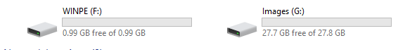
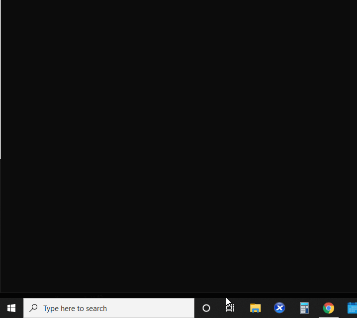
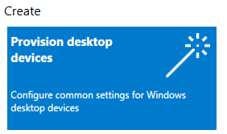
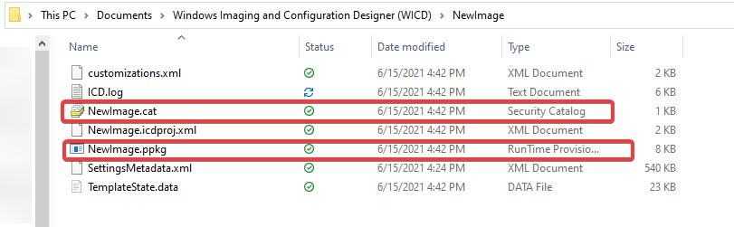
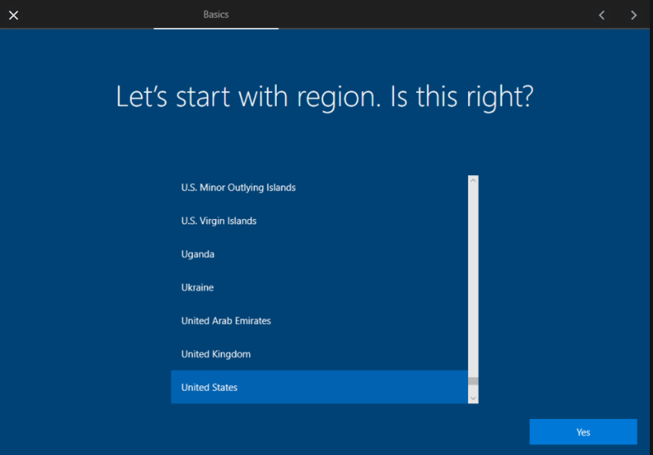
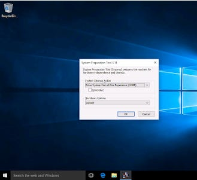
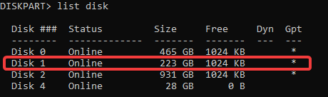
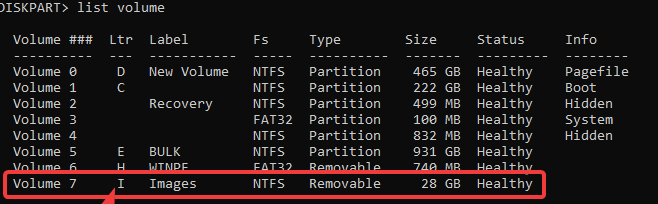

# Windows Speed Running: Win10 Install in 10 minutes and change

# **Materials**

- USB 3.0 flash drive, at least 16GB
- Keystroke injector ([Rubber Ducky](https://hak5.org/products/usb-rubber-ducky-deluxe)) or Barcode reader
- Technician computer with [Windows ADK and WinPE Add-on for WinPE installed](https://docs.microsoft.com/en-us/windows-hardware/get-started/adk-install), as well as [Windows Configuration Designer](https://docs.microsoft.com/en-us/windows/configuration/provisioning-packages/provisioning-install-icd). Technician computer should be running the same version/release of Windows as the target computers (e.g., Windows 21H1, 20H2, etc.).
- Computer (or VM) for reference image with same size drive as your target computer
- Video walkthrough of this process can be found on YouTube:

# 1) Create Bootable WinPE Drive with dual partitions

***Prerequisite: download and install [Windows Configuration Designer](https://docs.microsoft.com/en-us/windows/configuration/provisioning-packages/provisioning-install-icd), [Windows ADK and WinPE Add-on for WinPE](https://docs.microsoft.com/en-us/windows-hardware/get-started/adk-install) on your technician computer***

The following steps are to be done on your technician computer:

1. Insert a fresh USB drive. It's strongly recommended to be USB 3.0 and at least 16GB. If you'll be storing multiple images on the same drive, plan on 10-10GB per image.
2. Next, you need to find out some details about your USB drive. Open a command prompt and run the diskpart command. Type the command List disk and make a note of the drive number of your USB drive. Type the comman List volume and make a note of what drive letters are in use on your device. If you're not comfortable with command line, the same tasks can be completed graphically with the "Create and format hard disk partitions" tool in Windows

   
3. Type exit to exit diskpart
4. Open PowerShell ISE as admin and paste the Dual Partition Script below into the editing window, changing the Disk Number to the USB Disk Number you found in step 2 above, and with Drive Letters that are currently not used on your computer. Run the script. This step is used to create a flash drive that can both be bootable and capture the FFU image. Two partitions are needed because the WinPE drive needs to be formated as Fat32, while the size of the images being captured (>4GB) requires an NTFS partition.

   [Dual Partition Script](https://www.notion.so/Dual-Partition-Script-1a48dddbccb2443590d811d3a60481d3)
5. After a few minutes, your drive should be complete. You can verify by navigating to Windows Explorer and the drive should show up like below:

   
6. Launch the Deployment and Imaging Tools Environment in Windows. You can use the Windows search bar to find it and launch as administrator.

   
7. When Deployment and Imaging Tools launches, it will look like a command prompt. Create working files for your drive by entering the following command:

   `copype amd64 c:\winPE_amd64`
8. Run the following command where F: is the drive letter of your WinPE partition.

   `MakeWinPEMedia /UFD C:\WinPE_amd64 F:`
9. Voila! You should now have a bootable WinPE drive with an extra storage partition.

# 2) Create Provisioning Package and Add to the WinPE Drive

***Prerequisite: download and install [Windows Configuration Designer](https://docs.microsoft.com/en-us/windows/configuration/provisioning-packages/provisioning-install-icd) on your technician computer***

1. Launch Windows Configuration Designer
2. You can easily get in the weeds with all the configuration options in the Advanced editor... to get us started, we're going to use the Wizard by clicking on the "Provision Desktop Devices" button on the dashboard. NOTE: If you start with the wizard and then click on Advanced, that package can never go back to the wizard and will be stuck in "Advanced" forever.

3. Walk through the steps of the wizrd with basic configuration settings. For us, we enter a formula for device name using the serial number, like Student-%SERIAL%. We find this helpful with asset management. For product key, we enter the [Windows 10 Education KMS Key](https://docs.microsoft.com/en-us/windows-server/get-started/kmsclientkeys) (NW6C2-QMPVW-D7KKK-3GKT6-VCFB2) Since we are 1:1, we leave shared use off, and since it's an install from an image, we leave "Remove pre-installed software" toggled to NO. "Remove pre-installed software" can be really useful in some applications, though. For set up network, to do a wireless domain join you need to enter a wireless network on your domain. This process doesn't yet support 802.1x authentication yet though, so you're stuck using a PSK network. For us, we make a temporary SSID we leave up only for when we're doing mass device imaging. In account management, we select Enroll into Active Directory and fill out the info for a least-privileged account to join the domain, and we create a local admin user. For our purposes, we leave "Add Applications" and "Add certificates" blank, and click "CREATE" You'll get a link to the folder on your computer where the provisioning files are.
4. Click the link to open the folder with your provisioning files. Copy the .cat file and the .ppkg file to the root of your WinPE drive.

   

CAUTION: This USB is now live... if it's plugged in to a computer while it's at the OOBE, it will automatically be detected and will start provisioning the device. Don't leave it plugged in (especially on your reference image computer) unless you want the device to receive the provisioning package.

# 3) Prepare keystroke injector or barcode reader

This step is not strictly necessary in general, but speeds up the process and interactivity considerably. The purpose behind it is that there is a complicated command that needs to be run by technicians when applying the FFU image, and this takes out time typing and human errors in typing.

One thing we've found is that there are a few variables from device to device that affect the contents of the command. For example, with 300 of the same model of device, there may be 4 different Disk Number and Drive Letter combinations. The time it takes a technician to check these configurations also eats into efficiency.

So... what do we do? We make a command for all 4 configurations and program a keystroke injector to run all 4 commands. There are no negative side effects of running the wrong command, so it doesn't cause problems but increases productivity. We've also added some additional steps to the script to save a few seconds here and there. Similarly, we can do basically the same thing creating a script and saving it to the Images partition and creating a barcode scannable barcode that will execute the script from the WinPE environment. Both scripts are at the end of this page.

# 4) Create reference image

1. On the image where you'll be creating your reference image, do a fresh install of the version of Windows 10 you want to deploy to your devices. It's important to note that a limitation to this method is that the reference image drive size needs to be the same as your targeted devices. If the targeted devices have a smaller drive, this won't work. If they are bigger, there will be wasted space.
2. When Windows 10 has finished installing, it will be in the Out of Box Experience (OOBE).

3. Press CTRL+SHIFT+F3. It will take a minute or two, but it will take you from OOBE to Audit Mode, which will be an empty Windows desktop with a dialog box open for the Sysprep Tool. Check the "Generalize" box, but don't click okay yet.

   
4. Install any software you want to be on your target devices. If you think you'll be doing multiple configurations or will be experimenting a lot, it may be worth saving all your install files to a flash drive and scripting the install. That way if you have to come back and back a new reference image later, it's easy to install the software.
5. If you're using a Virtual Machine as your reference image, take a snapshot after you finish installing software.
6. When you're done with your reference image, be sure the "Generalize" button is checked in the sysprep tool and click "OK"
7. After a few minutes, the device will restart and go back to the OOBE and is ready to capture the FFU.

# 5) Capture FFU image

1. Once the reference image has been created and sysprepped, the computer will restart in the Out of Box Experience (OOBE).
2. Press Shift+F10 to launch the command prompt and enter the shutdown command (or, manually press the restart button or turn it off and back on again).

   `C:\windows\system32> shutdown -r -t 00`

   If you want to check your boot drive settings in BIOS, you can enter the following to restart and go straight to BIOS on most systems:

   `C:\windows\system32> shutdown -r -t 00 -fw`
3. When the computer begins to restart, insert the WinPE drive. CAUTION: DO NOT PUT IN THE DRIVE WHILE OOBE IS STILL UP.
4. On the splash screen, press the appropriate key to pull up your boot menu (i.e., F10, F12, etc.)
5. Once booted to the WinPE drive, select it as the boot device.
6. If all went as expected, you'll be able to tell you're in the WinPE environment because you'll have a command prompt.
7. Launch the disk paritition tool by running the diskpart command

   `X:\windows\system32> diskpart`
8. Type List Disk and make a note of the **Disk Number** of the physical disk of your computer's drive where the FFU is. It will almost always be Disk 0, but sometimes it's drive one. You can use the drive size as a guide. In the example below, the drive I want to capture is 223GB, so it's Disk 1 instead of Disk 0.

   
9. Type List Volume and make a note of the **Drive Letter** of the USB drive Images partition where you'll be capturing the FFU image to. It will usually be drive E, but not always. If you created the drive using the steps in this tutorial, you can use the "Images" label as your key for which one you're looking for. In this example, it's Drive Letter I

   
10. Type Exit to exit the diskpart utility

    `exit`
11. Use the following command (all one one line) to capture the FFU. Using the examples above, we'll use the Disk Number 1 and Drive Letter I. In your case, it will probably be Disk 0 and Drive E:

    `X:\windows\system32> dism /capture-ffu /imagefile=I:\CapturedImage.ffu /capturedrive=\\.\PhysicalDrive1 /name:CapturedImage`
12. A progress bar will be displayed. Once the operation completes, remove the drive and type Exit to restart the system.

# 6) Apply FFU image and Provisioning Package

1. Set up laptop, plug in to power, put Imaging/Provisioning Drive in any available blue USB 3.0 slot
2. Turn on device, pressing F12 on your computer's splash screen (or whatever key is required on your system) to bring up the boot menu.
3. Select your USB drive from the list of available devices
4. Once the computer boots to the flash drive, you should see the Windows PE environment with a command prompt open. Wait till the terminal has fully loaded and you have a prompt
5. Plug in the Rubber Ducky (or scan the barcode) from step 2
6. You will get a message telling you the image is applying and a progress bar. Before the progress bar hits 100%, unplug the Ducky. Leaving it in can cause problems later in the process.
7. Once the bar gets to 100%, the computer will automatically reboot and come up to the Windows Out of Box Experience (OOBE). (Note: If your computer restarts and goes back to the Windows PE prompt, your computer may be set to boot to flash drive first. If so, go to BIOS and change the Boot device settings to boot to your devices drive first).
8. Once in OOBE, your device will auto-detect the provisioning package we added to the USB drive in step 1. Once detected, the computer may restart multiple times. If there are no errors, you'll know it's finsihed onced you are at a Windows login screen that says "Setup successfully completed." Once at this page....
9. You're done! Any device renaming, networking joining, domain joining, local account creation, etc. should have been completed during the provisioning process.

# RESOURCES:

## Keystroke Injector Script (Rubber Ducky Script)

`REM for more info on getting started with a Rubber Ducky, check this link out:`

`REM` [`https://docs.hak5.org/hc/en-us/articles/360010471234-Writing-your-first-USB-Rubber-Ducky-Payload`](https://docs.hak5.org/hc/en-us/articles/360010471234-Writing-your-first-USB-Rubber-Ducky-Payload)

`REM Automated DISM command for quickly inputing one line for summer laptop deployment. There are 4 variations of the main command so this will try each one. Target: Windows 95 and beyond. Author: Brady Widener`

`DELAY 1000 STRING dism /apply-ffu /imagefile=e:\CapturedImage.ffu /applydrive:\\.\PhysicalDrive0 ENTER DELAY 100 STRING dism /apply-ffu /imagefile=d:\CapturedImage.ffu /applydrive:\\.\PhysicalDrive0 ENTER DELAY 100 STRING dism /apply-ffu /imagefile=e:\CapturedImage.ffu /applydrive:\\.\PhysicalDrive1 ENTER DELAY 100 STRING dism /apply-ffu /imagefile=d:\CapturedImage.ffu /applydrive:\\.\PhysicalDrive1 ENTER DELAY 100 STRING exit ENTER`

## BarcodeScript.bat

`Rem the most common configurations are Disk 0 and Disk 1, and drive letters D, E, and F.`

`Rem The command will only run with the correct configuration as long as the drive you're applying to is the largest drive.`

`Rem If it's not, you may want to use diskpart to be more exact`

`dism /apply-ffu /imagefile=d:\CapturedImage.ffu /ApplyDrive:\\.\PhysicalDrive0`

`SLEEP 2`

`dism /apply-ffu /imagefile=d:\CapturedImage.ffu /ApplyDrive:\\.\PhysicalDrive1`

`SLEEP 2 dism /apply-ffu /imagefile=e:\CapturedImage.ffu /ApplyDrive:\\.\PhysicalDrive0`

`SLEEP 2 dism /apply-ffu /imagefile=e:\CapturedImage.ffu /ApplyDrive:\\.\PhysicalDrive1`

`SLEEP 2`

`dism /apply-ffu /imagefile=f:\CapturedImage.ffu /ApplyDrive:\\.\PhysicalDrive0`

`SLEEP 2 dism /apply-ffu /imagefile=f:\CapturedImage.ffu /ApplyDrive:\\.\PhysicalDrive1`

`SLEEP 2`

`Rem to make the computer auto-reboot after applying image, un-comment the exit command below`

`Rem exit`

## Sample Barcode Images

