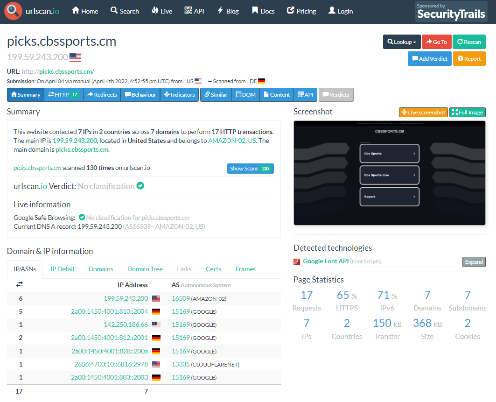

# Take a Sneak Peek at Hinky Websites

When it comes to suspicious links in your email, sometimes the call of curiosity can be strong. I mean, WHAT IF there really IS a free Amazon gift card for being the 103rd visitor to a website?

To satisfy your curiosity without clicking the click, you can use a tool like urlscan.io to preview the site and gather data for you without having to visit the site yourself.

To begin, copy the website address you want to gather info on (careful not to accidentally visit the site while trying to do this). For our example, we’re going to use picks.cbssports[.]cm. At a glance, it looks like CBS Sports, but the .cm instead of .com is a little suspicious. It could be that this is the CBS Sports affiliate in Cameroon, but I’m doubtful.

To find out, just pop the address into the URL TO SCAN box on the main page of urlscan.io and click “Public Scan.” If you think your link may be legitimate and may possibly have sensitive information, you can click “Options” and select a Private Scan. The effectiveness of the site depends on folks doing public submissions, however, so we’re going to keep ours public.

Once the scan completes, you get a variety of helpful details. Probably the most important is the screenshot on the right hand side of the screen - this is a screenshot of what the page looks like. Now, we can tell at a glance this probably isn’t a malicious site, but is a parked domain that’s there to take advantage of getting referral traffic due to url typos.

In addition to the screenshot, there is information about the domain and it’s server’s IP address, including a log of the GET and POST requests, a summary of any http redirect attempts, behavioral notes about the session, and indicators (not to be confused with indicators of compromise) that can be used to identify the page (address, DNS info, server info, file hashes, etc.). Additionally, the “Similar” tab is helpful because it gives a list of not only similar sites, but of other sites being served from the same IP address.

Finally, under the “Lookup” button in the upper-right hand corner of the main page, there are options to continue investigating with external tools like VirusTotal, Censys, SecurityTrails, RiskIQ, or crt.sh.
