# Mass Deployment of AutoPilot From Scratch (Zero Touch USB - Updated for 2023)

*Create a bootable USB drive that will wipe a device, install windows, provision the device, and enroll it into AutoPilot... with barely any user interaction*

[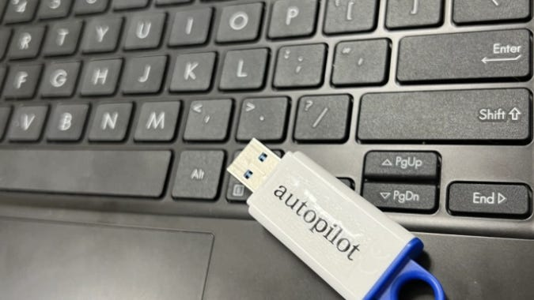](images/a9627caa-2674-4872-aa8f-164ac77ba37d_675x380.png)

**FINAL NOTE:** After using this imaging method for a few years, I am no longer able to get it to work. I believe this is due to a change in Windows PE. For historical purposes, I’m going to leave the article as is. However, you can find an [article on the method and program I am using now, here.](https://www.edtechirl.com/p/zero-touch-usb-imaging-new-and-improved) **NOTE**: There is an update at the bottom for 2023 and how we are currently using this process. This includes how we plan on doing our device refresh this school year after using this process and changes I would make to the original process now that I know more.

Did your vendor come to you with grand promises of being able to open your device and have it set up without the need to touch the device using Windows AutoPilot? Did they later come back and tell you that they never promised that, and that they didn't know how to assign an order tag to your devices BUT you can have them enrolled in autopilot from out of box if you pay a hefty white-glove service fee? For your sake, I hope not. If so, well, you came to the right place. My goal when starting this was to create an imaging process that would a simplified autopilot enrollment and make it as hands free as possible, completely from scratch. After roughly 2 months of reading articles, here is what I came up with. The goal of this guide is to make it easy enough for someone to set this up in a day without doing 2 months of deep diving.

**Disclaimer**: I did not create any of the scripts in this article. Credit is linked at the bottom and throughout the tutorial. I just had a dream scenario for setting up autopilot from scratch and used Ben and Sean's scripts to Frankenstein a solution together. I wanted to share this process because I am sure many others would like to do something similar and I could not find any documentation online on how to do this when I was doing my own research.

#### **Description**

This article will go over my method of creating a zero-touch\* usb drive to wipe and reimage a computer with the least amount of user interaction possible. All the user is required to do is hook the laptop up to ethernet and boot to the jump drive. This method has 5 big steps:

- Setting up a AutoPilot Profile and Azure AD Group
- Setting up the USB Install
- Automating the USB Install Script
- Setting up the Microsoft Graph API App
- Setting up the Provisioning Profile

How this works revolves around 2 different github projects. The first one is the automated USB install. It will set up a jump drive that will automatically wipe a computer and install windows, when booted to. Next, the device will reboot on its own and apply a provisioning package that is on the same USB. This provisioning package has any program you wish to install, along with a script (github project 2) that will interact with a preconfigured Azure AD app that passes the hardware hash through the Microsoft Graph API into the AutoPilot Enrollment program. The device will be added into the correct Azure AD group based on the device name or group tag.

#### **Setting up an AutoPilot Profile and Azure AD Group**

Let's start by creating a group for the devices we are going to reimage. There are plenty of guides on how to do this. I will link below a video I really like from Intune Training that shows the basics on creating a group in Azure AD and how to tie an AutoPilot profile to that group. This video also goes over setting up AutoPilot for the first time if you have not done this already or are confused about what AutoPilot is and what it does.

Note that in this guide we are going to be doing some things differently for the sake of efficiency. The biggest is that we will be gathering and sending off the hardware hash a different way. At roughly 28 minutes into the video, we will be doing this differently.

I am also going to recommend setting up a different dynamic rule for your group. The way they have it set up in the video will automatically add any AutoPilot Device to that group. We want to have the ability to get more granular than this. Instead, we are going to assign devices a Group Tag as they are being enrolled into autopilot.

So, what is a group tag? A group tag is just a short string to help identify the devices you are adding to AutoPilot. This can be handy as then you can have devices added to groups by group tag, and then different autopilot profiles for different groups. So we will add a group tag rule to our group to automatically assign the devices to our group IF they have the specified group tag.

> (device.devicePhysicalIds -any "\_ -eq "[OrderID]:examplegrouptag")

This will assign devices with the group tag **examplegrouptag** to your group. You can change that string to be whatever you would like. Note that whenever you autopilot reset a device, the group tag will remain attached to the device.

#### **Setting up the USB Install**

I spent hours trying to figure out how to make it work the way they did it in the video listed below, but good news, the creator has automated most of the steps in his PowerShell module. Follow the instructions in the link below. There is one step I have changed that will be listed below.

[Powers Hell Blog Post By Ben](https://powers-hell.com/2020/05/04/create-a-bootable-windows-10-autopilot-device-with-powershell/)

The only change we will need to make is on the final command to create your USB drive

> Publish-ImageToUSB -winPEPath "https://githublfs.blob.core.windows.net/storage/WinPE.zip" **-windowsIsoPath** **"C:\path\to\win10.iso"**

The 'windowsisopath' flag is optional for this, but is very important. The script was made for windows 10 and will download the latest windows 10 iso if you leave it blank. Instead, we will go ahead and link it to our preferred windows iso (for me, I am using the latest version of Windows 11).

Note: You could also add a -getAutopilotCfg flag if you wanted to have the device pull a specific autopilot configuration. This does not enroll the device in AutoPilot, but will apply the AutoPilot Profile settings to the device manually. We are leaving it off for this example because we want the device to be enrolled in AutoPilot.

After this, you will get a series of prompts. It will ask you the windows edition you wish to install, then it will prompt you to login to Azure and choose your AutoPilot Profile you wish to apply (only if you used the flag mentioned above). It will then ask you to which disk to apply to before creating the flash drive. This does take a while. For me it took around 20 minutes before the drive was ready. Hold onto this drive, as we will come back to it in a bit.

#### **Automating the Script for USB Install**

**WARNING: You are about to create a flash drive that will automatically wipe computers. Yes it is cool, no it is not safe. Use responsibly.**

We are going to go on the flash drive we just created and edit the 'kick off' script to ignore the safety features the creator added (sorry, Ben). This is not a smart thing to do, but in our scenario, we will be wiping student devices and there isn't any risk of major data loss. We also need the time save for the sake of efficiency... and my own sanity.

To start, go ahead and open up the Invoke-Provision script in visual studio. For me it was under D:\Scripts\Invoke-Provision.ps1

[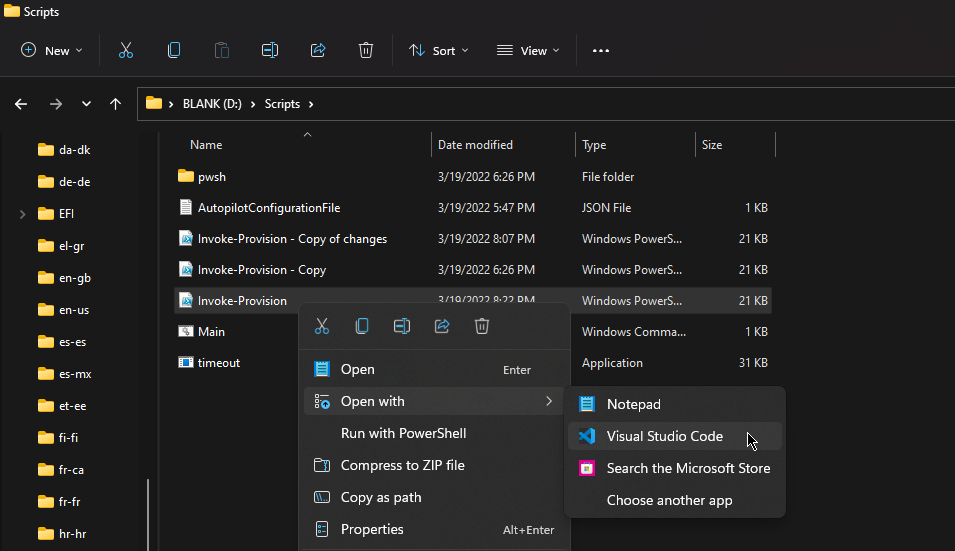](images/890fac21-e61a-45bb-a33a-5876bb978a4c_955x551.png)

When you do this, near line 365 (may be a different line depending on the settings you configured) you will see this line.

[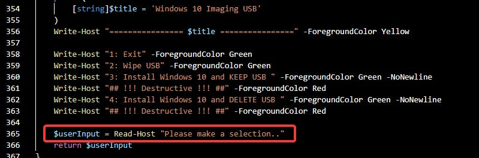](images/c0b6bd1b-da9e-4431-955c-e27b8cc8fa77_799x264.png)

This is setting a variable equal to user input. We already know that we want user input 3, so we are going to set the variable equal to 3, as seen below. Adding 3 will have the disk wiped, but preserve the USB drive.

[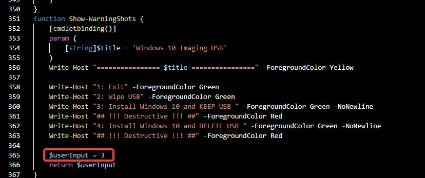](images/531e8012-8cb6-45ed-8fe8-2d5d52303ed7_828x347.png)

Below this on line 377, the user is prompted one final time to make sure they would like to wipe the computer. We are going to set the userinput variable equal to "Y". This just automatically accepts the prompt asking the user if they are sure they want to wipe the drive of the computer.

[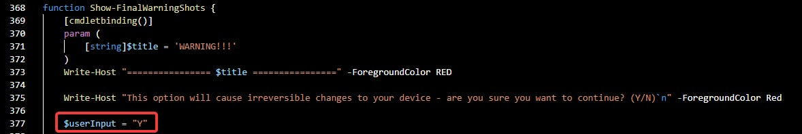](images/97c6b9d5-6f4e-4465-97e9-b1156b88f223_1178x198.png)

The warning messages will still come up, but they will be automatically answered because we have set the variable equal to what our choice is. Otherwise, the program would stop and wait for user input.

At the end, we will want to add **Restart-Computer -Force**

[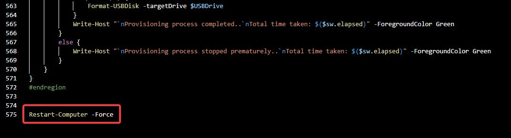](images/1176b777-e2f3-482b-b6e1-c2e6f01f6696_1073x290.png)

This will have the computer restart when it is finished. From here, the drive should be ready. You can plug it into a computer, boot to it. This will wipe the hard drive, reinstall windows, and restart all on its own.

In my testing, you can go from booting to the drive to a fresh install of Windows 11 on the OOBE screen in around 10 minutes with barely any user interaction. However, we want to go further than just windows OOBE.

#### **Setting up the Microsoft Graph API**

The author of the script we are going to use has a really great blog post on how to set this up that I am going to leave linked below and for the most part, urge you to follow his instructions.

[Modern Endpoint Blog Post by Sean Bulger](https://www.modernendpoint.com/managed/Silently-Collect-Autopilot-Hashes-using-Microsoft-Graph-and-a-Provisioning-Package/)

The next two sections are going to mostly be the same instructions that Sean has made. But I will briefly go over what he did to make this work. If you are looking for a step by step on how to do this, again, please go to Sean's blog.

If you go to your [Azure AD Portal and go to App Registrations](https://portal.azure.com/#blade/Microsoft_AAD_IAM/ActiveDirectoryMenuBlade/RegisteredApps) you will need to create a new app registration. I called mine 'Upload Autopilot Hashes'. Be sure to set supported account types to the top option (Accounts in Org Directory Only).

[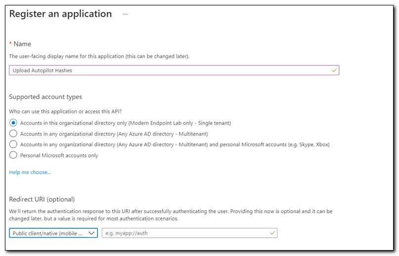](images/44b66ab0-b87f-4bd4-898b-4deb7e42df98_807x517.png)

After this we will go to authentication and click the add a platform button

[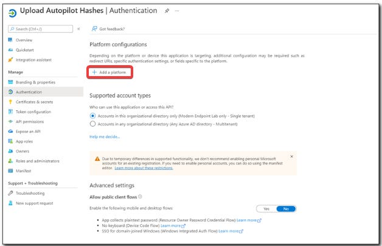](images/157916c9-c43c-4d25-8381-2542c52d9461_628x404.png)

Select the option 'Mobile and Desktop Applications'. Check the top URI Redirect box.

[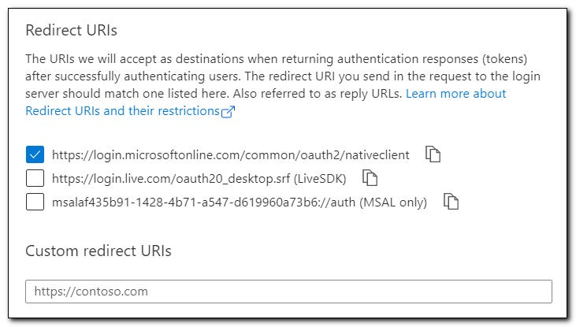](images/42bc1b35-56f4-4b99-878e-791002b85b9d_731x415.png)

After this be sure to set allow public client flow on the main settings page for the app.

[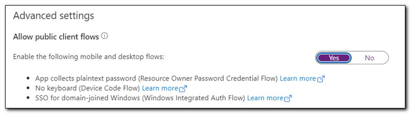](images/fc2e0879-8f92-45b2-8dde-55ff34074985_807x225.png)

Next, remove the default permissions of the app, as they will not be needed.

[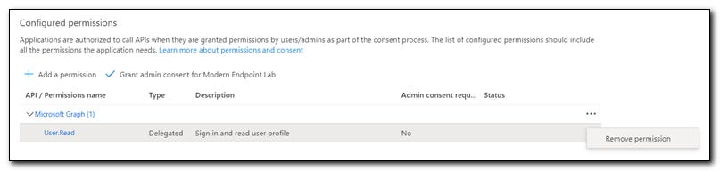](images/c8fc738e-86de-4057-bb74-d42f1b3fba5f_807x192.png)

You will need to give it permissions to Read and Write Device management settings through the Microsoft Graph API. Do this by clicking 'Add a permission' and choosing 'Microsoft Graph'. You need to give the app DeviceManagementServiceConfg Read/Write permissions.

[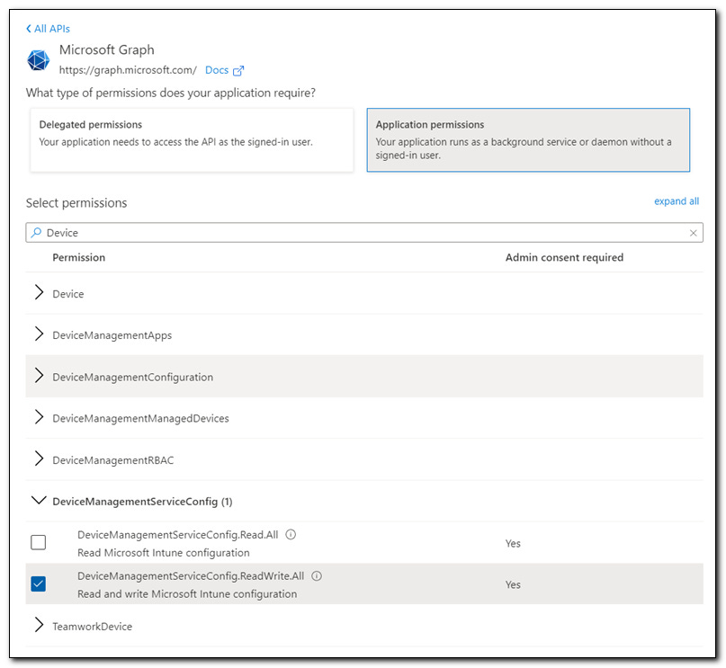](images/8a0b2694-6486-483d-8eea-a8231f4d2bc9_807x743.png)

Lastly, grant admin consent to the permissions you have configure to your app.

[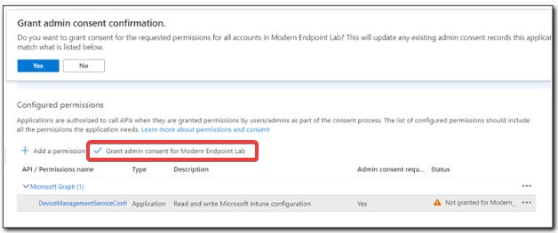](images/ba4c2fb9-2eaa-4bcd-bc12-b46ca34bd867_628x263.png)

We will then need to create a 'Secret' for the app. This is similar to a certificate, but instead of it being a file it is a hash password that you can only see when you first create it. This is a pretty simple process. Just go to the clients and certificates tab and click 'New Client Secret'

[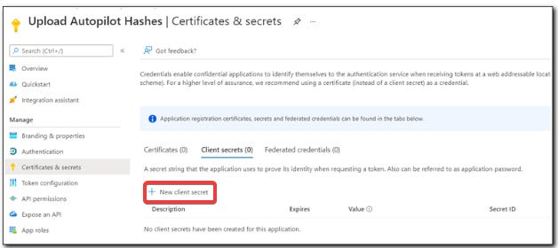](images/702c2f71-cefa-44c6-85f2-f5520f8660e2_628x280.png)

After you create the secret, please take note of its value, or you will have to create a new one.

Once you have your secret created, you will need to fill in your secret value, Tenant ID, and Client ID into the script Sean made.

[Github Link for Graph API Provision Package Command](https://github.com/managedBlog/Managed_Blog/blob/main/MEMAC/Import%20Autopilot%20Hash/Import-AutopilotHashFromPpkg.ps1)

[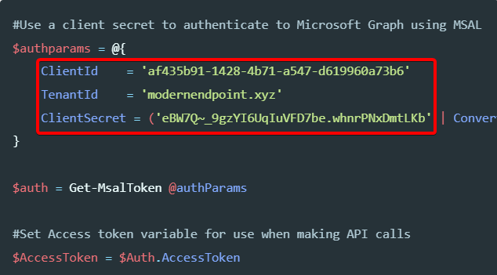](images/9b667aed-6cd7-444c-ad57-0bf4b56b5b17_634x351.png)

Note your TenantID may look like a hash instead of a domain name. You can find it on your Azure AD portal. After you have created the script, our next step will be to create a provisioning package that will run this script. This is detailed later in the same blog post above.

#### **Setting up the Provisioning Profile**

There are lots of extra things you can add to your provisioning package that are not required, if you are just looking to enroll in autopilot (as seen in Sean's blog). However, I am going to show the way to get it all the way working again with zero touching. This involves doing some extra steps in the provisioning package.

To start, open up the Windows Configuration Designer. If you do not have it, download it from the microsoft store. (if it gives you an error message at start up, try turning off windows defender and try again. Not sure why it does this, but its a common issue)

Once it opens up, we are going to select 'Provision Desktop Devices' from the list of blue boxes. Note that in Sean's guide he tells you to set up your provision package in the advanced editor. We will need to switch to the advanced editor to add the AutoPilot Enroll script, but I would highly recommend using the simplified editor until we apply our other configurations, especially if you are not a windows provisioning wizard. Once you switch a provisioning package to the advanced editor, you cannot switch back to the simplified view.

On the next screen, you will see the simplified provisioning wizard. Here is where you will want to configure any additional settings to your device. What you configure here is based on your organizations needs. For my situation, this provisioning package is going on student devices for a school system. We want them to be able to open the device on the first day and sign into Azure AD and have a few pre installed programs on the device, so students can get to work right away on the first day. Additional, lesser used programs will be pushed through intune and our secondary MDM as time goes on.

[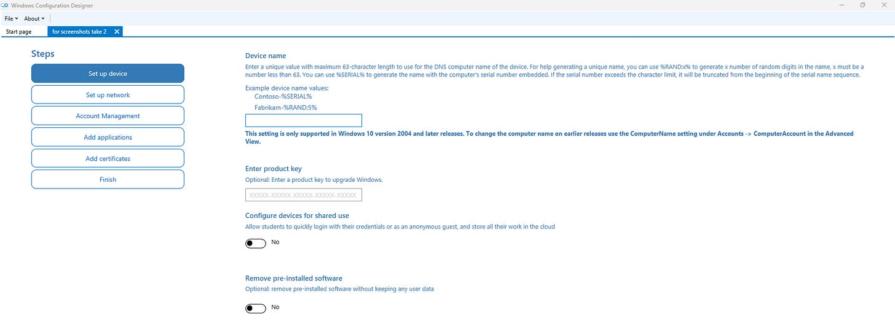](images/7ce2fdc1-d38b-4b99-8756-6686ccf80f4b_1918x699.png)

The settings I would recommend setting up before switching to the advanced editor are:

- Device Name
- Enroll in Azure AD
- Local Admin Account (Optional based on use case)
- Install applications (if needed. Can always be pushed by intune if you have the time)

Configuring these settings is easy for the most part in the simplified editor. I would recommend testing your provisioning package before switching to the advanced editor. Once you have everything working and are ready to proceed, click the 'Switch to Advanced Editor' button in the bottom left.

[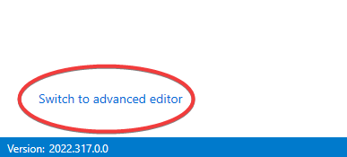](images/155565d8-0b03-4ca9-b607-255650bba828_387x175.png)

After you switch to the advanced editor you are going to have a lot of extra fluff on your screen. On the lefthand list, navigate to Provisioning Commands > Primary Context > Command . If you added any software installs, they will show up on this list. Name your autopilot hash script at the top and click 'add' at the bottom. Once you add it, you will get some additional options on the left side bar.

[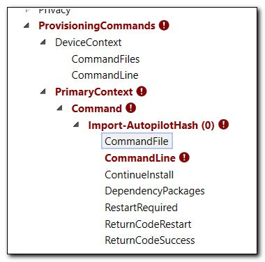](images/1f8e4bbe-21b7-40a6-bbfb-e41d9b2bf92c_380x376.png)

We will need to click on CommandFile and browse to the script we made earlier. Under Command line we will need to input the following command to execute the script and to enroll our device in AutoPilot.

> PowerShell.exe -ExecutionPolicy Bypass -File Import-AutopilotHashFromPpkg.ps1

Note: make sure to double check your file name when inputting the file name. It is rather easy to accidentally put in the wrong file name and to spend hours troubleshooting :)

Lastly, we will need to set 'RestartRequired' to FALSE.

After this, you can export your provisioning package at the top. When you do, you will get options to encrypt the package. If you are going for the zero touch route, I would not recommend this. I would recommend saving the package to a second flash drive so you can test that it is working and test it on a device running a fresh install of windows to make sure the device is being added to the [AutoPilot Enrollment Page](https://endpoint.microsoft.com/?ref=AdminCenter#blade/Microsoft_Intune_Enrollment/AutoPilotDevicesBlade)

[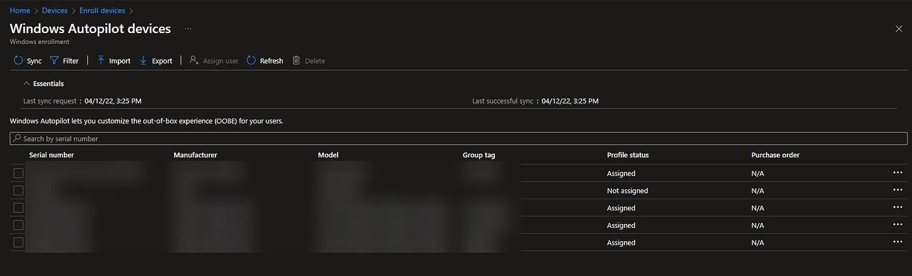](images/0a90b405-f33c-4e8e-b936-6d857d6af252_1681x510.png)

Once you have it ready, pull up your windows install flash drive from earlier, and copy and paste the contents your provisioning package into the 'Images' partition of your windows install drive. After you are done it should look like this: one drive with two partitions. One of those that has your provision package files (on the left in the picture) and one that has a mess of windows PE files (on the right).

[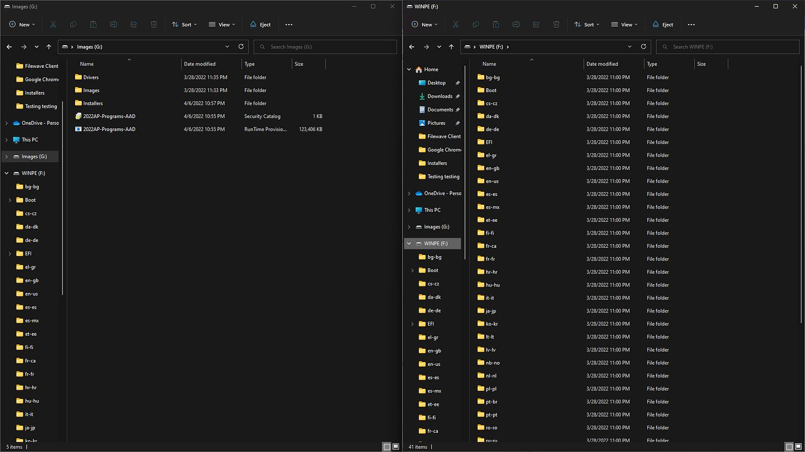](images/b9435c1e-3118-4363-93f2-25fd0d00364a_1920x1080.png)

#### **Conclusion**

Now, if everything works right, you should be able to hook up a device to ethernet and boot to the USB drive. It will automatically wipe and reinstall windows, provision it to join your Azure AD domain along with any other specified settings, and enroll in AutoPilot without anyone having to touch the device again. Once it finishes you will be at the Windows Login Screen. Once you know your drive is working correctly be sure to clone it using your preferred drive cloning software.

For me, the whole imaging process takes roughly 20 minutes to complete. However, this is on a lower spec machine and is installing a few programs on it. I believe on other machines this process could be even faster.

The thing that really makes this process beautiful is the fact the devices can now be reset with autopilot in the future. As a technician for a school system, we have to reset all of our student devices over the summer. If this works as it should, this will literally save us **2 months** worth of labor and headache each year.

#### **Resources**

[AutoPilot Video by Intune Training](https://www.youtube.com/watch?v=OYaDWKqg1uY&t=1474s)

[Powers Hell Blog Post For USB Install](https://powers-hell.com/2020/05/04/create-a-bootable-windows-10-autopilot-device-with-powershell/)

[Github Link For USB Install](https://github.com/tabs-not-spaces/Intune.USB.Creator)

[Modern Endpoint Blog Post for AutoPilot Enroll through Graph API with Provisioning Package](https://www.modernendpoint.com/managed/Silently-Collect-Autopilot-Hashes-using-Microsoft-Graph-and-a-Provisioning-Package/)

[Github Link for Graph API Provision Package Command](https://github.com/managedBlog/Managed_Blog/blob/main/MEMAC/Import%20Autopilot%20Hash/Import-AutopilotHashFromPpkg.ps1)

## UPDATE FOR 2023

We used this process last school year over the summer and the overall device refresh went very well. This year we are going even further with Intune by moving all of our windows devices from local AD to being managed by Intune, in AutoPilot, and Azure Active Directory. We are also switching to have all of our software deployments to push from Intune.

Because of our efforts from last summer, this summer we are going to put AutoPilot to the test. We have decided to collect devices this summer and reset them to get an idea for the consistency of AutoPilot before we have students take their devices home and have the devices reset themselves. The idea being to offload this to the end-user long term, but this summer we want to test the process to make sure everything is consistent as this will be our first summer using AutoPilot provisioning opposed to a traditional provisioning package.

#### What our refresh will look like this summer

Sense we now have all of our student devices in AutoPilot, this summer we are going to have them AutoPilot provision and pull all of their programs from Intune.

We could push an AutoPilot reset to all of our devices, sync them with Intune, and then wait for them to start the factory reset. However, this will not be very time effective. Instead, we are going to make a new automated USB installer using Ben’s blog post (in the original article). The difference will be that we no longer need Sean’s provisioning package, as the devices are now all enrolled in AutoPilot. We will use Ben’s USB Installation method to quickly install the latest, fresh copy of Windows 11. Once it has been installed and the device reboots to the Out-of-box experience, you should be able to walk through the setup and AutoPilot will recognize the device as part of our organization and apply our AutoPilot profile to it. We are going to sign in each device as the student and make sure it pulls the programs and configuration profiles from Intune.

#### What would I have done differently?

##### AutoPilot Enrollment

To start, I am not sure how necessary Sean’s provisioning package is now for having the devices send their hardware hashes to Intune. Now what you can do is image your device, apply a provisioning package that enrolls it in AAD and applies a name template, once it’s in AAD and in the correct groups, apply an AutoPilot profile to that group with the **Convert all targeted devices to Autopilot** toggle turned on.

[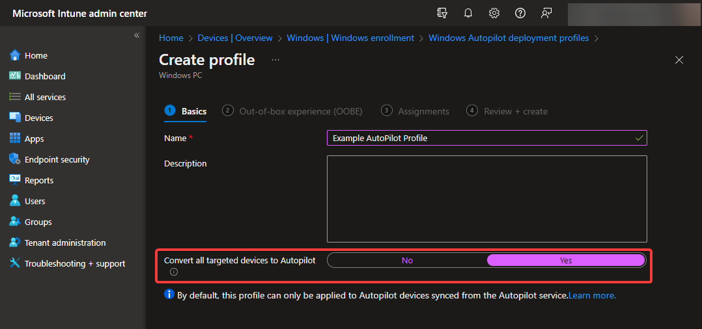](images/6ea4611b-ef03-4efc-9805-196dc4eebb7c_1078x506.png)

What this does is whenever the device picks up the Autopilot profile that is assigned to it, Intune will attempt to enroll it in the Autopilot program if it isn’t already enrolled. I’ve tested this toggle on some miscellaneous devices with good success. However, I would test this on a small batch of your own devices before relying on it.

##### Drivers

Previously, I relied on Windows to automatically pull the drivers needed for the device. However, I have found that you can also add drivers onto the Install USB. To do this, you will need to go to your device’s driver page and see if they offer a driver package (Preferably, you want a Windows PE driver package, but I’ve also had some luck by adding SCCM driver packages as well). Once you have it downloaded, extract it onto the drive in the Images partition, inside of the Drivers folder.

[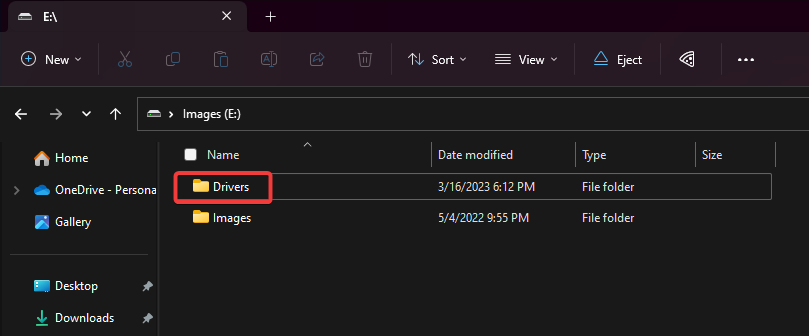](images/13adce78-d6ae-4963-89ff-9edc0f066e9c_809x336.png)

Now whenever you boot to the USB, it will attempt to load and install the drivers it finds in this package. There are two down sides to this. Now you must be careful as the install drive needs to be model specific. I would **not** run this on a different model of device that doesn’t use these drivers. The other down side is that it adds time for the installation of each device. In my experience, it was adding roughly 5 minutes per device. However, to have them loaded with the correct drivers, I see this as well worth it.
