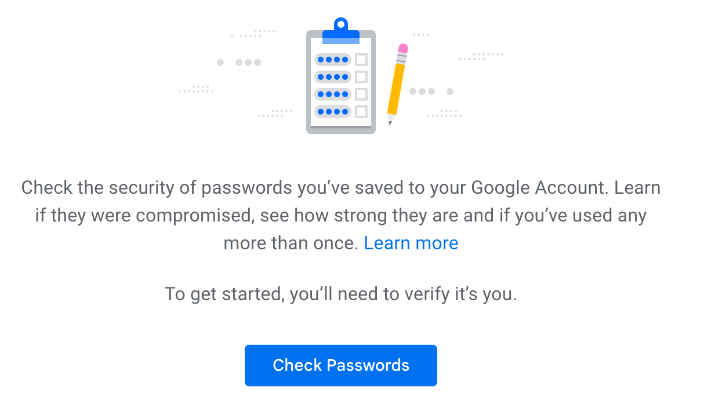
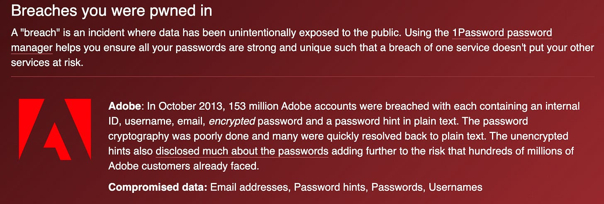

# 2 ways almost everyone is asking for their accounts to be hacked

*We all do it*

Photo by [Michael Dziedzic](https://unsplash.com/@lazycreekimages) on [Unsplash](https://unsplash.com)

There are two main ways that virtually everyone is asking for their accounts to be hacked:

**Having passwords that are too common or simple**

and

**Reusing passwords across multiple sites**

When these two bad habits combine, you’re putting yourself at risk for the most common cyber attacks.

So, if this is so bad, and everyone does it, how can you make it right?

**Use a password manager to automatically generate and store passwords for the sites you use.**

Chrome, Edge, Firefox, and Safari have built in password managers. These browser-based password managers weren’t very secure when they were first introduced, but modern browser password managers now have a decent base-level of security. Third-party password managers like LastPass, Bit Warden, Dashlane, and 1Password are mature tools that can also integrate into your browser using extensions or add-ons. They have a slightly steeper learning curve, but have a longer history of tried and true password protection. While these may be a little more secure, this is an area where the tool you’ll use is the best tool. Built-in browser password managers are generally very easy to use, as they sync across devices when logged in to your browser profile.

**Conduct a password audit of your existing passwords.**

Most of these managers will also conduct password checkups. In Google’s password manager (passwords.google.com), you can conduct a password checkup to search for passwords that are weak, reused, or have been parts of known data breaches.

Password check at passwords.google.com

**Check known data breaches for your email address.**

If you haven’t already, check haveibeenpwned.com to see if your email address has shown up in any known data breaches. This site is constantly updated, and will let you know if your address has shown up in a breach, and if so what data was compromised. If you reuse passwords across sites, this is a good wakeup call for the damage it can do. For example, if I used my andy@edtechirl.com email address and the password “merrychristmas” for my bank, my email, my doctor’s office, and poopsenders.com, if poopsenders.com has a data breach and leaks your password, attackers now know that you use the username andy@edtechirl.com and the password merrychristmas, and they’re definitely going to try using that same combination on your bank and email. You can also sign up for notifications to be notified any time your email shows up in a breach. If you manage an organization, you can also sign up for notifications any time someone in your organization has an email account that is detected in a breach.

Sample output from an email search on haveibeenpwned.com

Thanks for reading EdTech IRL! Subscribe for free to receive new posts and support my work.
