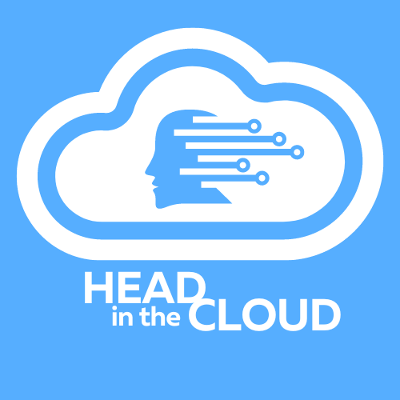

# Learning AWS #1: Head in the Cloud

*Welcome to the world's most dull journal*

After two years of putzing aimlessly with cloud, I’m starting to plan with direction. My goal is to level-up my tech skills with experience building AWS solutions. One of my favorite things about technology that pulled me into tech in the first place is a love for creating things, and cloud is the ultimate environment for being able to move from idea to product with minimal cost or infrastructure.

This page exists primarily as a tool for two things: to provide accountability for myself in making a plan and sticking to it, and to provide a record for myself to reflect on what I’ve learned along the way.

**Learning Resources:**

The two primary resources I’m using (at least at the moment) are Forrest Brazeale’s Cloud Resume Challenge [(Cloud Irregular | Forrest Brazeal | Substack)](https://cloudirregular.substack.com/) and Adrian Cantrill’s [learn.cantrill.io](https://learn.cantrill.io) AWS Certified Solutions Architect - Associate (SAA-C03) course and labs.

**Starting Point:**

My experience with cloud primarily comes through my life as an early adopter and evangelist in EdTech, but later through where cloud intersects with security while studying for the (ISC)2 CCSP certification and the CompTIA Cloud+ certification. I have experience with home lab networking, virtualization, and spinning up VM instances in VPC platforms like Linode and Digital Ocean, but no experience building multi-tiered cloud environments. I have no experience coding, but web design was one of my first hooks into technology.

**Finish Line:**

I hope to get to a point where I can be presented with a problem or a need and design a useful, secure, and available solution from the ground up.

Let’s do this thing!
