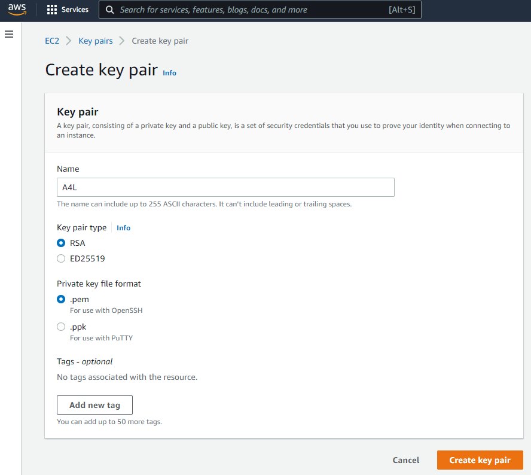
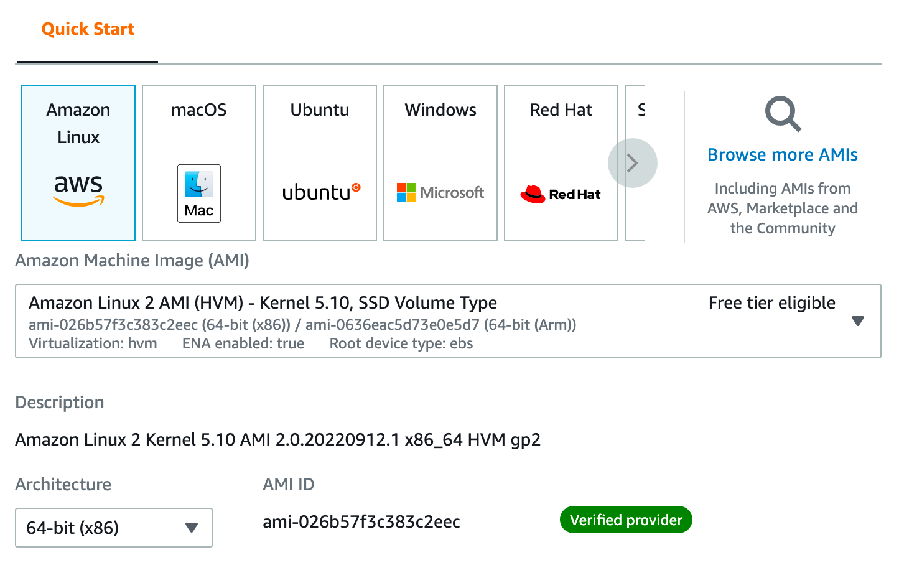
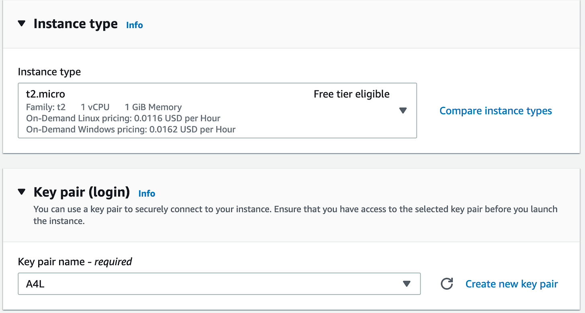
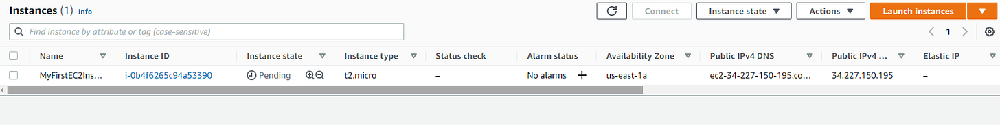
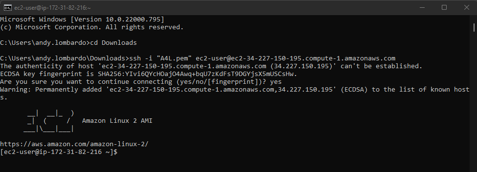

# Learning AWS #4: Core Service - EC2

[](images/0c415515-76fc-48aa-81b7-b552ebeea7cc_2001x1501.jpeg)

Thanks to how much I love working in my home lab, my mind’s eye vision of AWS is usually picturing VMs in the cloud, and that’s exactly where Elastic Compute Cloud (EC2) fits in the equation. At its most basic level, EC2 is where you build VMs that live in the cloud.

In this first EC2 demo from Project 1, I just spun up a basic Free Tier Amazon Linux server using the AWS Admin Console GUI.

I started by logging in to the Project 1 General IAM Admin account we previously set up, and navigated to EC2.

**Creating Encryption Key Pair**

To set up access to the VM (or “instance”) after it’s created, I started off by creating a key pair to enable authentication when connecting to the instance. I’ll be connecting to the eventual instance via SSH from my Windows computer, so I chose the .pem format for the key pair, then downloaded the private key file to my local computer.

[](images/89e32af6-bc55-43d7-8c4a-898b04fa8cc8_888x794.png)

Key pair creation screen

**Launch the Instance**

Next, from EC2 I went to Instances —> Launch Instances and configured a free tier eligible AMI — Amazon Machine Image — based off the Amazon Linux 2 AMI below.

[](images/0c850531-e9ba-49c4-9962-a8adb620a66d_1445x945.png)

For Instance Type, I kept with the Free Tier streak and chose the T2.Micro type with 1GiB RAM and 1CPU for $.0162/hr, which is low enough to run for the month at no cost. I then picked the Key Pair set up in the previous step.

[](images/79365236-187e-44ab-8a1f-2724e2042c09_1575x844.png)

I left the rest of the network and storage settings at the default values and clicked “Launch Instance.”

**Wait for Instance Status to Ready**

While the machine spins up, you can watch the status, refreshing periodically to see when the Status changes from Pending to Running.

[](images/b632fa2c-15fb-403a-98be-9c883a68d5f2_1641x206.png)

**Connecting to the Instance**

Once the instance is running, I right-clicked on the “Instance ID” on the instances dashboard and selected “Connect.”

To connect in-browser, you can select EC2 Instance Connect and it will give you a web shell.

To connect via an ssh client, I opened a terminal and navigated to the directory where I saved the private key file and entered the following instance-specific command:

```
ssh -i "A4L.pem" ec2-user@ec2-54-147-215-17.compute-1.amazonaws.com
```

and BOOM:

[](images/09d430b3-de48-4b19-9c8b-5858d759c2ba_975x353.png)

**Clean-up**

Since this was just a demo to try out spinning up an instance, I now need to clean up to avoid using up my free tier credits.

To get rid of the instance, I went back to the instances dashboard, right clicked on the instance —> Terminate.
