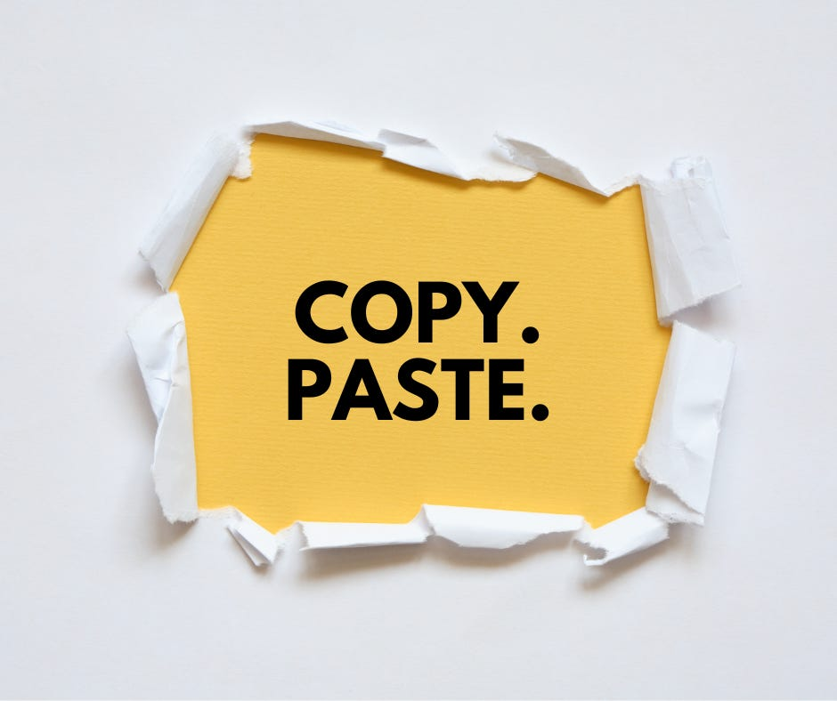
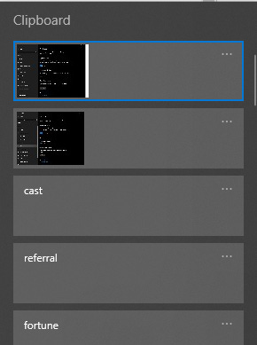
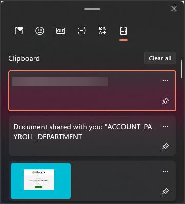

# Clipboard History

*Do you ever want to see something you copied and pasted earlier? Or on a different computer? *

I frequently find myself multi-tasking and spreading my workload across multiple screens and sometimes multiple computers. When I’m juggling like this, I often find myself having copied something for one task, and try to paste it into another one. Once I realize I’ve pasted the wrong thing, I have to search back through a few dozen browser tabs to try to find what I’m looking for.

To help with that and other use cases, there’s a Windows feature called “Clipboard history” that lets you maintain a running list of copied text or images.

To configure Clipboard history if you’re running a modern version of Windows 10 or 11, you can paste this address in your browser address bar

> ms-settings:clipboard?activationSource=SMC-IA-4028529

or you can use the Windows search box/magnifying glass to search for Clipboard Settings.

In Clipboard settings, toggle on Clipboard history. To be able to copy and paste across devices, you can sign in with a Microsoft account.

Windows 10 Clipboard history settings page

To use the clipboard, instead of hitting Ctrl+V like you normally would to paste, instead press the Windows Key+V. It will pull up a box like this where you can pick which image or text you’d like to paste.

In Windows 10, the Clipboard looks like this:

Windows 10 Clipboard History

In Windows 11, it picks up some additional features like the ability to insert emojis, kaomoji, GIFs, and symbols like below:

Windows 11 Clipboard history

And that’s all there is to it!
