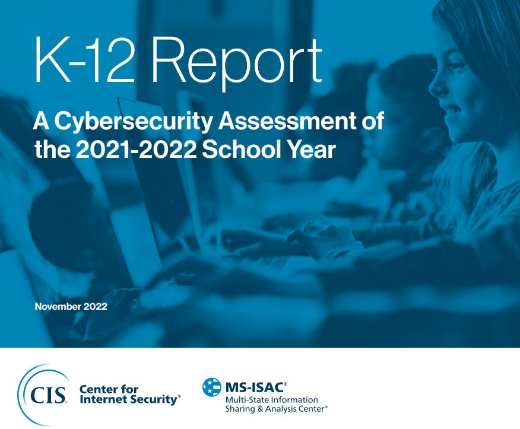

# MS-ISAC Releases K-12 Cybersecurity Assessment for SY2021-2022

MS-ISAC and CIS today released a K-12 Cybersecurity Assessment based on data for the 2021-22 school year gathered from the 2021 Nationwide Cybersecurity Review (NCSR), MS-ISAC member feedback, the CIS (Center for Internet Security) SOC, and threat and data analysis from the CIS Cyber Threat Intelligence Team (CTT).

The report is accessible here (<https://learn.cisecurity.org/k-12-report>) , and is designed for K-12 school and district leaders and IT professionals. There are definitely some good tidbits to take to heart and consider when evaluating your security posture, planning for the future, and getting stakeholders and decision makers onboard.

It’s short, concise, and worth the read on it’s own, but if you need convincing, here are some highlights:

- The K-12 Community has an average cyber maturity rating of 3.55/7, which shows improvement over time but lags behind other sectors
- Top 5 Security Concerns:

  - Lack of sufficient funding
  - Increasing sophistication of threats
  - Lack of documented processes
  - Lack of a cybersecurity strategy
  - Inadequate availability of cybersecurity professionals
- Areas of strength:

  - Identify management and access control
  - Awareness and training
  - Business environment
- Low performing areas:

  - Protective technologies
  - Supply chain risk management
  - Data security
- Top 10 Malware families affecting schools
- Top Malware infection vectors for schools
- Top 5 non-malware threats facing schools
- K-12 web security trends
- Recommendations for improvement
- Services available to MS-ISAC members (do NOT overlook this section)

MS-ISAC membership is a frequent soapbox I get on… If you’re eligible for membership and you aren’t a member, please treat yourself and your organization to an early cyber-Christmas and join. Membership is free to all US State, Local, Tribal, and Territorial government organizations (including public schools) and there is a mind-blowing wealth of resources available (briefly covered here (["Welcome to MS-ISAC"](https://www.edtechirl.com/p/welcome-to-ms-isac)).
