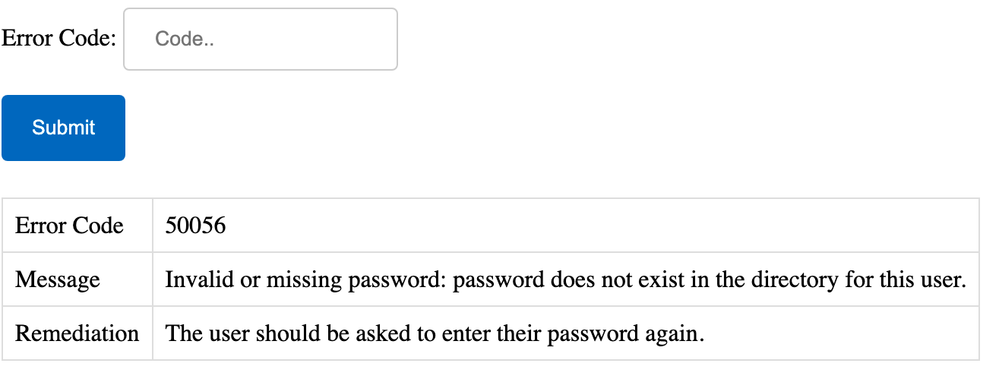

# Troubleshooting Azure AD Error Codes

*Check AAD error codes in a flash*

If you spend any time in Azure, bookmarking this site is a must:

<https://login.microsoftonline.com/error>

Pop in your error code, click submit, and it will explain the message and offer steps for remediation.

For example, entering the error code AADSTS50056 will give the following output:

