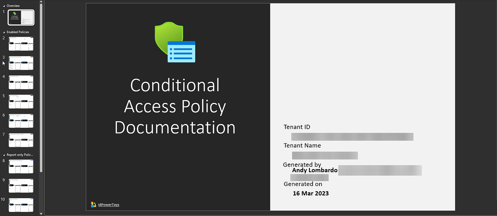
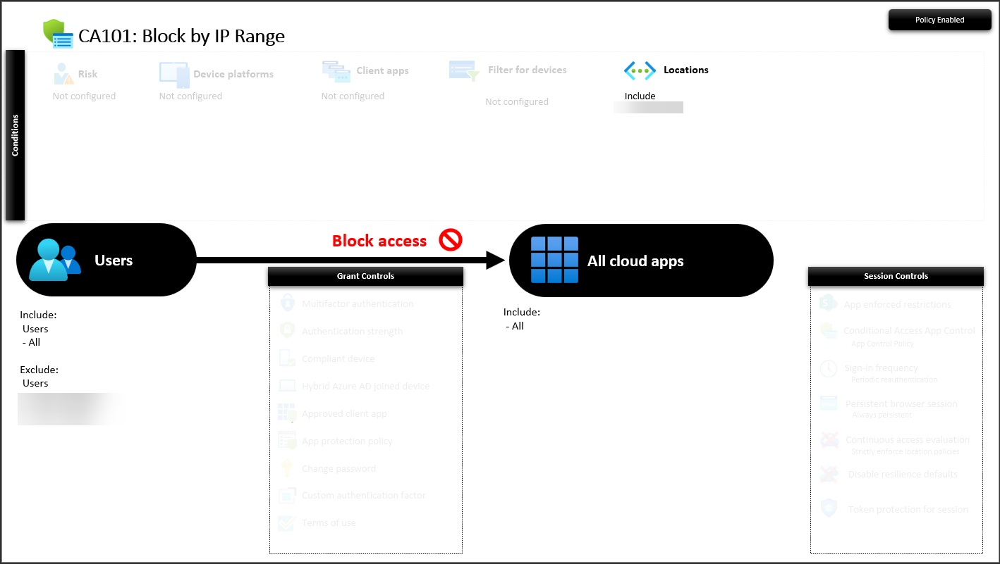

# Document Conditional Access in a Click

Identity PowerToys ([idPowerToys.com](https://www.idpowertoys.com)) is a community project by the Microsoft Identity CxP project that is focused on mini-apps for Microsoft Entra AAD. The first app in the project is Conditional Access Documenter, which does exactly what the name implies - after a sign in, it will pull your Conditional Access policies and format them into a PowerPoint in just a few seconds.

Policies are divided into categories for Enabled, Report-Only, and Disabled. Each CA policy that’s enabled for your tenant is displayed on its own slide, like my CA policy for disabling login access from a specific IP range below:

And that’s all there really is to it - just a quick, visual way to document your CA policies and the promise of future identity-based PowerToys in the future.
