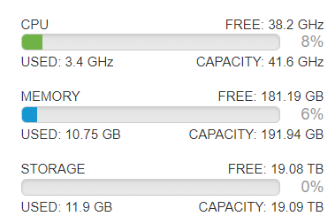

# Getting Started

My previous home lab setup was getting a little cramped, and I’d have to pick and choose which VMs I wanted to run and couldn’t run everything at the same time. Thanks to the relatively low cost of refurbished servers ($449 on [Amazon](https://www.amazon.com/High-End-Dell-PowerEdge-R720-2-60Ghz/dp/B075Z3F37Z/ref=sr_1_3?crid=367RRYYZCTX0U&keywords=high+end+virtualization+server+r720&qid=1679524728&sprefix=high+end+virtualization+server+r720%2Caps%2C179&sr=8-3) for the specs above at the time of writing), it was time to migrate from the [Antsle](https://shop.antsle.com/product/antsle-one-d-4-cores/) I’ve been using as a mini-test environment.

Plotting out my first layer of goals for the new environment, I want to create a test environment where I can test things out in a pre-production environment that could be translated to my work environment.

Up first:

Set up an Active Directory domain

Set up Azure AD Sync from the local domain to my M365 Dev Tenant

Set up Azure AD Password proxy to reset on-prem passwords from the cloud

Set up a local Certificate Authority

Set up a Windows Admin Center shared gateway

Tweaking and tuning M365 security

I intend for this section of edtechirl to be more overview than how-to, so I’ll include links to tutorials where feasible, but otherwise I’m planning for this to be more of a portfolio than a handbook.
