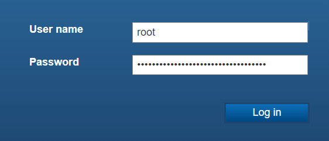
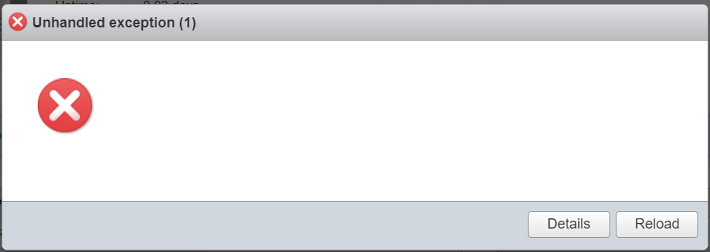
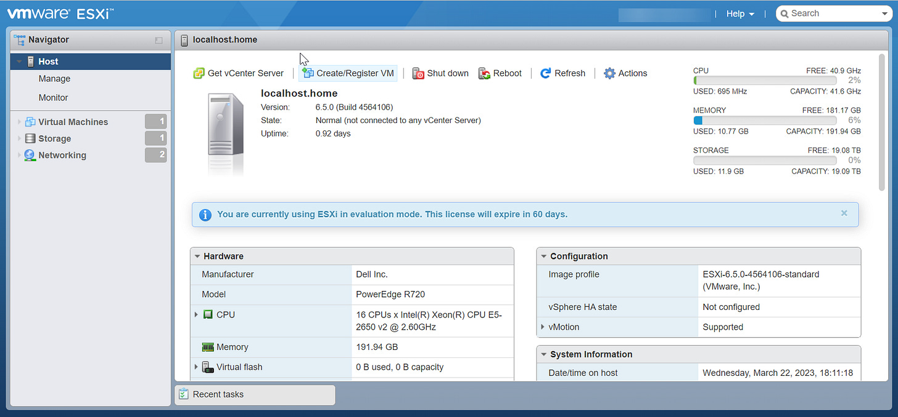

# Weird VMware Quirk

The first obstacle setting up my new server came early… with the first login to VMware. I’m not sure what the variable is, but on a fully updated Edge/Chrome browser and VMware 6.5 there’s an odd bug.

After entering the username and password, if you hit enter you’ll get this error message. When you hit reload, it logs you back out to repeat the process all over again.

Fortunately, there’s a really easy solution.

After entering username and password, click on Login instead of hitting enter.

Or, if you enter an incorrect password, and the page reloads with an incorrect password warning, entering username and password will then work when clicking enter. 🤷‍♂️🤷‍♂️🤷‍♂️

