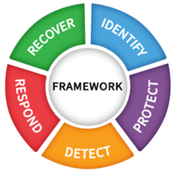
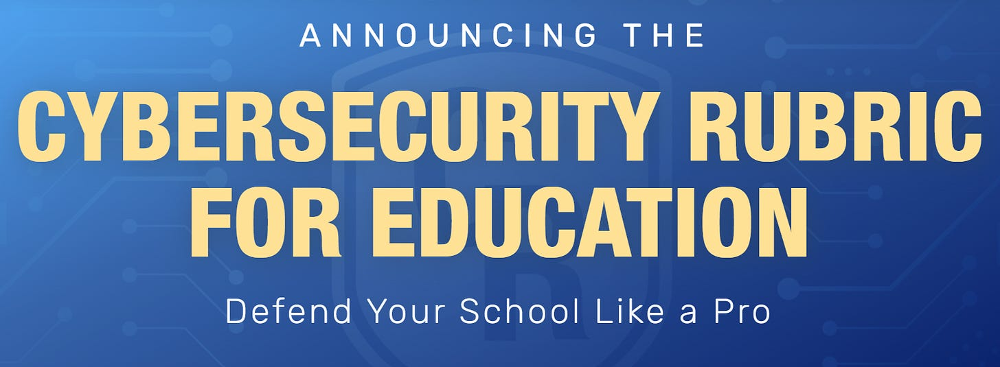

# Become a Certified Cybersecurity Rubric Evaluator

*Free voucher valid till March 31, 2023*

If you’re not familiar with the [NIST Cybersecurity Framework](https://www.nist.gov/cyberframework), it’s a framework for organizations to assess and develop their cybersecurity programs. It’s built around 5 essential functions: Identify - Protect - Detect - Respond - Recover.

While the NIST framework is free, it’s not education-centric and while it’s an industry standard, doesn’t have wide adoption in K12 education. To assist schools with improving cyber posture, the Cybersecurity Coalition for Education (i.e., Classlink & ENA) launched a program last week aimed at helping schools conduct NIST-based self-assessments and, more novel, a process for 3rd party assessments by certified assessors. Details on the education-centric NIST rubric is available at [cybersecurityrubric.org](https://www.cybersecurityrubric.org/).

For more details on the assessment rubic, the webinar launching the program is available at the [Classlink webinars site here](https://www.classlink.com/resources/webinars). As part of the 3rd party assessments, attending the webinar will give you information on accessing training, the rubric, and other tools, but also includes a discount voucher for the Certified Cybersecurity Rubric Evaluator that’s valid until March 31 (SPOILED: the $99 code is CCRE4ME). If you’re not ready to take the exam, you can still register for the training using the code and take the exam after March 31.

Whether you’re interested in the training or certification for evaluating your own environment or someone else’s, the training, rubric, and other resources are a great jumping off point for conducting your own NIST-based self-evaluation. As the program grows, the hope is that enough folks in the K12 Cybersecurity space will be familiar with the NIST framework and the accompanying growth and maturity models to be able to collaboratively work together to objectively evaluate cybersecurity programs.

**The Exam**

The provided free training is largely an overview of the role of rubric evaluators, how to conduct interviews to gather evidence when evaluating a cybersecurity program, and the evaluation report that accompanies an audit. The certification exam is a 50 question, 100-minute open-book exam that is heavily focused on matching sample critera with a rating on the rubric. The passing score for the certification is 85, and there are two attempts allowed.
