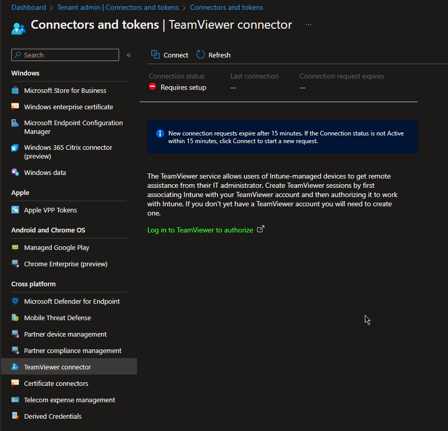
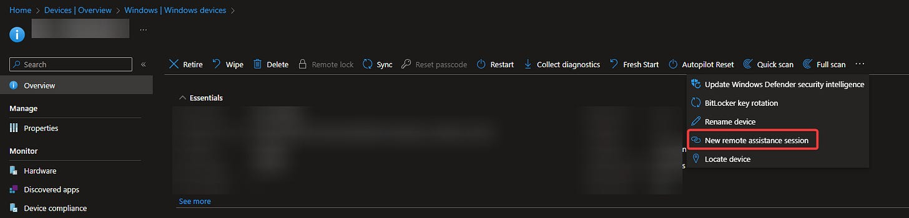
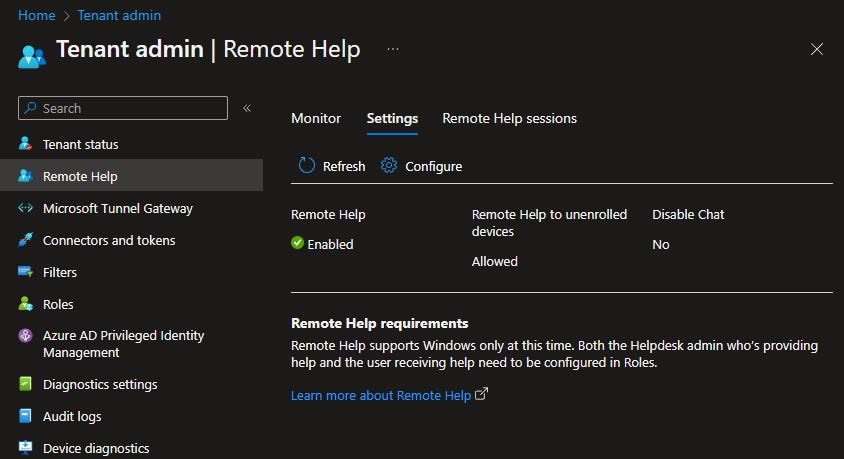
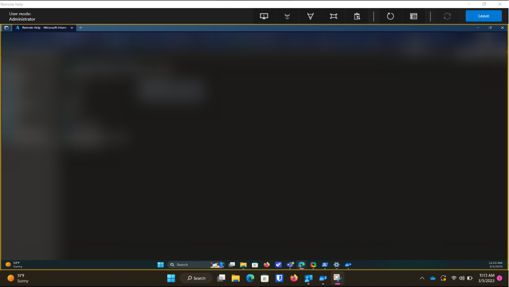

# Intune Remote Access Options: TeamViewer vs RemoteHelp

*I did the research on both, so you don't have to.*

Intune has two featured remote support options that you can push to your devices today. This article is going to give a breakdown of what those two options are and what the differences are between them.

### TeamViewer Integration

The German juggernaut of Remote Access Software, TeamViewer, does have a direct tie in with Microsoft Intune. For the TeamViewer Integration, you will need to have an *existing* TeamViewer Account and connect it to your Intune tenant.

Once your accounts are connected, you can remote into devices using the Remote Assistance button when looking at the Managment page of a device in Intune. By default, you can remote into your devices without any additional software as long as you are pushing the Company Portal app to those devices. If you are, company portal will be used to launch your (user attended) remote session.

You can also set up TeamViewer to work with unattended remote sessions, however, you will have to push a custom TeamViewer installer separately to get this to work.

**Pros**

- Unattended Installation Options
- No installer to push for basic remote sessions
- Support for multiple OS’s
- TeamViewer features (clipboard and file transfer, etc.)

**Cons**

- May be price prohibitive for many schools

### RemoteHelp

I normally think of RemoteHelp as the enterprise version of Microsoft QuickAssist. It feels and looks identical. The biggest difference to QuickAssist vs RemoteHelp is that you can ‘run as administrator’ from RemoteHelp on standard user accounts. RemoteHelp is also tied to your Azure Tenant. This makes for a nice added layer of security, as only admins in your tenant can remote into your devices using the RemoteHelp app.

The setup of remote help is a little lengthier, but nothing crazy. RemoteHelp is a premium add on for intune. You will need to purchase licenses for each user that you want to have access to remoting into other devices. If you already have the Intune Suite, Remote Help is included in this.

Once you purchase licenses, you will need to make a group in Intune for your RemoteHelp Admins and create a custom role to assign to that group that has your RemoteHelp permissions. After this you will need to push the RemoteHelp program as a Win32 package (this is also very well documented in the Microsoft Forums, if you are inexperienced with Win32 packaging).

Creating a session is similar to creating a session with QuickAssist. You can either open the RemoteHelp app on your computer and send a code to your end user, or you can generate the code directly in Intune using the same Remote Assistance button on the device page, however this will just launch your RemoteHelp app as well. Once you have a code generated, you give that to your enduser within the 10 minute time window. The end user will put in the code on their RemoteHelp app. Then the admin will ask for permissions to take control of the computer or just view. The end user will then have to accept those permissions before the admin can get to work. It is a lengthy process, especially compared to TeamViewer.

**Pros**

- Microsoft supported
- Very affordable
- Familiar to anyone who’s used QuickAssist

**Cons**

- No unattended access options
- Only support for Windows and Android remote sessions
- Can feel lacking in features

### Overall Comparison

I think if you really value the additional features of TeamViewer (unattended access, extra tools, OS support) then it is the clear choice. However, for many school districts it may not even be an option. When I called their support to get ideas on pricing, they said for my school district we would require the Tensor license so we could remote into all of our devices, which was completely out of budget. Because of this, we ended up going with RemoteHelp for a fraction of the price. It’s not as convenient as unattended access, however, with coordination between the admin and end user, you will be able to get the job done using this tool. I will be excited to see if Microsoft decides to expand on RemoteHelp in the future, considering they have now added it as a selling point for the new Intune Suite.

### Resources

**TeamViewer**

[TeamViewer Integration for Microsoft Intune](https://www.teamviewer.com/en-us/integrations/microsoft-intune/)

[Remotely administer devices in Microsoft Intune | Microsoft Learn](https://learn.microsoft.com/en-us/mem/intune/remote-actions/teamviewer-support)

[Intune Integration - Installation and User Guide - TeamViewer Support](https://community.teamviewer.com/English/kb/articles/45766-teamviewer-user-guide-for-intune?_ga=2.129557903.2081692127.1674948729-146607603.1661784366)

**RemoteHelp**

[Remotely assist users that are authenticated by your organization. | Microsoft Learn](https://learn.microsoft.com/en-us/mem/intune/remote-actions/remote-help)

[Microsoft Endpoint Manager - Intune Remote Help - YouTube](https://www.youtube.com/watch?v=UYeuP1xS2yE)
