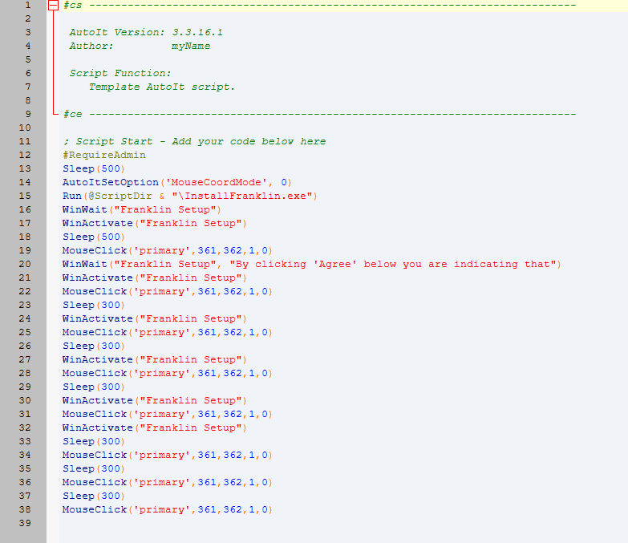
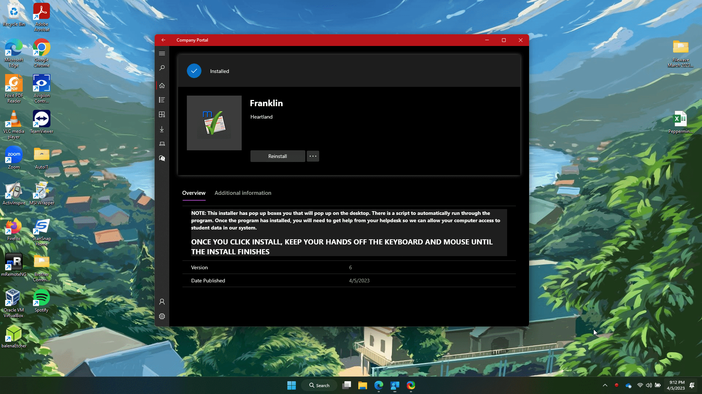
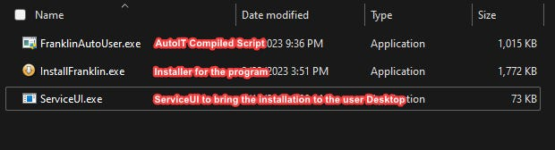
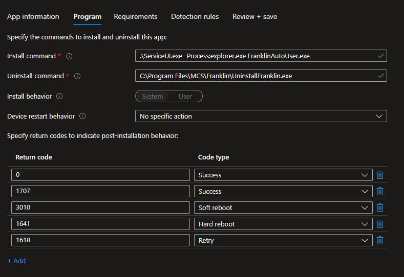

# Automating Interactive Program Installs through Intune

*Automating what isn't meant to be automated!*

### Introduction

This all started with a need I had to try and automate program installations that do not support silent installs and push it through intune. The solution I kept running into was to use the Powershell App Deployment Toolkit and package the program as a win32. However, this normal suggested solution doesn’t actually automate the install, as users are still required to make each click in the installer and has the potential to choose settings that you would not want.

While trying to research this, I found the coolest IT tool I’ve seen in a long time, AutoIT. AutoIT is like a leveled-up version of AutoHotKey. With this, you can create macro scripts to walk through installers by have the script inject either mouse clicks or key presses. The best part, after you are finished, **you can compile it as an executable.**

After a weekend of struggling, I eventually found a way to use this tool in conjunction with intune to automate old pesky installers, and potentially even more.

###### Video of it in action

### Pre-requisites

Here’s what you’ll need.

- [AutoIT](https://www.autoitscript.com/site/autoit/downloads/) - Scripting Langauge for creating the automation
- [ServiceUI.exe](https://www.microsoft.com/en-us/download/details.aspx?id=54259) - a tool included in the Microsoft Deployment ToolKit. Used for forwarding System Context dialog options to the user desktop
- Pesky installer of choice
- The Win32 Application Utility - Used for packaging your program files into a .intunewin file

### Getting to the automagic

The first thing we need to do is walk through our installer and figure out a way to automate each individual button press for the user. AutoIT does have a bit of a learning curve, but if you have experience with RubberDucky scripting or AutoHotKey, you will have a leg up on this one. Regardless, I highly recommend the tutorial below for setting up your first script.

My automation script looked like this, after I finished. Be sure to get the script working locally, before moving forward. If the script has issues here with the install, it will continue to have issues after being packaged and pushed.

After you have perfected your script, you will need to compile it into an executable.

### Packaging the Program

Next, we will need to package everything together. I’m going to assume that if you’re having this issue, that you’re familiar with Win32 packaging. If not there are plenty of great tutorials on it. Your source folder should have **ServiceUI.exe, TheInstaller.exe, and AutoITCompiledScript.exe** . It will look something like this.

###### Note: ServiceUI.exe can be found after installing the Microsoft Deployment Toolkit at this directory

###### "C:\Program Files\Microsoft Deployment Toolkit\Templates\Distribution\Tools\x64\ServiceUI.exe"

Whenever you package it, make sure that the AutoIT compiled exe is the setup file you choose. I don’t believe this matters too much, but I believe this determines when it runs detection rules, and we want detection rules to run after our automation script finishes running, as the installer should be done by then.

Once you have your .intunewin file, you are ready to upload to intune.

### Uploading to Intune

Open Intune and go to add a Win32 Application. Here you will need to make sure that your install command matches the following format.

> **.\ServiceUI.exe -Process:explorer.exe AutoITCompiledScript.exe**

Mine looks like this.

Using this install command is important, because without the ServiceUI executable, everything will run in the system context and none of the pop up boxes will appear, nor will any of the keystrokes or mouse clicks from our script happen.

For the uninstall command, you can make a script for uninstallation too, or reference the uninstall file from Control Panel.

After this, create your detection rule for your program and assign this as a Kiosk Association to your desired group. Give it a test and it should install the way it did before packaging, all from Company Portal Kiosk!

### What this is, and what it isn’t.

This isn’t a perfect solution. As far as I know, this doesn’t work at all outside of Kiosk installs, however, in most of my use cases, these programs are better as kiosk associations anyways. This also isn’t meant to replace programs that have silent installation compatibility. It is much too time consuming for that, but can be a nice last-ditch effort.

This does provide a pretty sure-fire way to add some automation to even the peskiest of installs, making it end-user friendly.

### Future Potential

There is future potential to make this process even better. I know AutoIT has a lot of extra functions that I’ve barely scratched the surface on. I know there are some for blocking user input and creating message boxes that I plan on exploring to see if I can make my current install scripts better.

There is also lots of potential to create automated fixes for known issues and uploading them to company portal. You can do this already with powershell scripts, but this adds a vast amount of possibilities to

Pretty slick if I don’t say so myself!
