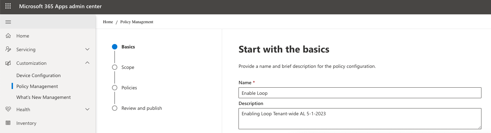
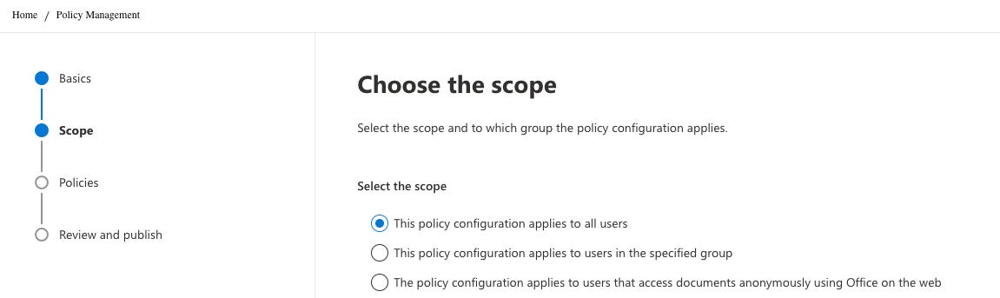
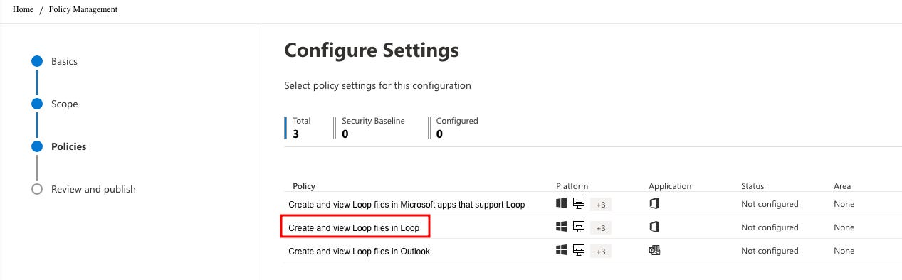
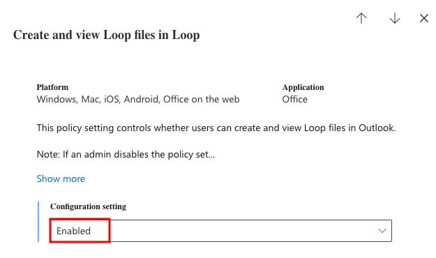
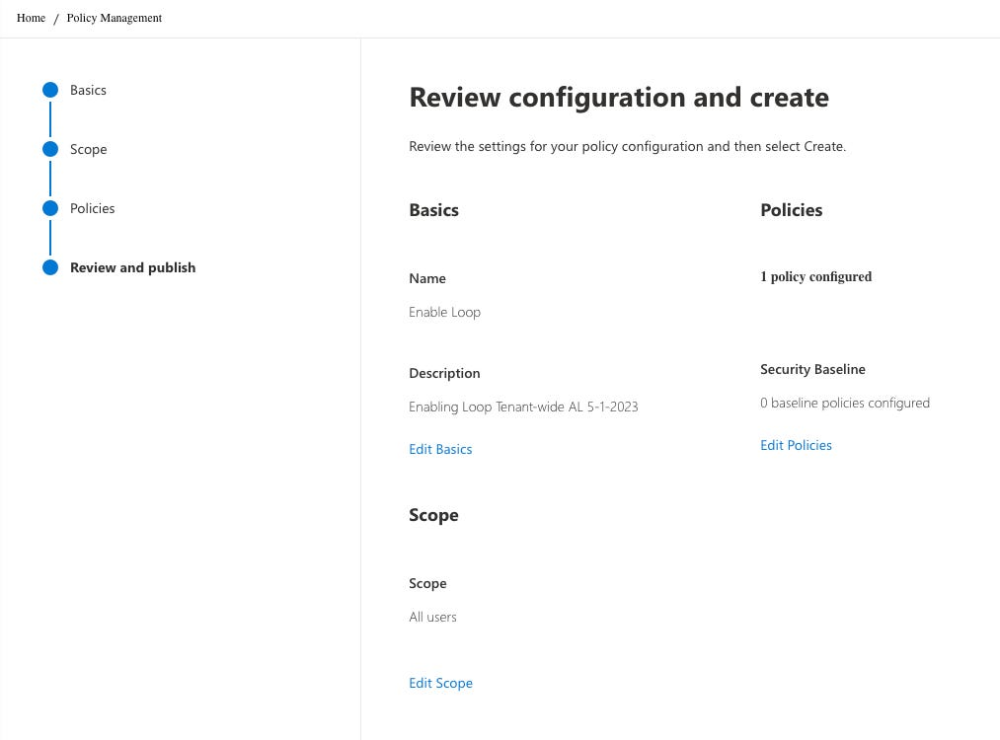
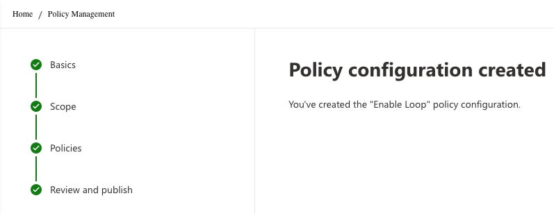
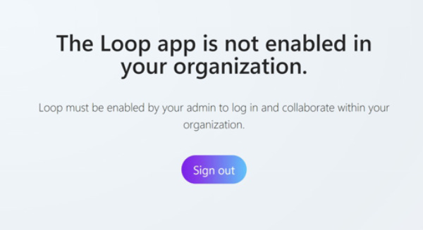
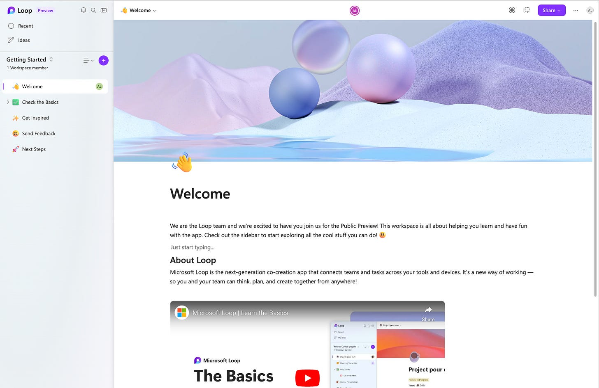

# Get in the Loop!

*Enabling Microsoft Loop Public Preview Tenant-Wide*

As a rabid Notion fan, I’m downright giddy to see Microsoft Loop. After launching in public preview a few weeks ago, I wanted to see if Loop could replace my paid Notion subscription, but the first hurdle was being able to access it.

To enable Loop in public preview, you first need to decide if you want to provide access to a specific group or your whole tenant. It’s always a good practice to test small before rolling out to everyone, so I’ve already done this process with users in my department. We’re three weeks in and everything has gone smoothly (knock on wood), so I’m now ready to provide access district-wide. As you’re going through this process, after deciding on the group, you’ll have to create a Cloud Policy and attach it to the group. The final step is the easiest, as it’s just wait an hour or so for the policy to propagate to your users.

**Here we go…**

1. Go to config.office.com and sign in with your M365 account.
2. Navigate to Customization —> Policy Management to create a new policy to allow Loop. Name the policy something obvious, and add a description. I also like to include my initials and a date created tag to my descriptions so Future-Me can have a little help when I come back and look at this a year or two from now.

3. Choose the appropriate scope that you want to push Loop to. I’ve already tested loop in a smaller test group, so I’m just going to go ahead and scope it to all users:

4. On the policies screen, search for Loop and select Create and view Loop files in Loop. You don’t need to configure the other two settings related to Outlook and other Microsoft apps because they’re on by default when you select “Create and view Loop files in Loop.”

5. In the blade that opens when selecting Create and view Loop files in Loop, be sure to Enable the configuration setting:

6. Apply the setting above, then click Next, and you’ll be at the Review and Publish tab:

7. Make sure the scope and settings look appropriate, then click “Create” at the bottom of the page.

**At this point, Loop should be enabled for your scoped users, and should be accessible after the policy has a chance to propagate within an hour or so.**

In my demo tenant, this took about 5 minutes to become active. When I did it in my actual production tenant, it took about 45 minutes before all of my test users were able to access Loop.

Until the policy has taken effect, your users will see a message like below:

Once it’s ready, your users should see something like this when they log in to Loop.Microsoft.com:

**Additional Resources:**

[Manage Loop experiences (Loop app and Loop components) in SharePoint - SharePoint in Microsoft 365 | Microsoft Learn](https://learn.microsoft.com/en-us/sharepoint/manage-loop-components)

[First things to know about Loop components in Microsoft Teams - Microsoft Support](https://support.microsoft.com/en-us/office/first-things-to-know-about-loop-components-in-microsoft-teams-ee2a584b-5785-4dd6-8a2d-956131a29c81)

[New Microsoft Loop app is built for co-creation | Microsoft 365 Blog](https://www.microsoft.com/en-us/microsoft-365/blog/2023/03/22/new-microsoft-loop-app-is-built-for-modern-co-creation/)
