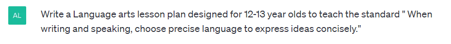
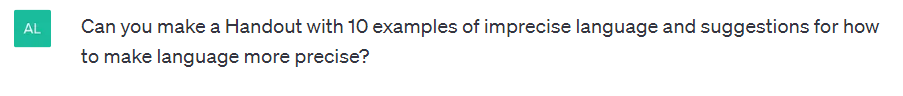

# Obligatory Chat-GPT Post

*Instead of focusing on the Chat-GPT Devil, how about focusing on how Chat-GPT can help teachers?*

Most of the talk in schools that I’ve heard about iterative Artificial Intelligence tools like Chat-GPT has been centered around how to restrict it, namely how to block students from using it and how to detect it when it’s being used. While academic integrity has a valid place in the conversation, I think that’s missing the mark. It reminds of when I was an English teacher, which was long enough ago that I remember the speculation that having spellcheck in word processors was going to cause an entire generation of people to not be able to spell. I remember as a classroom teacher having to configure an entire computer lab to disable spellcheck in Word so students couldn’t use it to cheat. Instead of spellcheck causing the downfall of civilization, what’s really happened is that people who “can’t spell” now have a tool to help them communicate more clearly, and when that tool is used their writing is elevated. While that may be over-simplifying the issue of iterative AI, I feel like we’re dealing with a similar balancing act between usefulness and fear.

I could go on at length about how Chat-GPT has helped me as a parent to help my neurodivergent, Language Arts-hating child to organize their thoughts and outline for writing. It’s also helped me as a professional to gain additional perspective when I’m stuck looking at a problem from the wrong angle. It’s a great productivity tool, too. But today I want to look at a real, concrete way Chat-GPT can help teachers.

**Lesson Planning with Chat-GPT**

First, I realize that teaching is an art and a craft, and one of my core beliefs has always been that “any teacher who can be replaced by a computer, should be replaced by a computer” (Isaac Asimov, from *I, Asimov: A Memoir*). That being said, there are times when you are stuck on a lesson, or need to come up with a quick lesson for a substitute. So let’s use the scenario that you need to come up with a quick lesson that meets the 7th Grade TN State ELA Standard for use of precise language:

Standard 7.L.KL.3: When writing and speaking, choose precise language to express ideas concisely.

Entering the below prompt in Chat-GPT elicits the following response:

---

Title: Choosing Precise Language for Effective Communication

Grade level: 7-8

Duration: 45-60 minutes

Objectives:

- Students will understand the importance of using precise language in both writing and speaking.
- Students will practice identifying and using precise language in their own writing and speaking.
- Students will develop their critical thinking skills by analyzing the effectiveness of language choices in various forms of communication.

Materials:

- Whiteboard or chalkboard
- Markers or chalk
- Handout with examples of imprecise language and suggestions for how to make language more precise
- Examples of written and spoken communication (e.g. news articles, speeches, advertisements, etc.)

Introduction (5-10 minutes):

1. Begin by asking students if they have ever heard the phrase "less is more". Discuss with them what this phrase means and how it applies to communication.
2. Explain to students that in order to effectively communicate their ideas, they must choose precise language.
3. Define the term "precise language" and provide some examples of how it can improve communication.

Body (30-40 minutes):

1. Distribute the handout with examples of imprecise language and suggestions for how to make language more precise. Review the handout with the students.
2. Divide the class into small groups and give each group a different example of written or spoken communication (e.g. news articles, speeches, advertisements, etc.). Ask each group to identify examples of imprecise language in the communication and suggest ways to make the language more precise.
3. Have each group present their communication examples to the class and discuss the effectiveness of their suggestions for using precise language.
4. Ask students to choose a topic they are passionate about and write a short paragraph about it using precise language.
5. Have students share their paragraphs with the class and discuss how the use of precise language improved the effectiveness of their communication.

Conclusion (5-10 minutes):

1. Recap the importance of using precise language when writing and speaking.
2. Encourage students to continue practicing using precise language in their communication outside of the classroom.
3. Ask students to reflect on how they will apply what they have learned about using precise language to their future writing and speaking.

Assessment:

- Observe student participation in group discussions and class discussions.
- Evaluate student paragraphs for the use of precise language.
- Have students reflect on their learning in a short written reflection or class discussion.

---

Now, at a glance, that looks like a pretty solid (albeit basic) lesson that meets the standard. But it’s not turnkey. Let’s tweak our scenario and say it’s 6AM, and we need a lesson for the sub at 7:30. You have a raging migraine, and you’re in no shape to fully flesh things out. What else does the lesson above need?

- Handout with examples of imprecise language and suggestions for how to make language more precise
- Examples of written and spoken communication (e.g. news articles, speeches, advertisements, etc.)
- A way to evaluate student paragraphs for the use of precise language.

Let’s check back with Chat-GPT for help.

Sure, here's a handout with 10 examples of imprecise language and suggestions for how to make language more precise:

---

Examples of Imprecise Language and Suggestions for Precision

1. Vague language: "That's a nice shirt." (What makes the shirt nice?) Suggestion: "That's a stylish shirt."
2. Overused adjectives: "The incredible, amazing concert." (Pick one or two strong adjectives to describe the concert.) Suggestion: "The unforgettable concert."
3. Clichés: "Time flies when you're having fun." (Use original language to convey your message.) Suggestion: "Time seems to pass quickly when you're enjoying yourself."
4. Passive voice: "The window was broken." (Who broke the window?) Suggestion: "Someone broke the window."
5. Ambiguous pronouns: "He gave her the gift, but she didn't like it." (Which person didn't like the gift?) Suggestion: "He gave her the gift, but she didn't like the perfume."
6. Using "thing" or "stuff" instead of a specific noun: "I have to grab my stuff." (What specific items do you need to grab?) Suggestion: "I have to grab my backpack and my notebook."
7. Overgeneralization: "Everyone knows that." (Not necessarily true for everyone.) Suggestion: "Many people know that."
8. Colloquialisms or slang: "I gotta bounce." (Use standard English to convey your message.) Suggestion: "I have to leave."
9. Unnecessary words: "In my opinion, I think that pizza is really good." (Simplify the sentence by removing unnecessary words.) Suggestion: "That pizza is really good."
10. Unclear antecedents: "After he saw her, he told her he loved her." (Who saw whom?) Suggestion: "After John saw Mary, he told her he loved her."

Sure, here's an example of a news article that contains imprecise language:

"Several people were injured in a car accident on Main Street yesterday. The driver lost control of the vehicle and hit a number of objects before crashing into a wall. Some of the injured were taken to the hospital, while others were treated at the scene."

While this news article provides some basic information about the car accident, there are several instances of imprecise language that could be clarified to provide more details. For example:

- "Several people" is vague and doesn't provide a specific number of individuals who were injured.
- "A number of objects" is also imprecise and doesn't specify what the driver hit before crashing into the wall.
- "Some" of the injured were taken to the hospital, but it's unclear how many people were hospitalized and how many were treated at the scene.

To make the language more precise, the news article could be revised to include more specific information, such as:

"Five people were injured in a car accident on Main Street yesterday. The driver lost control of the vehicle and hit a fire hydrant, a mailbox, and a parked car before crashing into a brick wall. Two of the injured were taken to the hospital with serious injuries, while three were treated at the scene and released."

Sure, here's a 6 point rubric for evaluating student writing for use of precise language:

1. Exemplary: The writing consistently uses precise and descriptive language to convey ideas clearly and effectively. The language is varied and engaging, enhancing the reader's understanding and enjoyment of the text. The student has chosen words and phrases that are accurate, specific, and appropriate for the intended audience and purpose of the writing.
2. Proficient: The writing generally uses precise and descriptive language to convey ideas. While there may be some imprecise language or a few instances of wordiness, the overall effect is clear and effective. The student has chosen words and phrases that are mostly accurate, specific, and appropriate for the intended audience and purpose of the writing.
3. Developing: The writing shows some attempt to use precise and descriptive language, but may lack consistency or clarity in certain areas. The student may use vague or overused language at times, and the overall effect may be weakened by wordiness or imprecise expression.
4. Emerging: The writing shows limited use of precise and descriptive language, with a tendency towards vague or overused language. The student may struggle with selecting appropriate and accurate words and phrases to convey their ideas, resulting in imprecise or unclear expression.
5. Insufficient: The writing uses imprecise and unclear language that detracts from the reader's understanding and engagement with the text. The student may rely on cliches or jargon, or struggle to convey their ideas in a clear and effective manner.
6. Incomplete: The writing is incomplete or does not provide enough evidence to evaluate the use of precise language.

---

That whole process, including me writing this article around the Chat-GPT session, has taken less than 10 minutes. Is the lesson plan perfect? No. Do you need to review everything the AI gives you to review for accuracy and appropriateness? You betcha. But does it give you a solid foundation to build on? Absolutely.

As a teacher, getting comfortable with using a tool like Chat-GPT can help elevate your craft. By outsourcing the work that a computer **can** do, you free yourself up to focus on the parts of what you do that can’t be replaced by a computer. As a teacher, I know I had many days where I was off my game in the classroom because I was up till 2AM the night before writing sample sentences for a worksheet or writing anchor essay exemplars for students to dissect. With the tools that are available now, that part of the job can be as easy as a quick chat with your new robot overlords.
