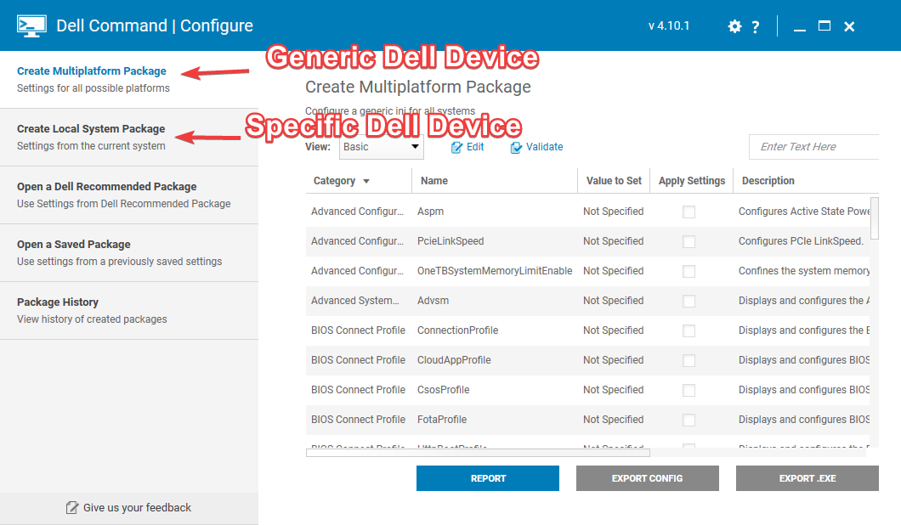
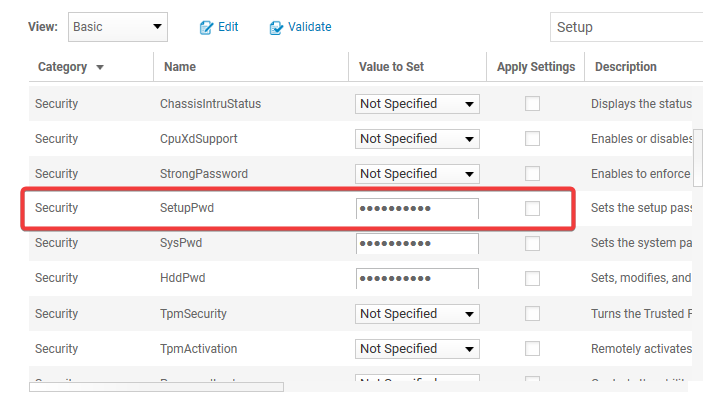
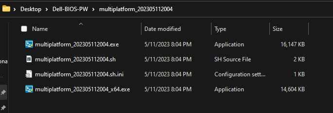
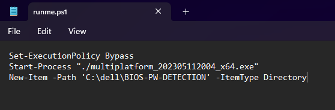
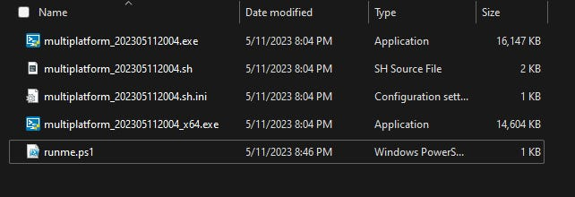
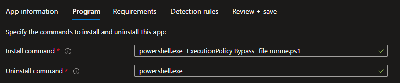
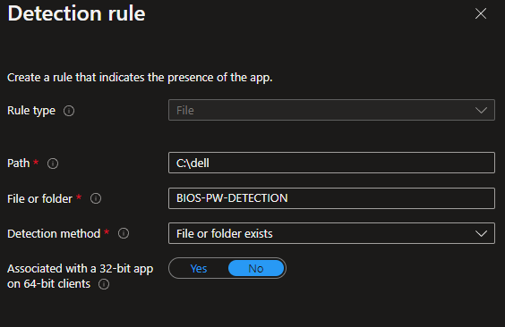
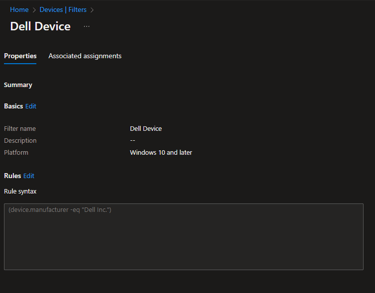

# Revised - Pushing changes to Dell BIOS settings with Intune

*Now revised with a powershell script alternative!*

### Introduction

**NOTE: The majority of this article covers how to change dell BIOS passwords using Dell Command | Configure, however in testing this hasn’t been as reliable as I had originally hoped. I recommend scrolling to the bottom of the article and using the Powershell method instead.**

In the K12 environment, a common pain point for student devices is changing BIOS settings. Though 99% of students wouldn’t even care enough to try and get into their device’s BIOS, the pesky 1% require that we protect our devices from misuse. The catch: this is VERY time consuming. In the past, we got so fed up with manually setting up BIOS passwords on our new laptops that we even bought USB rubber duckies to script the keystrokes to add a BIOS password. Luckily, with Dell Command Configure, you can secure your end user devices without having to touch a single one.

### Dell Command Configure

To pull off this magic, you must use the program [Dell Command | Configure.](https://www.dell.com/support/kbdoc/en-us/000178000/dell-command-configure) Configure is a part of Dell’s proprietary management program suite. It is specifically made for allowing users to easily change BIOS settings. First thing you will need to do is install Configure on a device. Once you have it installed, it is important to know that there is a GUI version (Dell Command Configure Wizard) and a command line version (Dell Command Configure Prompt) that installs on your device. For this tutorial, we will use the GUI version.

Once you launch Dell Configure Wizard, you will need to select from the side bar menu which type of package you would like to make. If you want to create a generic package that will be compatible\* with all Dell Devices, you will want to choose the ‘Create MultiPlatform Package’ option. Note, that it will be “compatible*”* with all Dell devices, but that doesn’t mean every setting you configure will work on any Dell device. For example, if you change BIOS settings related to TPM in the package and push it to an older dell device that doesn’t have a TPM chip, it will change all other settings that are applicable to the device, but skip the TPM setting as it does not apply to the device.

If you want to choose settings for a specific model of Dell Device, you can install Dell Command Configure on that model of device and choose the ‘Create Local System Package’ option. This will allow you to choose specific BIOS settings that apply to the device you are running Configure on.

You also have the option to use one of Dell’s recommended packages. These are prebulit by dell with their recommended BIOS settings.

Once you are on the right tab, you can click the ‘edit’ button at the top and go through the list of BIOS settings that you wish to configure. For this example, we are going to keep it simple and just set a simple admin BIOS password. If you would like to do this too, note that it is referred to as a ‘SetupPwd’ in this tool.

Once you have configured all settings changes, we will click the ‘Export .EXE’ option at the bottom of the wizard. Once you do, you will need to specify the current BIOS, system, or HDD passwords of your device, if there is one.

Once it has been exported, you should have a folder that contains your EXE’s. Note that there is two, one for 32-bit and the other for 64-bit operating systems.

### TEST TEST TEST TEST TEST TEST TEST TEST

I **highly** recommend running this on one of your end user devices to make sure it works correctly and changes the desired settings, before pushing this out in mass to all devices. The last thing you want to do is create a mess, especially where this is dealing with device firmware.

### Writing an Install Script

Next, we will write an installation script.

**DISCLAIMER**: This is probably not the best way to do this. The only reason I am creating an install script is because I needed some way to create a detection rule. Where this is changing a BIOS setting, I am unsure of a way to have the device check to see if the BIOS password was set. Instead, what I opted to do was create a custom installation script that, as part of the script, would create a folder under C:\dell after it finished running the BIOS configuration executable. This way we can use that folder to make sure the script ran correctly on the end user device, but in general this is not the best practice.

My installation script is short and sweet. It runs the installer and then creates a folder.

Again, I would test this on a device to make sure this does kick off the installer, changes the BIOS settings on your end user device, and that it creates the folder.

### Packaging the Program and Intune Configuration

Lastly, we will need to package the program and upload it to Intune. I am packaging mine as a Win32. If you don’t have experience packaging programs as Win32 packages, here is [Microsoft’s Documentation](https://learn.microsoft.com/en-us/mem/intune/apps/apps-win32-app-management).

When you package it, I would package everything that was created when you exported your BIOS configuration as an EXE, and of course add your install script as well.

Zip it up into a .intunewin file and upload it to intune.

For the install script, you will need to have it launch powershell and run your install script. For uninstall script, I just put in to launch powershell.exe . This obviously won’t uninstall the script. If you wanted to create an uninstall script, you could set up a second package that is blank as far as BIOS settings goes and run that as the uninstall script. For me, this won’t be necessary. If I ever need to change the BIOS settings that are being pushed to the device, I will either update the .intunewin file with a new configure exe and detection rule, or create a whole new package from scratch to replace the current one.

Under detection rules, I am having it check to see if the folder in my script was created. If it detects that folder after the script has ran, it will consider it a successful install.

Lastly, I would consider creating a filter (under Devices then Filters in Intune) before assigning this to devices. I made one that checks to see if the device is manufactured by Dell.

Then whenever you assign the app to a group, make sure to have it filter to *include* devices within this filter. This means that Intune will only push this app to devices that meet the criteria of this filter. That way, if you have a non-Dell device in the group you are assigning the BIOS app to, it will not attempt to push this package to it.

If it were me, I would push this to a single device before pushing it out to your entire device group. Once you confirm it works the way you want it to, then I would apply it to the entire device group.

### REVISION - Dell Command | Powershell Provider

I ended up revisiting this as I found later that we did have some false positive devices that were reporting back to have an updated BIOS password with our detection rules but did not have one set. I ended up finding a new way to change Dell BIOS settings using Dell’s BIOS Provider PowerShell module, and I found it to be more consistent and recommend it over the previous way. I am leaving the original article intact for historical purposes or in case someone needs to reference it later, but if you plan on implementing this yourself for the first time, I advise you to go this route instead.

I have created scripts for creating a new BIOS password and updating an existing BIOS password. I have uploaded these into intune as scripts instead of packaging them as Win32. The biggest reason for this is because detection scripts after you have a BIOS password applied is tricky to figure out. With the powershell module you can figure out if a password is set, but you cannot tell the value of the current password. Whenever you upload your script to intune, be sure to change the script setting to run the script in 64bit Powershell, as the module is not compatible in 32bit Powershell.

### BIOS Password Script

If all you wish to do is create a BIOS password for your Dell devices that currently do not have any, you can use the following script below.

[Github | Set-New-Dell-BIOS-PW](https://github.com/bradywidener/Dell-BIOS-Scripts-for-Intune/blob/main/Set-New-Dell-BIOS-PW.ps1)

### Updating BIOS Password Script

This script will allow you to update a BIOS password to a new one. You will need to previous password for this to work.

[Github | Update-Dell-BIOS-PW](https://github.com/bradywidener/Dell-BIOS-Scripts-for-Intune/blob/main/Update-Dell-BIOS-PW.ps1)

### BIOS Password in Dell Command | Update

If you are using Dell Command Update with your devices (a program that is used to keep track of driver and firmware updates on your devices) you may need to add the BIOS password to the program so it will be able to update firmware. This can be done with the script below. Note, users will not be able to see the password in the program and only users with admin rights can clear the password saved in Dell Command Update.

[Github | Set-Dell-BIOS-PW-in-CommandUpdate](https://github.com/bradywidener/Dell-BIOS-Scripts-for-Intune/blob/main/Set-Dell-BIOS-PW-in-CommandUpdate.ps1)

### References for Dell Command | Powershell Provider

If you wish to do other things besides setting a BIOS password, I advise you check the documentation below on the module.

[Dell Command | Powershell Provider](https://www.dell.com/support/kbdoc/en-us/000177240/dell-command-powershell-provider)

[Powershell Provider User’s Guide](https://dl.dell.com/content/manual37680244-dell-command-powershell-provider-version-2-7-user-s-guide.pdf?language=en-us)

[Powershell Provider Reference Guide](https://dl.dell.com/content/manual33113077-dell-command-powershell-provider-version-2-7-reference-guide.pdf?language=en-us)
