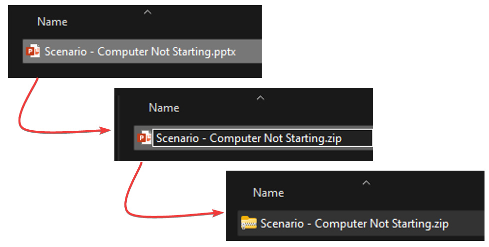
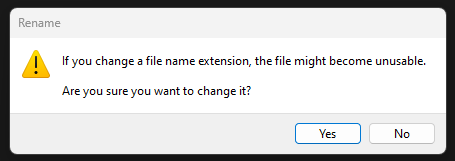
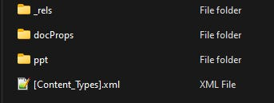
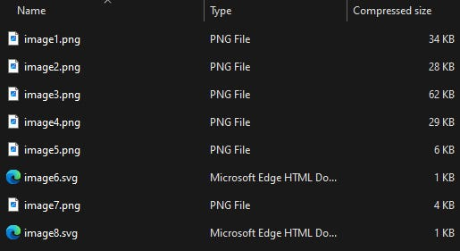
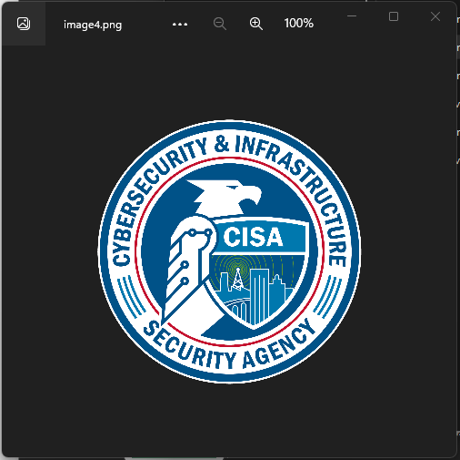

# A Peek Inside Office Files

*Looking behind the .docx curtain*

On a practical side, have you ever had a Word or PowerPoint document that has a picture embedded in it, and you want a copy of the picture file? Sure, you could just take a screenshot, but did you know you can also take a peek inside the document itself?

The reason is pretty cool - all of the modern Office files like docx, .pptx, .xlsx, etc., are all compressed XML-based documents. So all you have to do to see the components of the file is change the file extension to .zip and then extract the folder.

> Note: If you don’t have “View File Extensions” enabled in File Explorer, go ahead and do that by opening File Explorer and selecting View —> Show —> File Name Extensions.

Then, right-click on the file you want to extract and select Rename.

Change the file extension from .pptx to .zip like below:

You’ll be prompted by the intimidating prompt below, but say Yes.

Now, to view the contents of your zip file, just double-click on it in File Explorer to view the contents (or, right-click on it and Extract All to fully unpack it. You should now see a file structure similar to this:

Open the ppt folder and then the media folder. You’ll now see all of the media assets associated with the file.

In my case, I wanted to make a copy of the CISA logo that’s image4.png. I just have to copy that and paste it into one of my own directories, and I now have the full-quality copy of that image rather than a screenshot.

So what are some other uses for this? On the investigative side, I’ve had situations where I’ve gotten an alert from Microsoft that a user has uploaded or shared a malicious document in OneDrive, or Microsoft Defender on a user’s computer has detected malware in a document. This trick gives you the ability to be able to (carefully) dig into the guts of the file and inspect the specific malicious component. In a recent example of this, I had a user who uploaded a PowerPoint document to OneDrive that Microsoft flagged as malicious. After getting a second opinion from VirusTotal, the malicious component was shown to be a specific file bundled inside of the PowerPoint. I was then able to extract that specific file, upload it to VirusTotal, hash it, and add that hash to my tenant blocklist in MS as well. There’s a good chance that Microsoft would have flagged that as well, but better safe than sorry.
