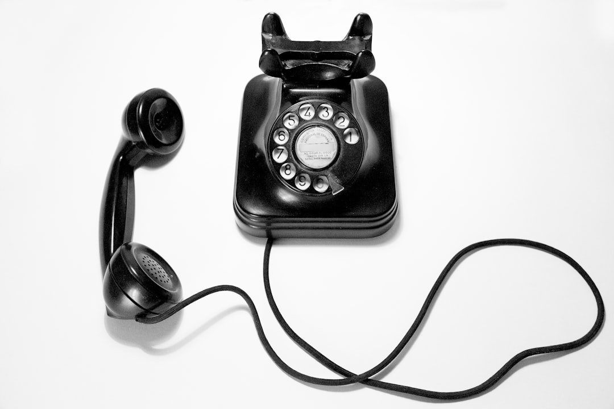
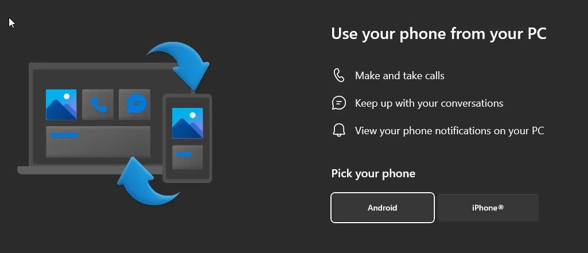
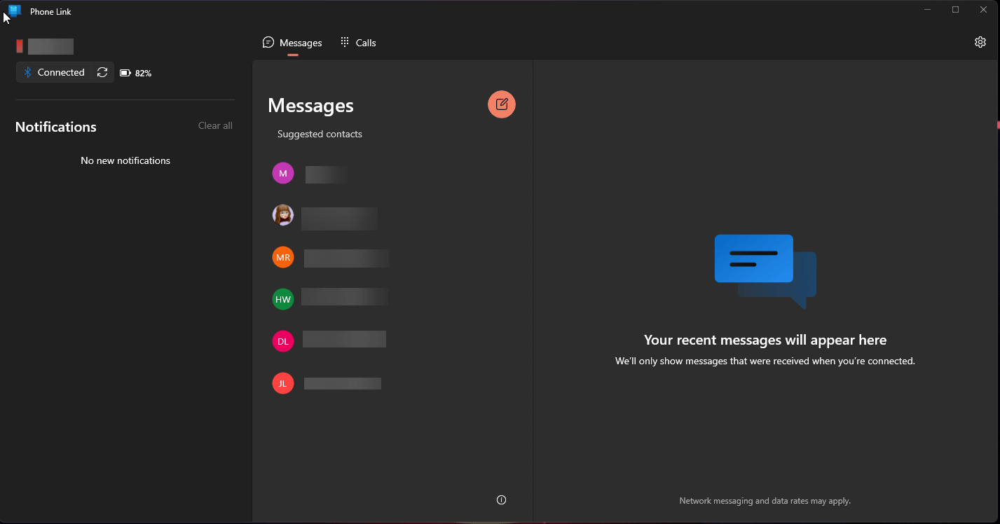
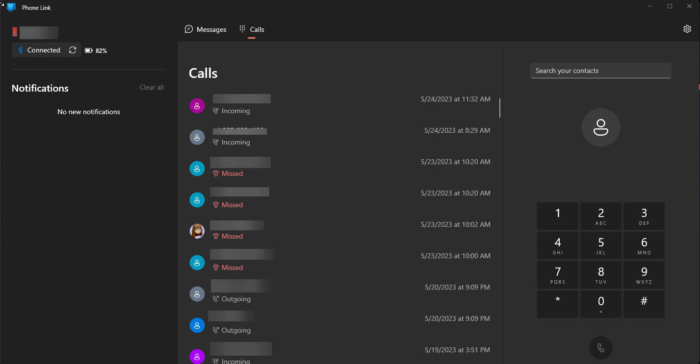

# Linking your iPhone to Windows

*It's not iMessage, but you can now send and receive text messages and calls from your PC*

Photo by [Quino Al](https://unsplash.com/@quinoal) on [Unsplash](https://unsplash.com)

Although this has been around for Android for a while, availability for Microsoft Phone Link for iPhone on Windows 11 is widely available as of last week. When you launch the built-in Phone Link app in Windows, you should now see a “Pick your phone” prompt to choose Android or iPhone” (if it says “iPhone - Coming Soon” - check for Windows updates).

After selecting iPhone, it will walk you through the steps to connect your computer to your iPhone to set up Phone Link. A few pre-requisites:

- You’ll need Bluetooth on your Windows 11 PC
- You’ll need the “[Link to Windows](https://apps.apple.com/us/app/link-to-windows/id6443686328)” app on your iPhone
- iOS 14+
- Up-to-date Windows 11

When you start the Phone Link app in Windows, it will walk you through pairing your phone to your PC and setting notification settings. If you’ve already downloaded the “Link to Windows” iPhone app, this should take about a minute to pair and set permissions.

Once it’s done, you’ll see an interface like below to be able to manage iOS text (top image) and phone (bottom image).

There are definitely still some quirks, and the functionality isn’t as high as iMessage on a Mac, but it’s a welcome addition to Windows for iOS users. The main functionality on my wish list is message history. If I want to search back through messages sent while not connected to Phone Link, I need to use my phone because the app only collects and displays what’s been sent while connected to the phone. Group chats also still need to happen via iMessage. However, being able to dedicate some screen space to my phone is well worth the quirks of early adoption.
