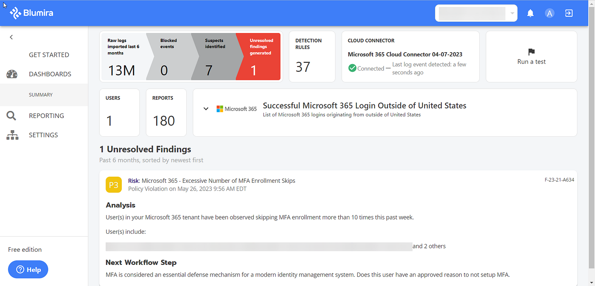
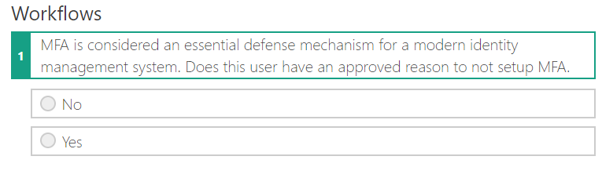
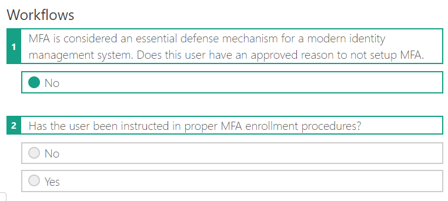
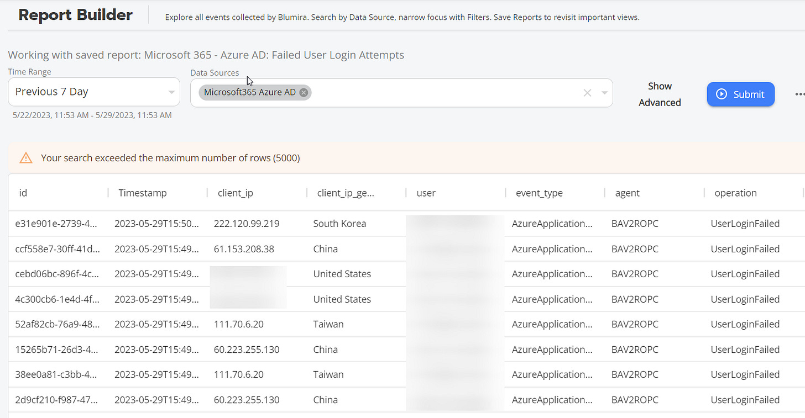
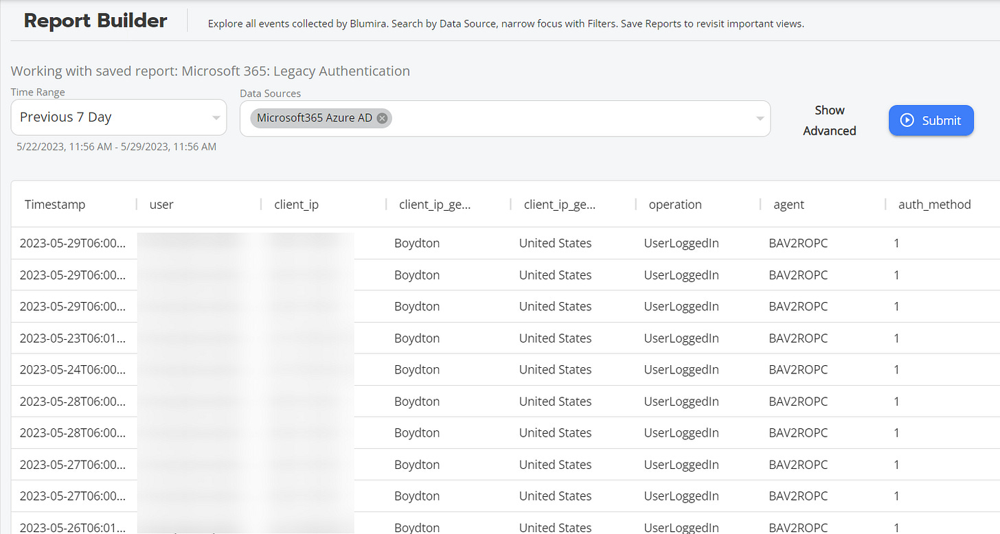
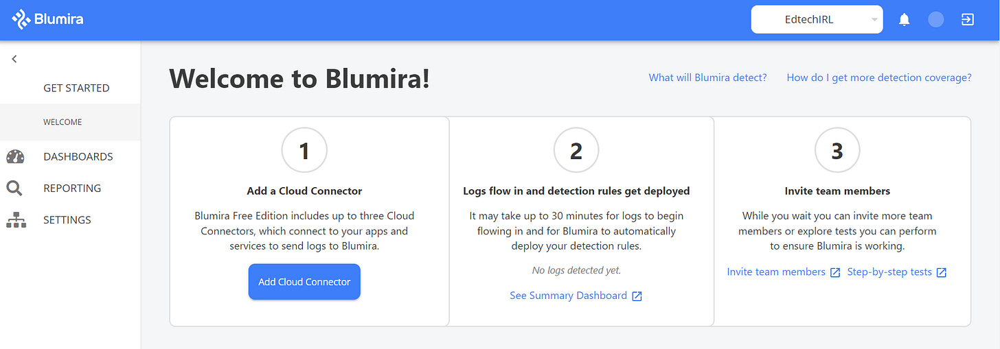
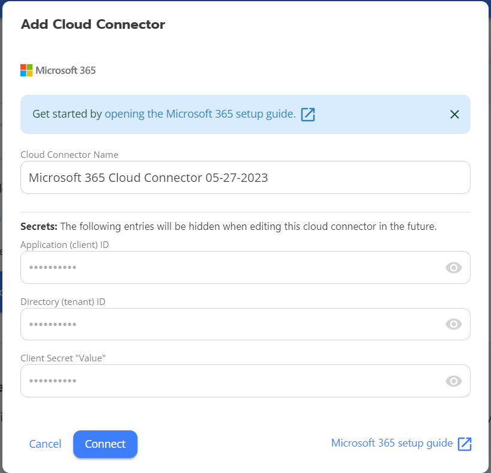
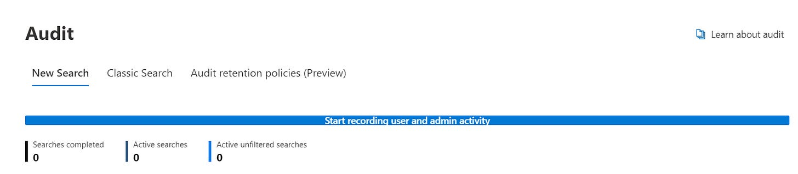
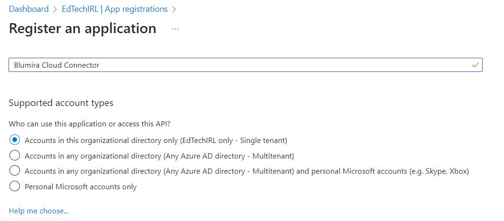
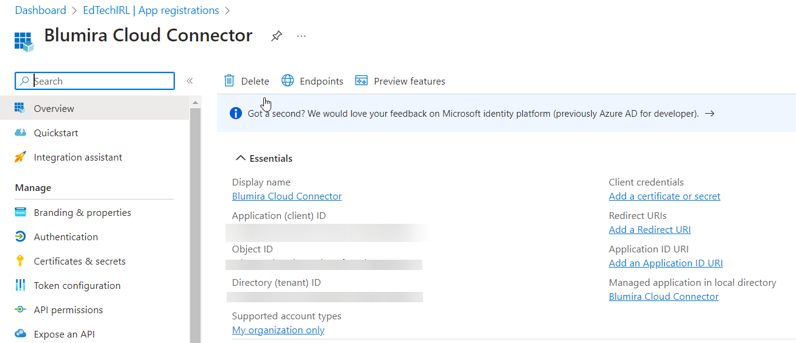

# Free SIEM for Microsoft 365?! 

*Blumira's Free Connector for M365 is a Handy Tool for Small Tech Teams*

If your cybersecurity budget is slim or non-existent and you use Microsoft 365 (or a handful of other cloud services), Blumira is a \*free\* tool you definitely want to check out.

Blumira offers cloud SIEM and XDR features for a wide variety of services, and the paid offering can suck data up from [dozens of sources](https://www.blumira.com/integrations/).

With Blumira’s Free SIEM, you get:

- up to 3 cloud integrations — Microsoft 365, Duo Security, Cisco Umbrella, Webroot and/or Mimecast
- 2 weeks of data retention
- Unlimited users and data
- Agentless integration setup via Cloud Connectors
- Detections automatically rolled out to your account
- Summary dashboard of key findings and security reports
- Playbooks with each finding to guide you through response steps

**So, what does Blumira do?**

In a nutshell, Blumira scours the data being sent to it from your M365 tenant and looks for evidence of nefarious activity happening in your environment. When data is ingested that implies something bad could be happening, a finding is generated based off a set of pre-defined detection rules. From a month of using this in production, one of the things I like is that the findings are pretty well-tuned and aren’t reporting on every little incident, but rather focusing on things that warrant investigation. For example, when I look at incidents and alerts in the M365 Defender, there are a lot of legitimate incidents like “Initial access involving one user.” However, most of these are reporting on unsuccessful access attempts, so they don’t necessarily warrant investigation, especially if you have a small team. One of the things Blumira does is that it looks for more actionable data. In the example from my dashboard below, it’s detected an excessive number of users skipping MFA enrollment.

The power of the platform comes in what’s next. If you’re on a small staff or don’t have incident response experience, Blumira has built-in playbooks to walk you through how to respond to the findings. For the Excessive MFA Skips finding above, the workflow moves like this:

As you answer questions and work your way through the logic, you’re presented with clarifying questions and next steps:

In some cases, the playbook will provide you with steps to take or information you need to find out, or it will let you know if the finding needs to be closed as either a valid finding or as no action needed.

Additionally, there are built-in reports for M365 where you can use the Blumira interface to run more than 20 pre-built reports against your tenant. For example, if you want to see unsuccessful login attempts, there’s a report for that:

If you’re getting ready to move to MFA and need to disable legacy authentication, but you want to know what accounts are still using legacy auth, there’s a report for that:

In our case, we still have a single service account where legacy auth is still enabled, so this is as expected.

Other reports include AAD Accounts Disabled, AAD Group Changes, Login Report, Logins outside of US-Canada-Mexico, New User Created, Password Changes, AAD Device Added, Mailbox Permission Delegation, Mail Items Accessed by non-Owner, New Domains Forwarded Emails, Sharepoint File Previewed or Accessed, Unusual DLP Policy Matches, Impossible Travel, Successful Logins from Outside US, and Successful O365 Logins Outside of US.

**How is this free?**

While the Blumira M365 integration is free, they make their money from other integrations. As of writing this article, there are currently [76 integrations available](https://www.blumira.com/integrations/), ranging from Firewalls to AV to AWS and beyond.

**Getting Setup**

That all sounds great… so how do you get this set up? Blumira has a [step-by-step guide available](https://www.blumira.com/support/#support-Integrating+with+Microsoft+365), but the steps below will get you on your way. Setup is quick and doesn’t require a credit card - only a work email and phone number. Once an account is created at Blumira.com, you’ll be dumped out at a dashboard like below:

From this dashboard, start out by adding a cloud connector at step 1. In my case, I’ve set up a cloud connector to M365.

To do this, you’ll need to log in to your AAD Admin Center as a Global Admin and get three credentials: Application ID, Directory ID, and Client Secret Value.

> NOTE: If auditing isn’t enabled in your tenant, you’ll need to enable auditing at https://compliance.microsoft.com —> Audit —> Start Recording User and Admin Activity.

After Auditing is enabled, go to Azure AD at https://aad.portal.azure.com and go to Azure Active Directory —> App Registrations —> + New Registration.

Give the app a name — something descriptive, like Blumira Cloud Connector and select “Accounts in this organizational directory only” and then Register.

Now, on the newly registered app’s page, you see two of the three credentials you need: Application ID and Directory ID. Copy these for a later step.

Under “Manage,” click on “API Permissions.” Next, go to Add a Permission —> Office 365 Management API —> Application Permissions. Under Application Permissions, expand ActivityFeed and check the boxes for ActivityFeed.Read and ActivityFeed.ReadDLP. Finally, click Grant Admin Consent.

Next, to find the third credential you need, go to Certificates and Secrets and click on New Client Secret. Make a note of the Secret ID Value (Note: grab the string listed under Value, not Secret ID).

With these three credentials handy, head back to Blumira and finish filling the creds into the cloud connector for Microsoft 365. After setup, it may take up to 30 minutes for logs to start flowing in.

.
