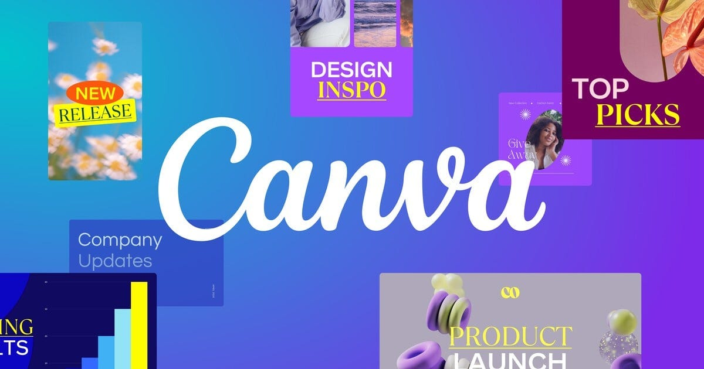
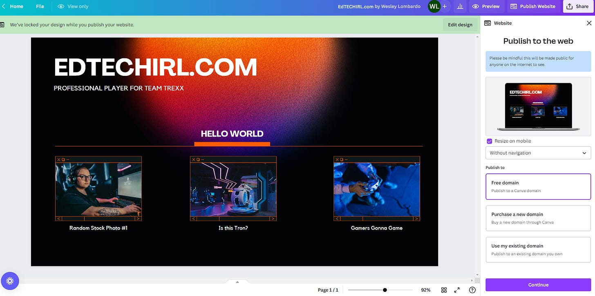
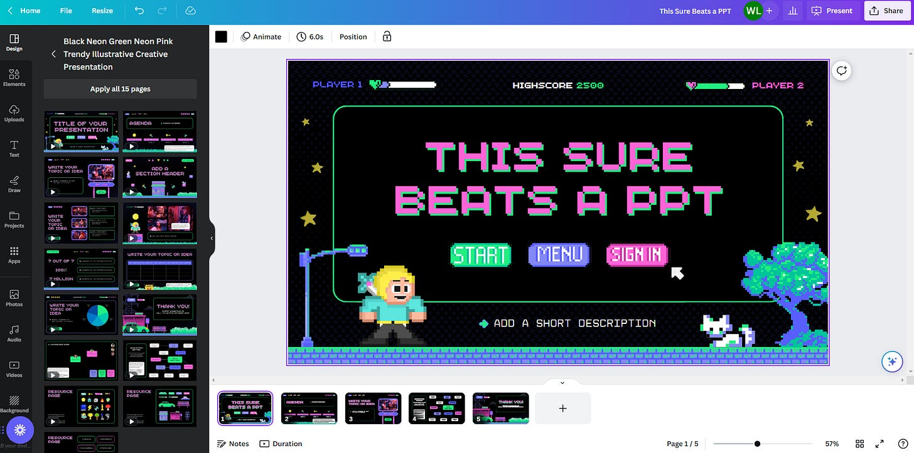
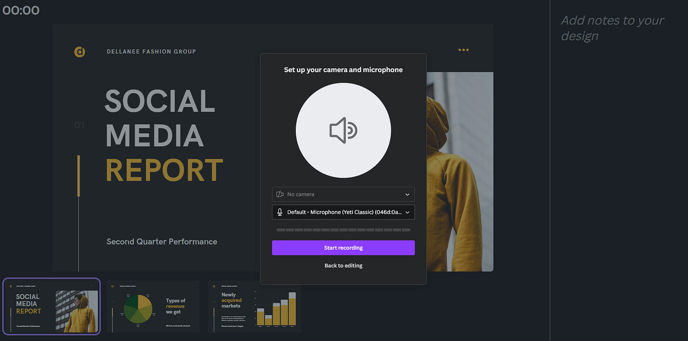
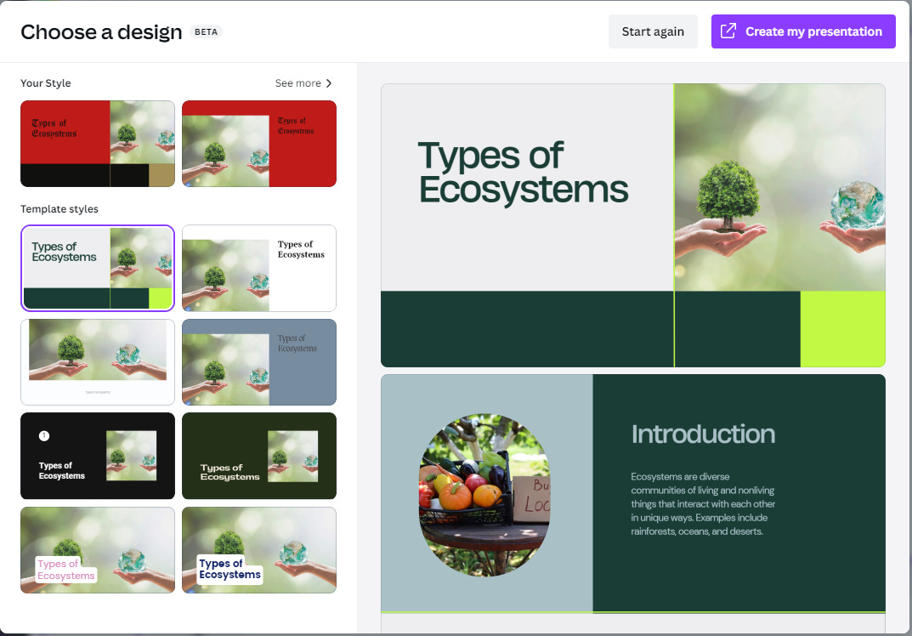
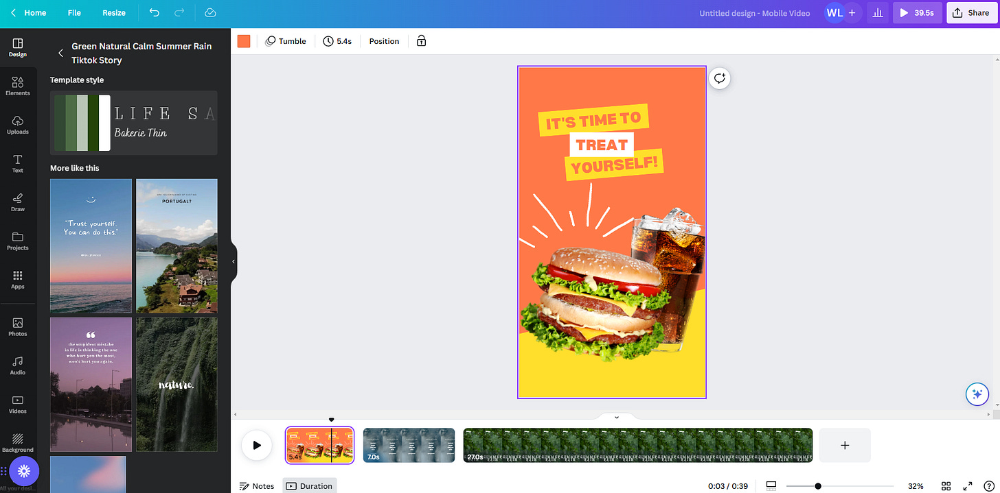
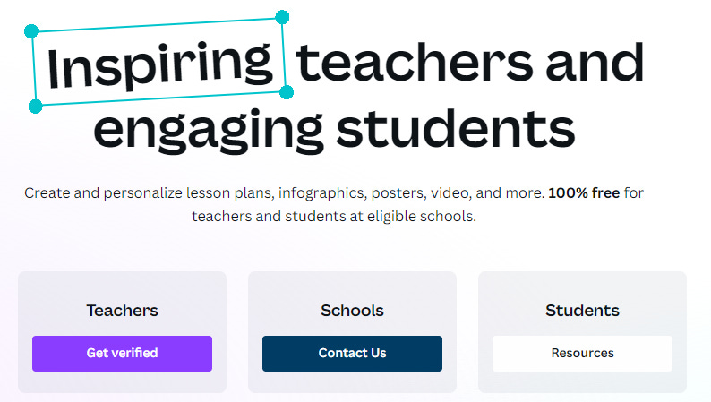
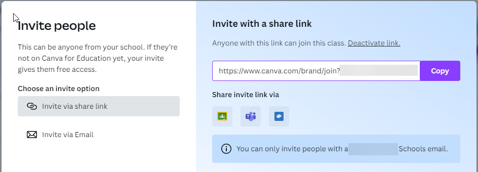

# Using Canva EDU for Quick and *FREE* Presentions, Gaphics, and Collaboration 

*It's not just for designing logos any more*

Canva has been around for a while, and it has been my go-to for making quick work of designing logos and graphics for several years (all of the EdTechIRL logos were made in Canva). If that’s all you use it for, though, you’re missing out. Canva has built out their offerings extensively over the past few years, and their PRO features are now FREE for K12 Students and Teachers (details on how to sign up for free are at the end of this list).

# 5 Ways You Can Use Canva in Your Classroom:

## **Publish quick websites**

Using the “Website” templates, you can not only design a simple website in just a few minutes, but you can also publish it as well. The [site below](https://biglongrandomteststring.my.canva.site/) took my less than 4 minutes from the time I opened the template till it was available [on the internet](https://biglongrandomteststring.my.canva.site/).

## **Presentations**

PowerPoints can get a little boring, and Canva has tons of templates to spice up presentations. In addition to being able to [share presentations with a link](https://www.canva.com/design/DAFkhLTmYcY/NtkBaKjJ_SgoKxvxQLsNRQ/view?utm_content=DAFkhLTmYcY&utm_campaign=designshare&utm_medium=link&utm_source=publishsharelink), you can also work collaboratively on a presentation with other users. By creating a shared collaboration link, multiple people can work on the same presentation at once.

## **Recorded Presentations**

Having spent a decade in EdTech, simple things like recording presentations always prove to have the most hurdles. Canva has a built in feature to be able to create a presentation like the one above, and then record over it.

## Magic Design

I’ve mentioned some AI shortcuts in other areas before, and Canva has jumped on this in a few areas. One of the most impressive is Magic Design. Using Magic Design, you can describe a presentation you want to do, and it will automatically develop a draft you can start with. For this example, I used the prompt “types of ecosystems,” and Canva created the [following presentation](https://www.canva.com/design/DAFkhAG0FRk/GrgerOBR_N7_GUZ9ku3-ag/view?utm_content=DAFkhAG0FRk&utm_campaign=designshare&utm_medium=link&utm_source=publishsharelink). Is it the best presentation ever? No, but if you’ve having trouble getting started, it takes the first steps and you can tweak and perfect till you have a solid lesson.

## Video Editing

You may not want to do TikTok in the classroom, but why not have an assignment that leverages the same format? Canva has templates for a wide variety of video projects (including TikTok videos) that offer a simple video editing platform, with some additional tools like removing the background from video clips or syncing music to your video. Like the other areas of Canva, there are collaboration options here, too, so if you had a group of 4 students, they could all work on the same video. And, if they have the Canva app on their phone or tablet, they can upload video clips from their to Canva.

## **How do you get Canva for free?**

There are two methods you can use to sign up for Canva for free for your K-12 institution. Both journeys begin at https://www.canva.com/education/

If you are signing up for just yourself as a teacher, there is a path to “Get Verifed” at the link above. If you’re signing up for your whole institution, there is a “Contact Us” option listed under Schools. This will initiate a discussion with Canva to begin setting up Canva for all staff and students in your schools.

Once your institutional account is set up, you’ll be able to invite users who have email addresses at your organization using a special enrollment link like below. You can also invite via email.

