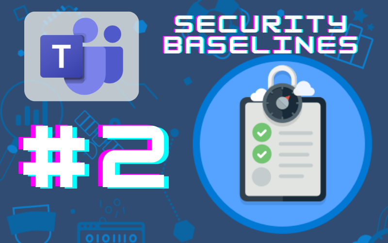
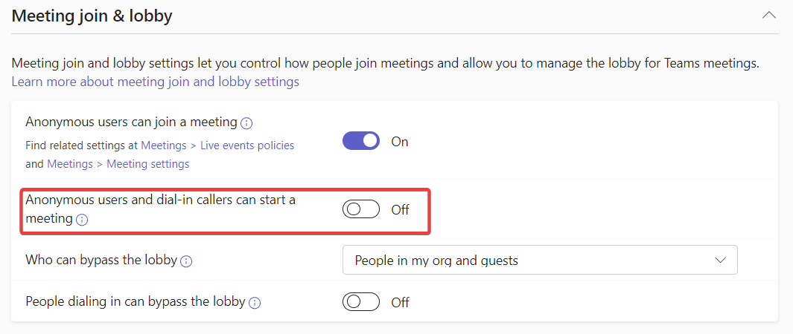

# Teams: Prevent Anonymous Users from Starting Meetings

*Spending 10 minutes or less on this will help your M365 environment be a little more secure*

In Oct. 2022, CISA released a document called [Microsoft Teams: M365 Minimum Viable Secure Configuration Baseline](https://www.cisa.gov/sites/default/files/publications/Microsoft%20Teams%20M365%20Minimum%20Viable%20SCB%20Draft%20v0.1.pdf). This document outlines 13 steps to take to raise your Microsoft Teams environment to a minimum viable security posture. In this series, we’ll take a look at these 13 steps over a series of articles.

# Baseline 2: Preventing Anonymous Users from Starting Meetings

This baseline reads “Anonymous users SHALL NOT be enabled to start meetings in the Global (Org-wide default) meeting policy or in custom meeting policies if any exist.”

## What is it?

When this setting is turned on, an anonymous user or dial-in user can bypass the meeting lobby and start a meeting before the host has joined the meeting.

## Why is it bad?

Having an anonymous user start a meeting before the host arrives can have embarrassing consequences, as they can essentially be in charge of the show without oversight in the absence of the host, and without accountability because their identity isn’t known. This is the virtual version of a class of students alone in the classroom without their teacher, and the class clown has been left in charge.

## What should you know before enforcement?

I’ve not yet come up with or found a use case where this is a desirable feature to have left on. If you have any ideas for legit use cases, drop one in the comments.

## How do you enforce it?

To disable the ability for anonymous users to start meetings, follow the steps below:

1. Go to the Teams Admin Center (teams.cmd.ms)
2. Navigate to Meetings —> Meeting Policies
3. Select the appropriate Policy — probably the Global (tenant-wide default) policy, but if you’ve created additional Policies, you’ll need to check those as well.
4. When you’ve selected the policy, scroll down to Meeting Join and Lobby and toggle “Anonymous users and dial-in callers can start a meeting” from ON to OFF.
5. Repeat for custom policies if necessary

## Resources:

[Teams settings and policies reference - Microsoft Teams | Microsoft Learn](https://learn.microsoft.com/en-us/microsoftteams/settings-policies-reference)

[M365 Teams Security Baselines from CISA](https://www.cisa.gov/sites/default/files/publications/Microsoft%20Teams%20M365%20Minimum%20Viable%20SCB%20Draft%20v0.1.pdf)

Note: The articles in the Security Baselines series aren’t being sent via the subscriber emails. Once the series is complete, I’ll be publishing a single article with links to all of the articles in the series.
