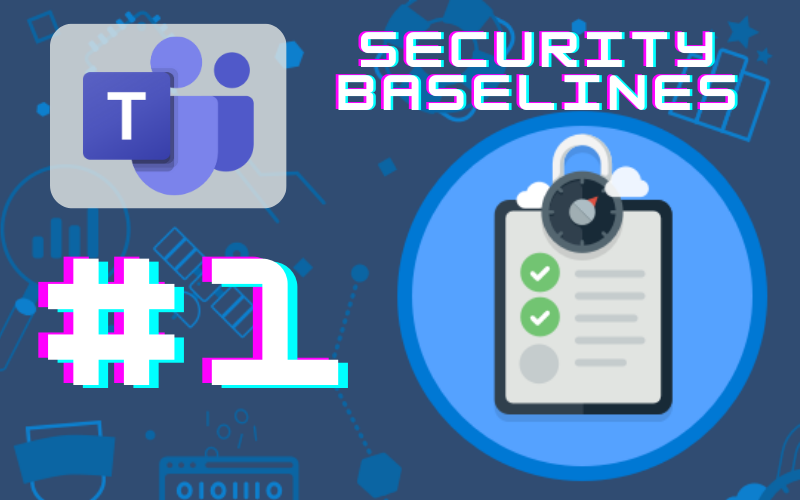
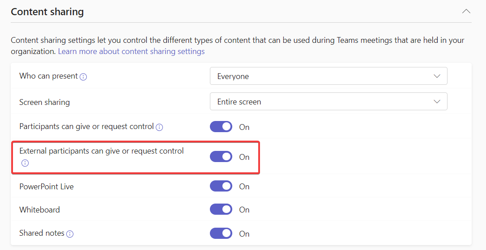

# Teams Security Baselines: Disabling Control Requests from External Users

*Spending 10 minutes or less on this will help your M365 environment be a little more secure*

In Oct. 2022, CISA released a document called [Microsoft Teams: M365 Minimum Viable Secure Configuration Baseline](https://www.cisa.gov/sites/default/files/publications/Microsoft%20Teams%20M365%20Minimum%20Viable%20SCB%20Draft%20v0.1.pdf). This document outlines 13 steps to take to raise your Microsoft Teams environment to a minimum viable security posture. In this series, we’ll take a look at these 13 steps over a series of articles.

# Baseline 1: External Participant Control Requests

This baseline reads “External participants SHOULD NOT be enabled to request control of shared desktops or windows in the Global (Org-wide default) meeting policy or in custom meeting policies if any exist.

## What is it?

In your M365 environment, external participants are users who aren’t members of your tenant (guests, anonymous users, external contacts). This baseline is aimed at preventing external users from controlling an internal user’s computer during a Teams meeting.

## Why is it bad?

When external participants are able to control an internal user’s desktop during a Teams meeting, they can both highjack the meeting and take control of a computer that is part of the M365 tenant.

## What should you know before enforcement?

There are some legitimate use cases where you may want external users to be able to take control. As an IT-specific example, I’ve been on Teams calls with external consultants before, and the inability to give them control to walk me through something did put a cramp in the pace of the meeting. If you have groups that need this feature, you should add a separate policy for that group where the feature won’t be disabled.

## How do you enforce it?

To disable control requests from external participants:

1. Sign in to the MS Teams Admin Center (teams.cmd.ms)
2. Navigate to Meetings —> Meeting Policies
3. Select the appropriate Policy — probably the Global (tenant-wide default) policy, but if you’ve created additional Policies, you’ll need to check those as well. If you have a legitimate need for a subgroup of your organization to maintain this feature, creating a new policy for that subgroup would be the way to handle this.
4. When you’ve selected the policy, scroll down to Content Sharing and toggle “External participants can give or request control” from ON to OFF.

## Resources:

[Manage meeting policies for content sharing - Microsoft Teams | Microsoft Learn](https://learn.microsoft.com/en-us/microsoftteams/meeting-policies-content-sharing)

[M365 Teams Minimum Viable Secure Baselines (cisa.gov)](https://www.cisa.gov/sites/default/files/publications/Microsoft%20Teams%20M365%20Minimum%20Viable%20SCB%20Draft%20v0.1.pdf)

Note: The articles in the Security Baselines series aren’t being sent via the subscriber emails. Once the series is complete, I’ll be publishing a single article with links to all of the articles in the series.
