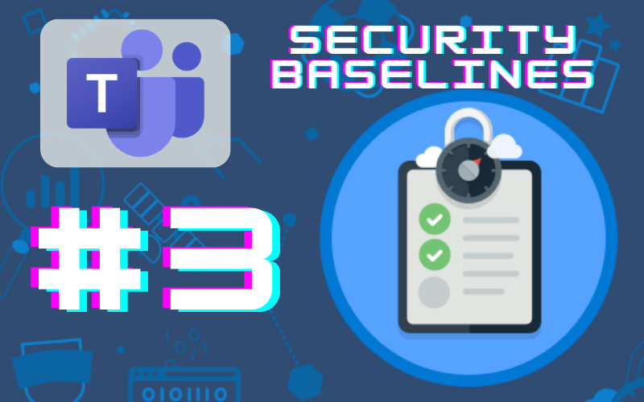
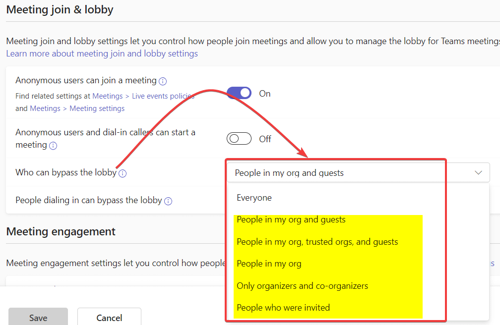
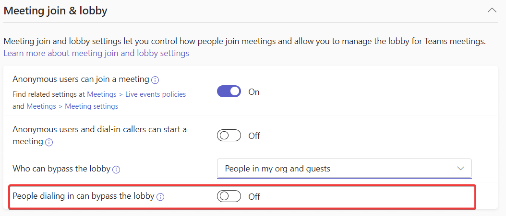

# Teams Security Baselines: Automatic Meeting Admittance

*Spending 10 minutes or less on this will help your M365 environment be a little more secure*

In Oct. 2022, CISA released a document called [Microsoft Teams: M365 Minimum Viable Secure Configuration Baseline](https://www.cisa.gov/sites/default/files/publications/Microsoft%20Teams%20M365%20Minimum%20Viable%20SCB%20Draft%20v0.1.pdf). This document outlines 13 steps to take to raise your Microsoft Teams environment to a minimum viable security posture. In this series, we’ll take a look at these 13 steps over a series of articles.

# Baseline 3: Automatic Meeting Admittance

This baseline reads “Automatic admittance to meetings SHOULD be restricted.”

## What is it?

This setting refers to the meeting lobby and which participants are required to wait for approval for admittance to the meeting.

## Why is it bad?

Automatic admittance isn’t inherently bad, but as Zoom-bombers highlighted during Covid, automatic admittance for everyone is a bad idea because it doesn’t give the meeting leaders an opportunity to vet or approve specific types of attendees. Guidance for this control is to set the policy to account for the following:

- Anonymous users should NOT be admitted automatically
- Internal users SHOULD be admitted automatically
- B2B guest users MAY be admitted automatically

These settings should be made globally, but custom policies may be created as necessary if there is a legitimate need.

## What should you know before enforcement?

It’s possible that you may have legitimate use cases to allow automatic admittance. If that’s the case, think through those scenarios in order to establish custom policies so they are focused policies rather than globally allowed.

## How do you enforce it?

Login to the Teams Admin Center (teams.cmd.ms)

Navigate to Meetings —> Meeting Policies and select the Global (org-wide default) policy

Under “Meeting join and lobby,” set “Who can bypass the lobby” to the most appropriate option that isn’t Everyone. For many, “People in my org” will be the most appropriate, but for more granularity you may select “Only organizers and co-organizers.” In an educational environment, something to keep in mind is that if you set it to “People in my org,” students will be able to bypass the lobby, which is likely an undesirable state.

Additionally, “People dialing in can bypass the lobby” should also be set to Off like below.

## Resources:

[Teams settings and policies reference - Microsoft Teams | Microsoft Learn](https://learn.microsoft.com/en-us/microsoftteams/settings-policies-reference)

Note: The articles in the Security Baselines series aren’t being sent via the subscriber emails. Once the series is complete, I’ll be publishing a single article with links to all of the articles in the series.
