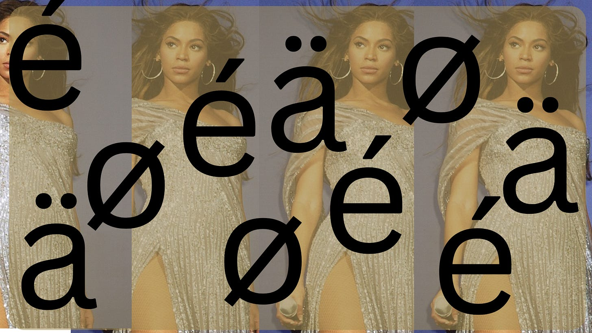
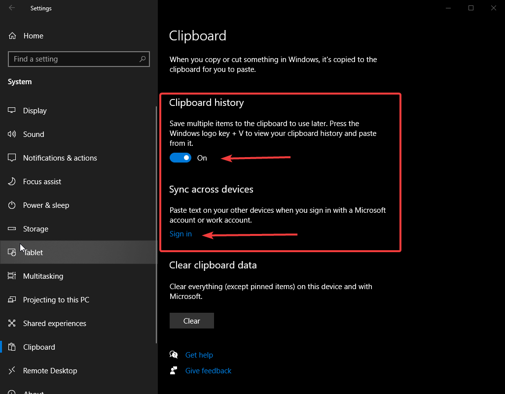
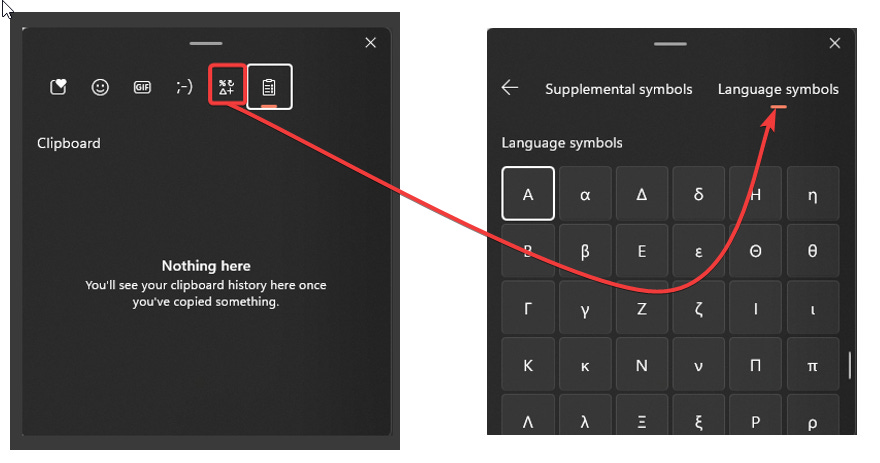
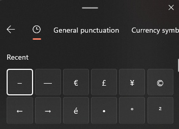
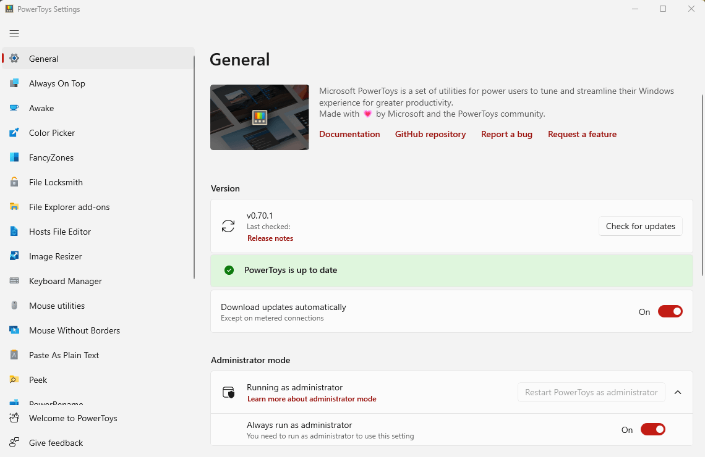
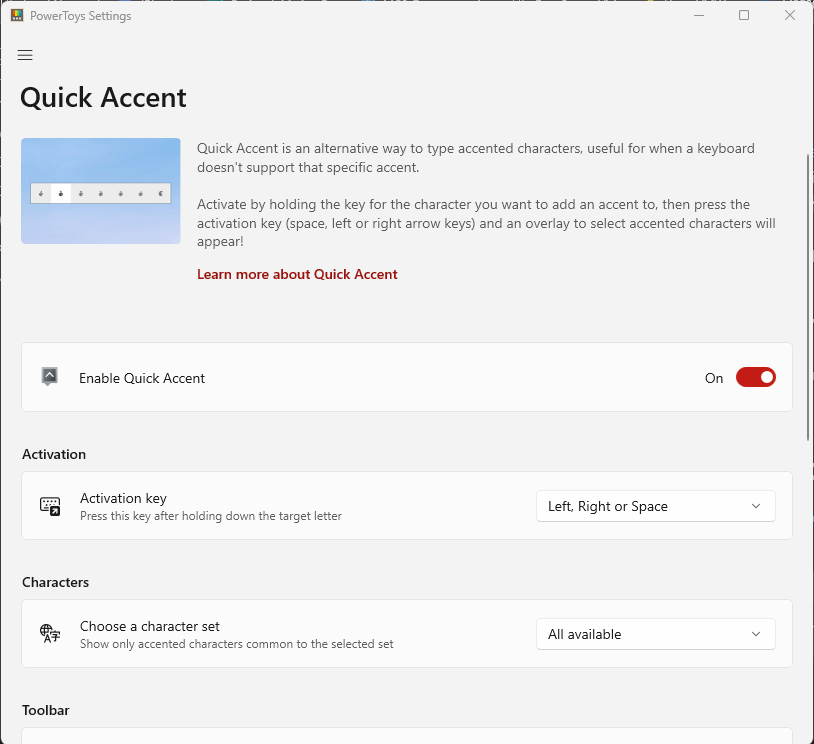
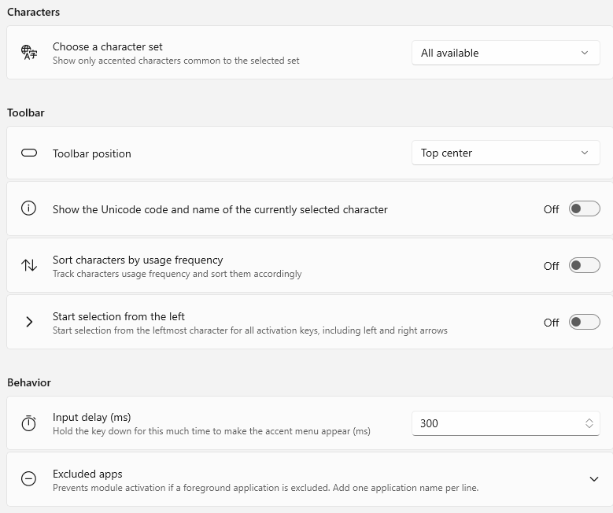

# World Language and Math Teachers: Rejoice!

*Two Windows Tools for Quick Access to Symbols and Special Characters*

When I need to use a special character like an é, I usually go to Beyoncé’s Wikipedia page and copy and paste. Don’t be like me.

Using special characters has long been the bane of world language and math teachers everywhere. To help with this, there are two Microsoft tools that come in really handy. The first is the easiest to set up and is probably already installed on your Windows computer. The second requires an installation, but it has some more powerful options.

### Method 1: Language Characters/Math Symbols in Clipboard History

[I’ve previously extolled the virtues of Clipboard History](https://www.edtechirl.com/p/clipboard-history) for things like keeping track of what you’ve copied and adding emoji’s to everything (🤪), but there is also a feature for Language Characters and Math Symbols.

To enable Clipboard History, you can use the Windows search box/magnifying glass to search for Clipboard Settings.

In Clipboard settings, toggle on Clipboard history. If you want to be able to copy and paste across devices, you can sign in with a Microsoft account, but this step is optional for our purposes with language symbols.

To use the clipboard, instead of hitting Ctrl+V like you normally would to paste, instead press the Windows Key+V. It will pull up a box like this where you can pick which image or text you’d like to paste. The highlighted menu item below will open a tab for Symbols, under which there is an option for Language Symbols. For math folks, there are also categories for Geometric Symbols and Math Symbols.

Scroll through the language symbols, and practice using the ones you’ll be most likely to use IRL. Once you’ve used them, they’ll now show up as Recent:

### Method 2: PowerToys

The second method utilizes one of my favorite Microsoft utilities: PowerToys for Windows. Information on PowerToys and how to install can be found from Microsoft [here](https://learn.microsoft.com/en-us/windows/powertoys/install), or if you’re familiar with [Winget](https://www.edtechirl.com/p/winget-with-the-program) already, this snip of code will do the trick:

> winget install Microsoft.PowerToys --source winget

After installation, you’ll have a whole suite of new Windows tools.

My most commonly used tools are Awake, a utility that keeps your computer from going to sleep (like Caffeine or Amphetamine for MacOS), Mouse Without Borders (a utility for using the same mouse across sessions on multiple computers… similar to Synergy), Keyboard Manager (for programming custom keys), etc., etc. There are tons of tools here. But for our purposes, Quick Accent is the answer:

When you launch Quick Accent, you’ll first need to enable it. Then, there are a variety of configuration options. In the example above, the activation key is set to “Left, Right, or Space.” What this means is that if you want to insert an é, you would press the “E” key on your keyboard and then immediately hit either the left arrow, right arrow, or space bar while E is still pressed. It takes a teensy bit of practice to get it to activate the accent without typing eeeeeeeeeeee, but you’ll notice that as soon as you get the timing right, a small toolbar will show at the top of your screen with the different accent options for that particular letter. You can then cycle through these options by pressing the space bar, or release both keys to default to the first option.

The default settings should work well, but you can additionally configure Quick Accent to sort characters based on usage frequency; increase or decrease the delay time for activating the accent keys; change the toolbar position; or exclude apps from activating Quick Accent. You can also tweak which character sets you want Quick Accent to draw from.

Once it’s activated and configured, Quick Accent will continue to run, waiting to be summoned for any Beyoncé or Resumé needs you may have.
