# Silently Pushing UltraVNC Server through Intune for Unattended Remote Access

*Unattended remote access on your local network... for FREE*

### Introduction

Before our school district started using Intune, we used to use another MDM solution that used UltraVNC to give users a way to remote into computers. This was a feature we really enjoyed as we were able to very easily and quickly remote into computers without the user even knowing. This came in handy for monitoring students that teachers reported misuse of their device and quickly helping staff or students around the site without having to leave your desk. The best part is that this software is completely FREE for commercial and personal use. This article is going to cover how you can silently push UltraVNC to your devices with custom settings. We’re going to focus on how to do it in Intune, however, if you use another MDM solution it should work there as well.

UltraVNC has some great features as well, including file transfer, 2-way chat, switching monitors, running programs as admin, and more.

### **Prerequisites**

- The installer from [uvnc.com](https://uvnc.com/downloads/ultravnc.html)
- Make sure port 5900 is accessible on your devices.

### Creating an installer configuration file

First, we are going to need to get the package ready to be converted into a .intunewin file. To do this, I would go ahead and create your source folder and throw in your UltraVNC installer inside of it.

[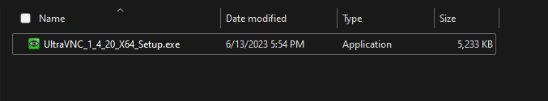](images/3a912f9d-de72-4663-bd63-86e91b8026d9_677x125.png)

Next, we are going to launch the installer from the command line with the argument */saveinf=”installerselections.inf” .* This will create an installer configuration file after we finish installing the program. This file is used to represent the selections you made while going through the installer. We will need this for later.

When walking through the installer, choose the settings you would like best. I am making this installer for student devices, so I am going to just install UltraVNC Server.

[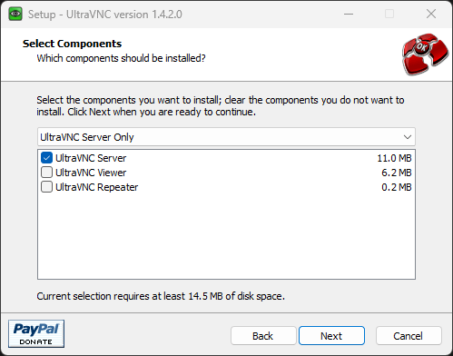](images/4c7a0731-3a5a-4dd6-bedb-5fdc255bd331_499x392.png)

I am also going to register it as a system service to make life easier.

[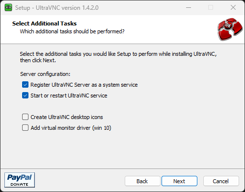](images/149b7a3b-fb06-4f45-92fe-9a84a463f957_499x392.png)

After it finishes, you should have the program installed on your computer, and there should be our installer configuration file in our sources folder.

[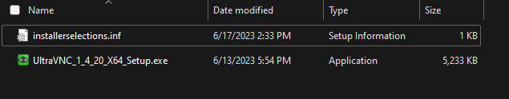](images/e8fff639-4545-4875-9504-83a4b788c1c2_635x124.png)

### Custom Settings and Password

Next, you will want to configure settings for when we remote into our devices. The most important of these is setting the password.

To start, right click on the program in your system tray and click **admin properties.**

[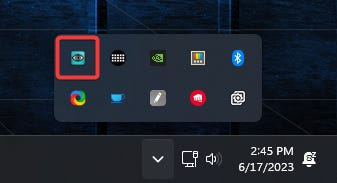](images/b839b57e-ac13-4ff2-ba64-93ffda417d81_337x183.png)

You will get a long list of things you can change (and even more if you click on the advanced options list). For this, I would recommend setting a password, setting up Encryption, DisableTrayIcon, and Forbid the user to close down WinVNC (last two under advanced options).

[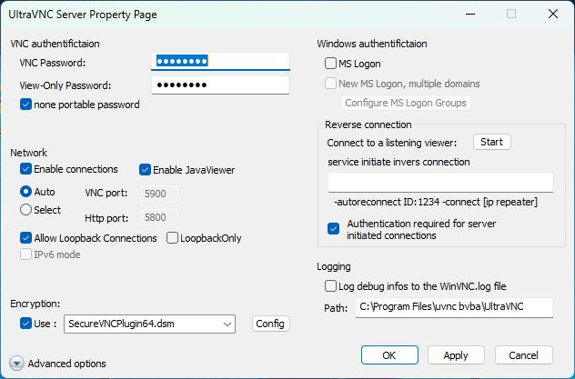](images/825c5fe6-904a-40c8-b88b-9c2ec3141adb_632x417.png)

Once you have decided on your settings, click Apply and OK. Note that you may need to restart your computer before all of these changes apply.

Once you have all of your settings the way you would like them, go to **C:\Program Files\uvnc bvba\UltraVNC** or wherever you selected for the program files to go to. Here you will see lots of files, but we are interested in the **ultravnc.ini** file. This file contains the admin settings we just made. If you wish to edit them again, you can open the file in a text editor. Copy this file and put it in our sources folder.

[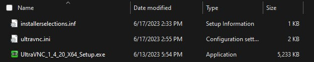](images/2a2b966a-9ceb-4df6-a506-e7693443ca8f_625x125.png)

### Custom Install Script

Lastly, we will create a powershell script in our sources folder to initiate our install with our install configuration file, copy over our admin settings file, and restart the service to apply these changes. I am also having mine delete the shortcuts in the start menu folder. This makes it to where you can’t launch the program by searching for it on the taskbar. This is optional. If you do not want this, just omit line 5 (the one starting with Remove-Item).

Here is the code from my script.

> #Starts Install and loads configuration file that tells it the settings to use for silent install
>
> start-process UltraVNC\_1\_4\_20\_X64\_Setup.exe -wait -argumentlist '/verysilent /no restart /loadinf="installerselections.inf"'
>
> #Removes start menu icons
>
> Remove-Item "C:\ProgramData\Microsoft\Windows\Start Menu\Programs\UltraVNC\\*" -Force
>
> #Copies over the settings configuration file into the program directory
>
> Copy-Item ".\ultravnc.ini" -Destination "C:\Program Files\uvnc bvba\UltraVNC"
>
> #Short wait to make the the settings file gets copied over, then it will restart the VNC service to apply the changes
>
> Start-Sleep -Seconds 5
>
> Restart-Service -DisplayName uvnc\_service

When you are done, your sources folder should look something like this.

[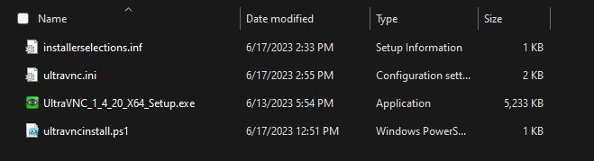](images/c73986eb-427a-482c-858f-0e2efc227bc3_659x179.png)

### Pack it up and send it.

Next, we will need to package the installer using the **IntuneWinAppUtil.exe.** I am going to assume you have experience here, but if not, there are many great tutorials online. For the setup file, be sure to use our powershell script and NOT the installer.

Upload this to intune as a Win32 package. When you do, the only important parts are to use the correct install commands to launch the script we made and I would use the uninstaller in the program files for uninstalling.

[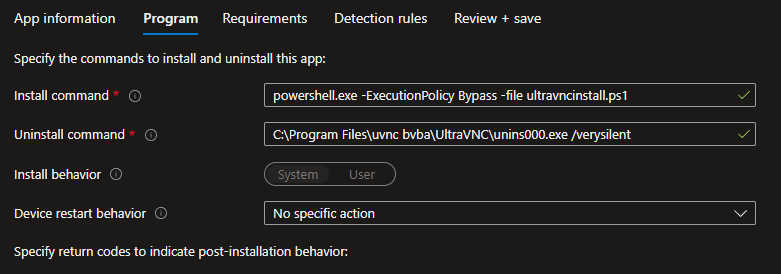](images/d621a393-ce75-417c-9d46-02520229e719_781x274.png)

For detection rules, I would have it reference the winvnc.exe file that is in the programs folder.

[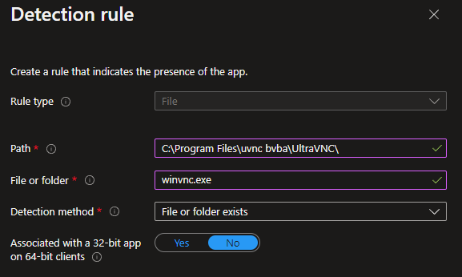](images/d5e40bbd-9185-4f39-809f-dca4536a8add_577x346.png)

### Conclusion

After this, you should be able to push this to a device and it will use the predefined settings and require zero user interaction from the end user, whenever you remote into their computer.

To remote into one of these computers, you will need to run the installer on your computer and install the **UltraVNC Viewer** program (it uses the same installer that we downloaded before). If you set up encryption before, you will want to do this as well on the viewer program.

Lastly, you should be able to run the viewer program, enter your computer’s host name, and click connect. When you do, you will be asked to put in the password we set up earlier before gaining remote access to the device. Once it is pushed to all of your devices, you will be able to pick and choose devices from the intune portal to remote into.

[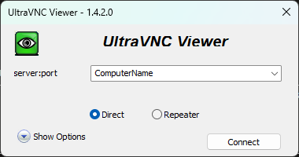](images/2fb87116-641c-489e-b2aa-bca06ac5379b_380x200.png)

Enjoy!
