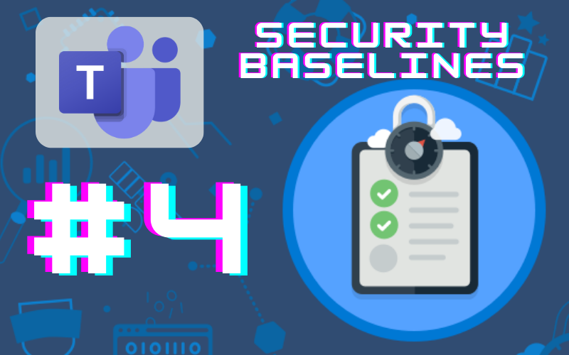
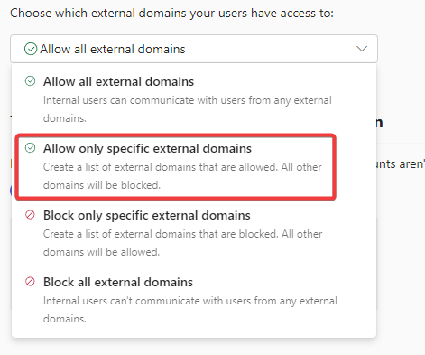
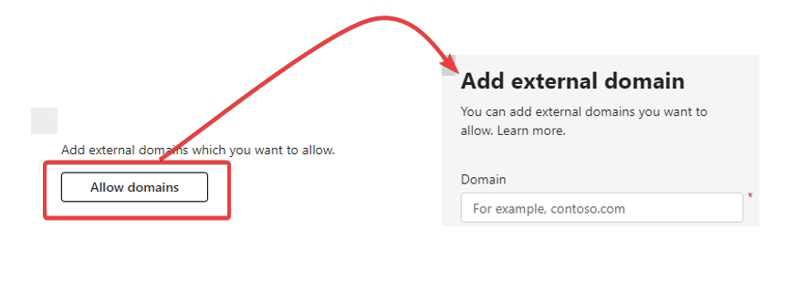
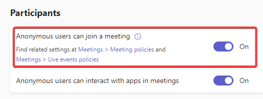

# Teams Security Baselines: External User Access

*Spending 10 minutes or less on this will help your M365 environment be a little more secure*

In Oct. 2022, CISA released a document called [Microsoft Teams: M365 Minimum Viable Secure Configuration Baseline](https://www.cisa.gov/sites/default/files/publications/Microsoft%20Teams%20M365%20Minimum%20Viable%20SCB%20Draft%20v0.1.pdf). This document outlines 13 steps to take to raise your Microsoft Teams environment to a minimum viable security posture. In this series, we’ll take a look at these 13 steps over a series of articles.

# Baseline 4: External User Access

This baseline reads “External user access SHALL be restricted.”

## What is it?

External user access refers to members of a different Microsoft 365 tenant, and by default they have the ability to find, call, and chat with people who have Microsoft identities, even if they belong to a different organization. It should be noted that “external users” only refers to those with a Microsoft identity. Users outside of your tenant who don’t have a Microsoft identity are referred to as “unmanaged users.”

## Why is it bad?

When external user access is unrestricted, they are able to look up internal users and initiate chats and calls within Teams, which carries a high risk for phishing and social engineering.

## What should you know before enforcement?

In legitimate use cases where you want to allow this ability for external users, it’s best to narrow the focus to which external users you want to allow, and allow them on a per-domain basis. The concern in a K-12 is that if you’re using Teams to hold meetings with parents or other stakeholders who don’t have accounts in the tenant, you may restrict legitimate access needs. To ensure that these users can still join a Teams call, anonymous join should be enabled. Likewise, if there are cross-district collaborations or vendor relationships that justify use of Teams as external users, provisions should be made to allow those external domains. It would be worthwhile to compile a list of domains you’d like to allow in advance of configuring these settings.

## How do you enforce it?

Login to the Teams Admin Center (teams.cmd.ms) and navigate to Users —> External Access

Under “Choose which external domains your users have access to” select “Allow only specific external domains.”

This will bring up an interface to be able to allow and enter the desired domains. Any domain you don’t add in this step will be blocked.

I had the bright idea to add all of the school systems and the Department of Education in my state in order to prevent any possible issues. However, the domain entry is one domain at a time, and I didn’t want to manually enter all 148 domains, so I scanned the list and manually entered the dozen or so that I felt would be most likely.

To ensure external users are still allowed to participate in meetings, next go to Meetings —> Meeting Settings

Under participants, make sure “Anonymous users can join a meeting” is set to ON.

## Resources:

[Manage external meetings and chat with people and organizations using Microsoft identities - Microsoft Teams | Microsoft Learn](https://learn.microsoft.com/en-us/microsoftteams/trusted-organizations-external-meetings-chat?tabs=organization-settings)

[Teams settings and policies reference - Microsoft Teams | Microsoft Learn](https://learn.microsoft.com/en-us/microsoftteams/settings-policies-reference#allow-anonymous-users-to-join-meetings)

[Use guest access and external access to collaborate with people outside your organization - Microsoft Teams | Microsoft Learn](https://learn.microsoft.com/en-us/microsoftteams/communicate-with-users-from-other-organizations)

Note: The articles in the Security Baselines series aren’t being sent via the subscriber emails. Once the series is complete, I’ll be publishing a single article with links to all of the articles in the series.
