# AI Level-Up for Teachers

In the six months since ChatGPT hit the scene, the buzz in education has shifted from “how do we block it” to “how do we use it.” At a recent conference I attended, roughly a third of the sessions were on AI and how districts and teachers can leverage it. As AI tools have proliferated in the past several months, a teacher-centric tool called MagicSchool.ai launched in May. Having just crossed over 1500 users, the site is still young, but the novel approach is geared toward giving educators tools to level up their efficiency on traditionally time-consuming tasks.

Currently, the MagicSchool.ai tool is divided into 6 main categories: Planning, Student Support, Communication, Productivity, Community Tools, and Raina (AI Coach). Within each of these categories, there are already a handful of tools, but new tools are being added regularly.

[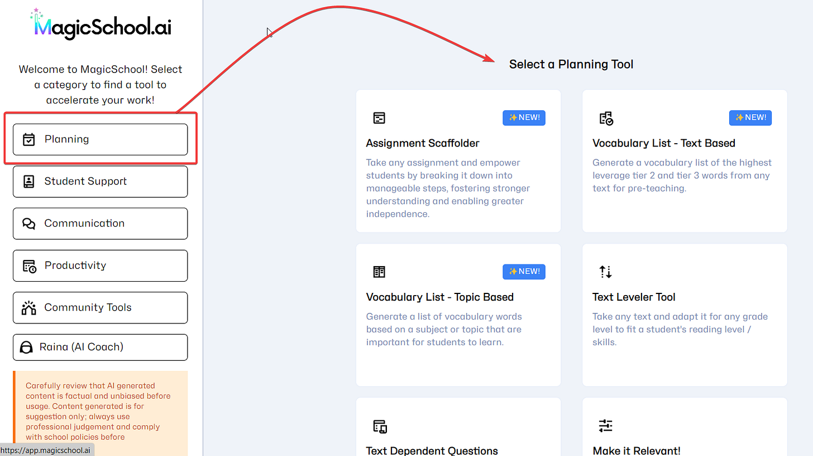](images/c5567137-8862-469a-af6f-e055cb16b8b8_1580x889.png)

There are too many options to go into great depth, but some of the tools you’ll find in MagicSchool.ai:

## Planning: Text Leveling

Insert up to 20 pages (!!!) of text, select a grade level, and MagicSchool will readjust the text to different grade levels:

[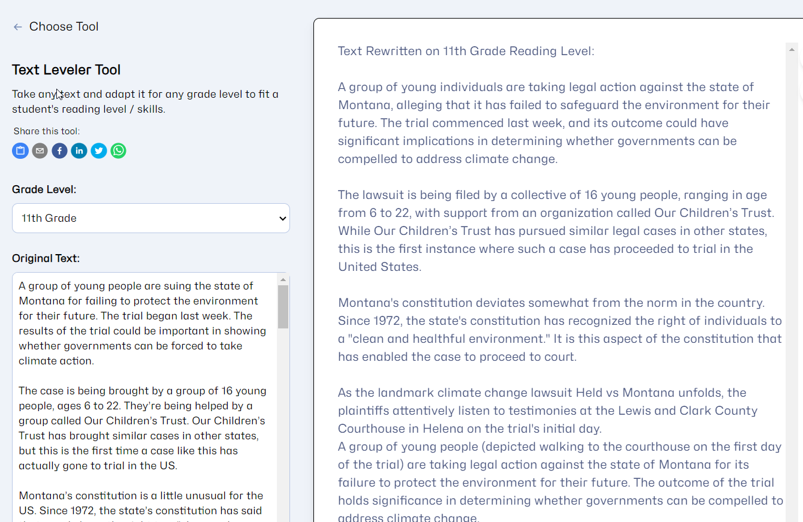](images/8e70cc64-aca9-4460-82ae-65b37d2e62d9_1340x871.png)

## Planning: Make it Relevant

With the Make it Relevant tool, you can input parameters like grade level, topic (standard), and student interest, and it will generate personalized suggestions for possible activities.

[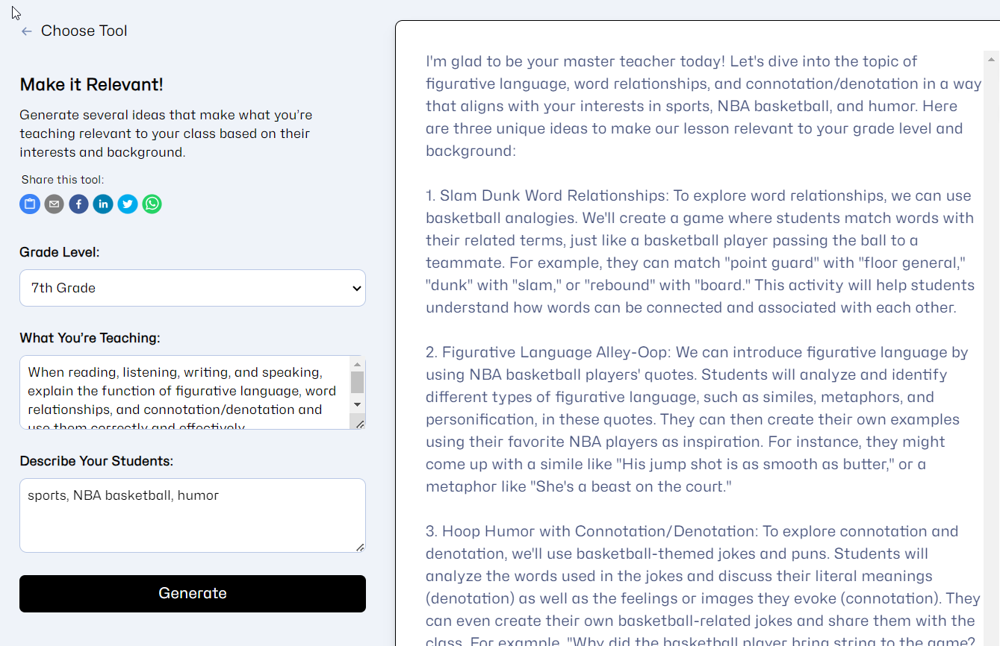](images/b05b1752-9ad4-4367-9792-25ba58c213c6_1339x866.png)

## Planning: Word Problem Writer

Like the tool above, the Word Problem tool lets you input parameters for grade level, topic, number of questions, and story topic, and it generates word problems.

[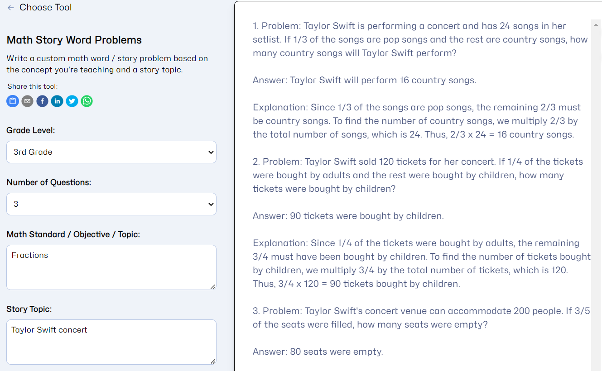](images/a2ddfc9e-700d-4812-ba73-e1687aec28e7_1329x820.png)

> Other Planning Tools: Assignment Scaffolder, Vocabulary Lists, Text Dependent Questions, Reading Quiz Generator, Exemplar/Non-Exemplar Creator, Explanations for Complex Topics, Text Scaffolder, and Directions Clarifier

## Student Support: Accommodation Suggestion Generator

As a new teacher, this would have been gold for me. Input a grade level and areas where the student needs support, and the generator will give you 5-10 accommodations for support.

[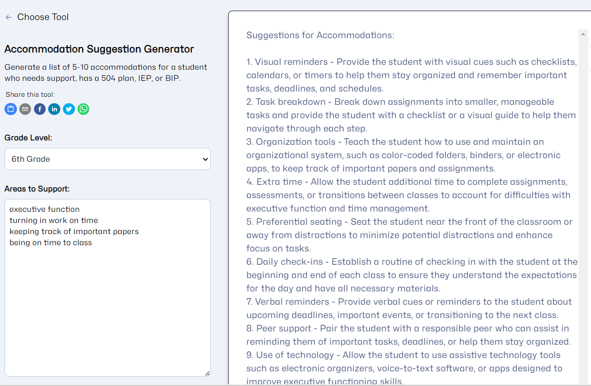](images/a274d1ba-3a63-446f-a4be-d661fc070a0d_1329x869.png)

## Student Support: IEP Suggestion Generator

Aimed at creating an IEP, this tool highlights another perk of MagicSchool.ai. At the surface, my knee-jerk reaction was that this was too sensitive to include, but note that there are no inputs for student name. [The Privacy Policy for MagicSchool.ai](https://www.magicschool.ai/privacy-policy) is one of the better ones I’ve seen for schools and is [worth checking out](https://www.magicschool.ai/privacy-policy). The policy notes that they don’t keep student data. One of the ways they do this is by not requiring student data on any inputs - in this tool, you simply list the scenario you’d like help generating an IEP for, and it gives you suggestions without tying the information to a specific student. There are also safeguards in the case of accidentally entered student information on their platform. As with any AI tool, you shouldn’t just copy and paste generated content from here to an IEP, but it can definitely give you a starting point or additional ideas.

[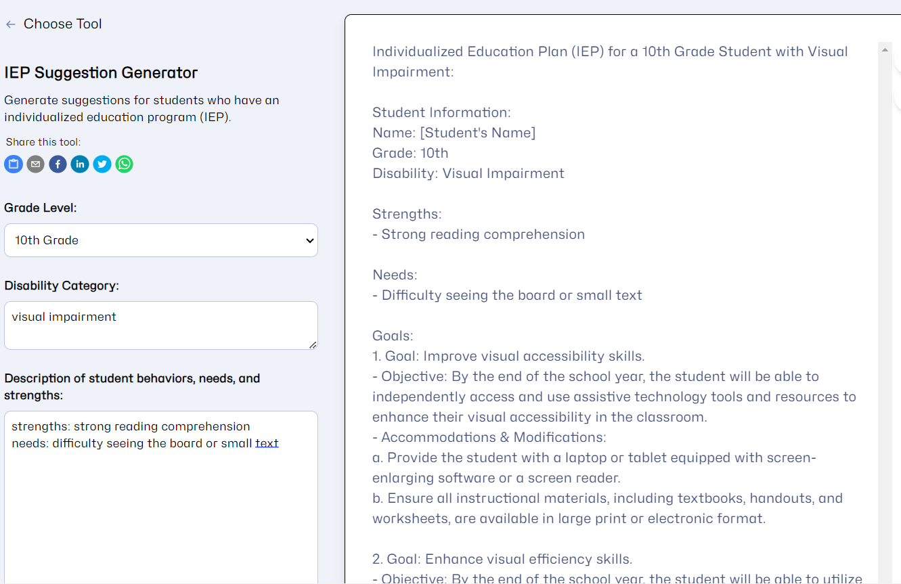](images/0ae718f8-6a9c-48d7-bb1c-93482972aa6f_1331x863.png)

> Other Student Support Tools: Text Leveler, Text Scaffolder, Behavior Intervention Plan Generator

## Communication: Class Newsletter Tool

The Mad Libs-style fill in the blanks should seem pretty natural at this point, but one of my favorite things about this Newsletter tool is that you can select additional languages you want the newsletter to be written in, and it will give you a copy in each language selected.

[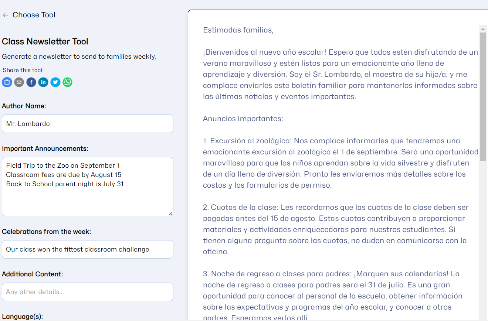](images/99519189-78d2-425b-9195-91a379be2c19_1320x869.png)

## Communication: Recommendation Letter Generator

Rec Letter season can be brutal sometimes. Using a tool like this is an easy way to generate an excellent starting point for recommendation letters that can include specific student traits or activities. Also note that keeping with the site’s policy to not store student information, you’ll need to personalize the final letter with the student’s name and additional identifying information for yourself and the recipient of the letter.

[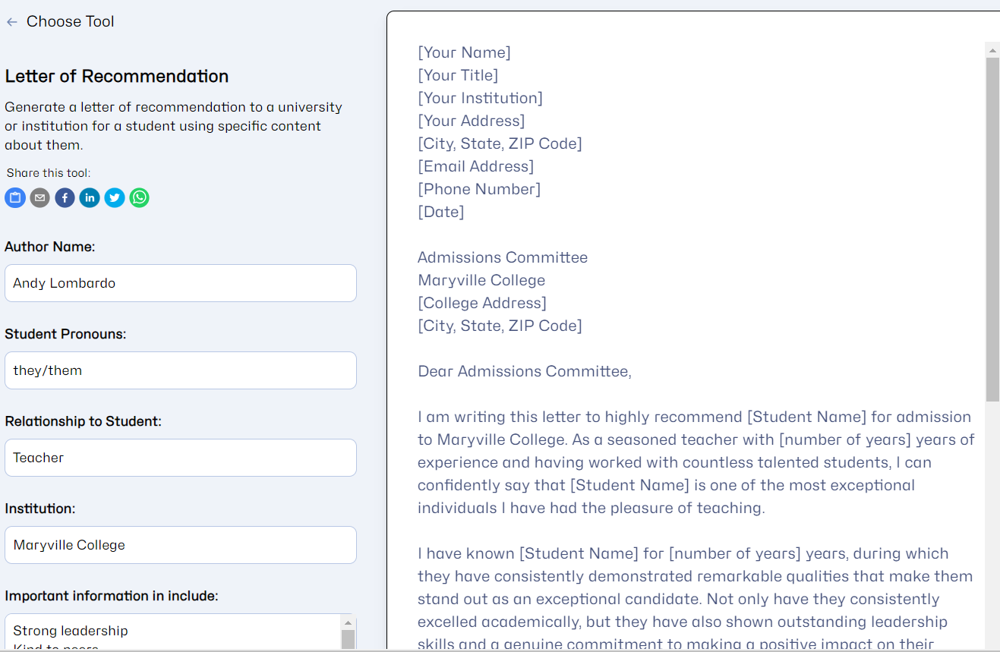](images/d03a85e1-41d2-4fb1-9bb7-b4d9c45cdd3e_1317x859.png)

> Other Communication Tools: Email Responder, Family Email Tool

## Productivity: Text Proofreader Tool

This is a powerful tool for teachers and students. In addition to proofreading a piece of text, this tool will also highlight any changes made in the text.

[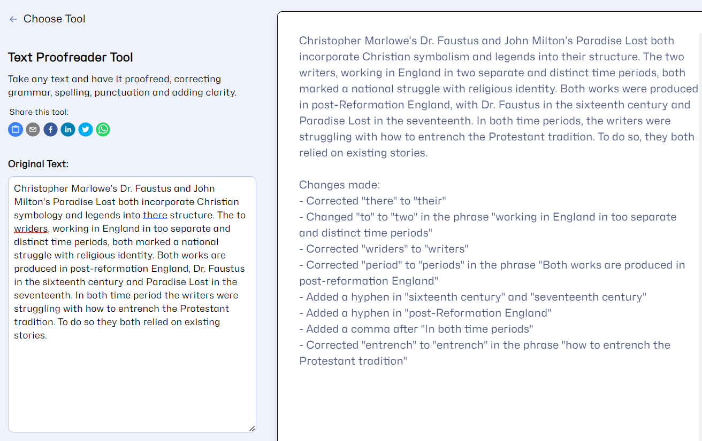](images/441890e3-0e92-4bc8-a159-e28d77a5cb5e_1312x826.png)

## Productivity: Text Summarizer Tool

The Text Summarizer Tool lets you input a text up to 20 pages and set a summary length. The example below took about 10 pages of documentation and summarized it to 250 words.

[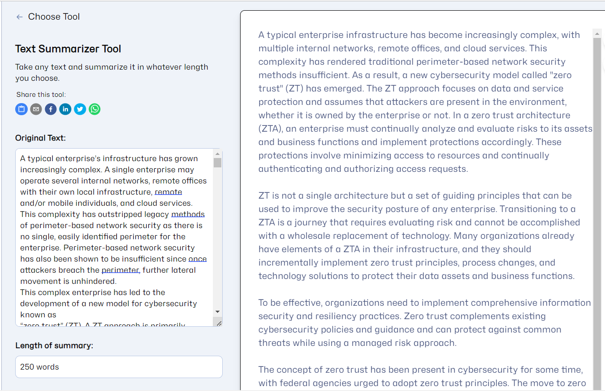](images/f7146b62-96ee-47b8-9ef3-9f04f5044895_1353x876.png)

> Other Productivity Tools: Text Rewriter Tool, Text Translator Tool

## Community Tools: Restorative Reflection Generator

This tool quickly generates a restorative reflection assignment based on details you provide regarding a disciplinary incident. Note that this is another area where you shouldn’t include any identifying student information.

[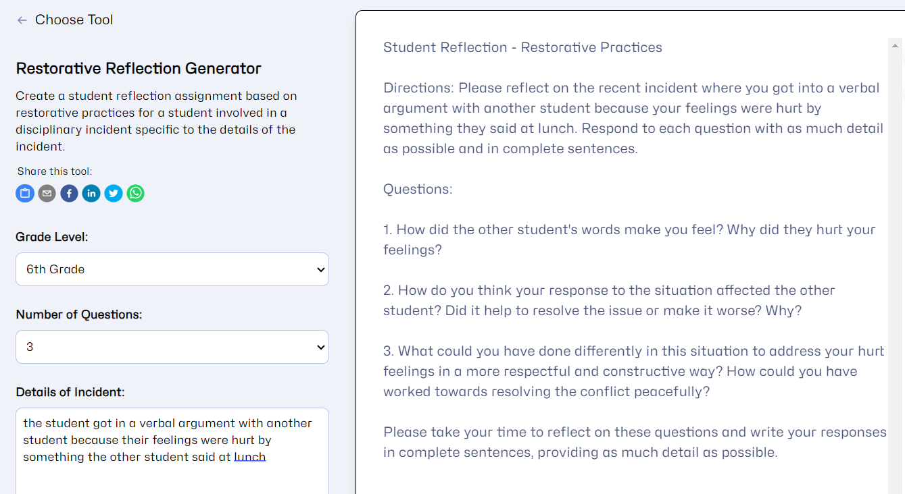](images/8f7d8e1d-7991-4362-a213-f5abdef6ccb7_1339x732.png)

## Community Tools: Ice Breaker Maker

Provide a meeting setting (in person or virtual), whether or not materials are available, and the number of participants to get a handful of ice breaker activities.

[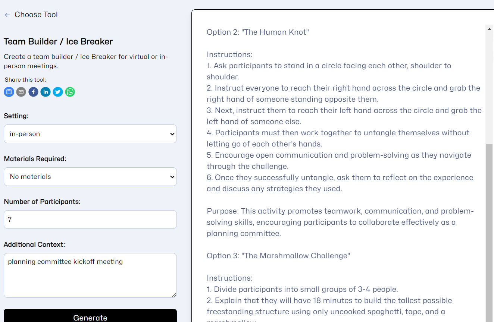](images/94cc3c64-bc19-4b4a-a35a-bf41c4149667_1324x864.png)

> Other Community Tools: Colleague Song Generator, End of Year Comment Generator

## AI Coach

AI Coach - nicknamed Raina - is an open ended chatbot similar to ChatGPT. Raina is geared towards answering questions about teaching and pedagogy.

[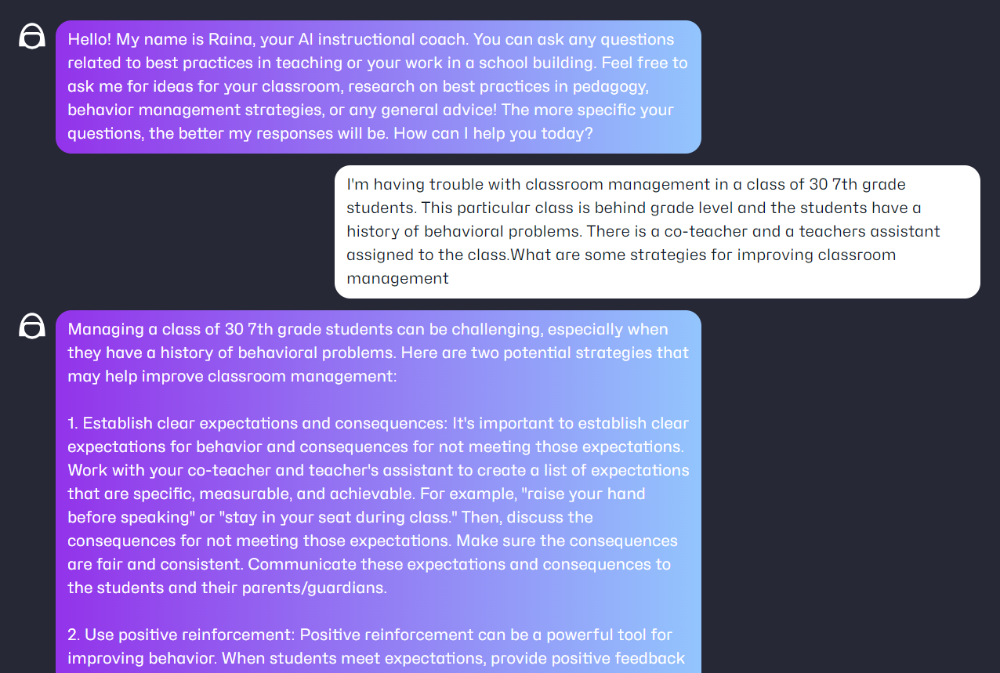](images/b0a59fc9-6f32-4251-97e5-8720a8f14201_1276x859.png)

While free for teachers, MagicSchool.ai is also seeking volunteer schools and districts for early access during the 2023-24 school year. More details can be [found here](https://www.magicschool.ai/partner).
