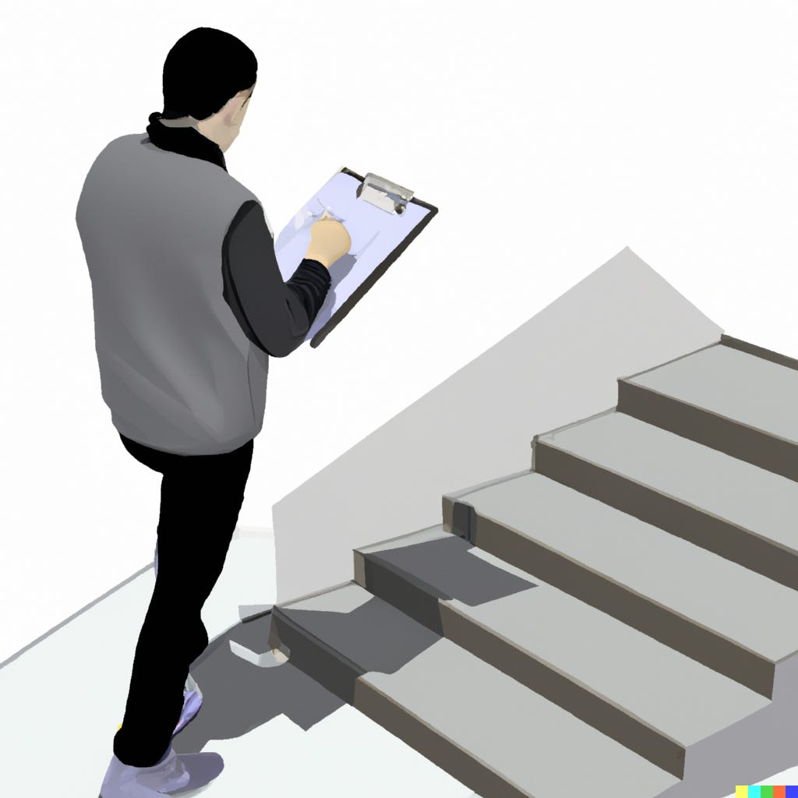
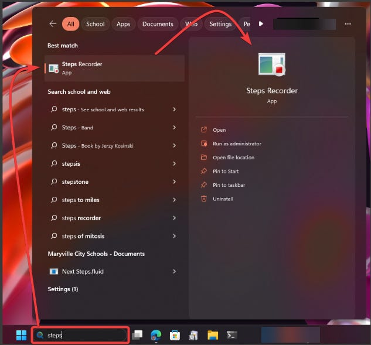
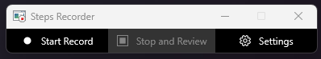
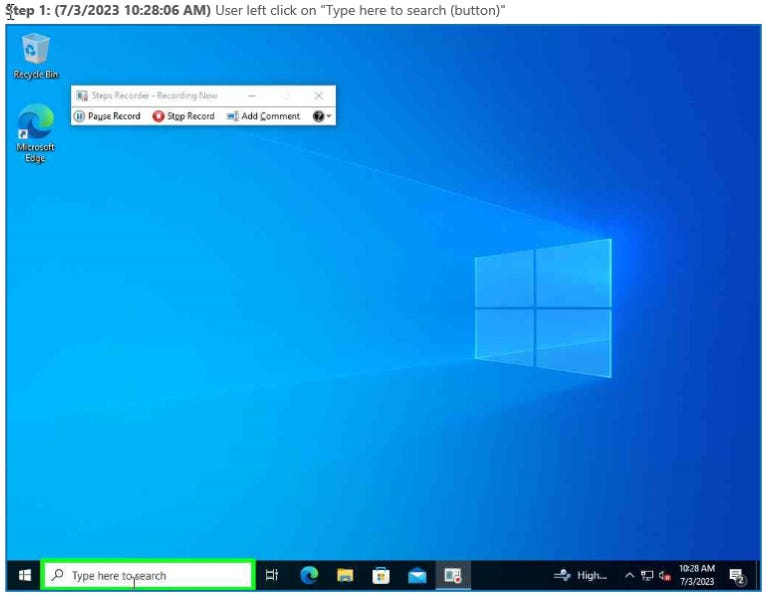
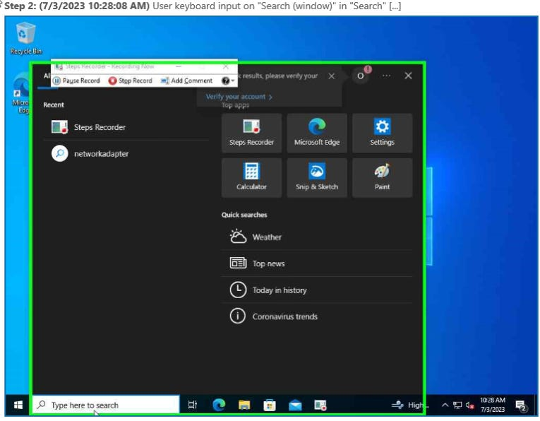
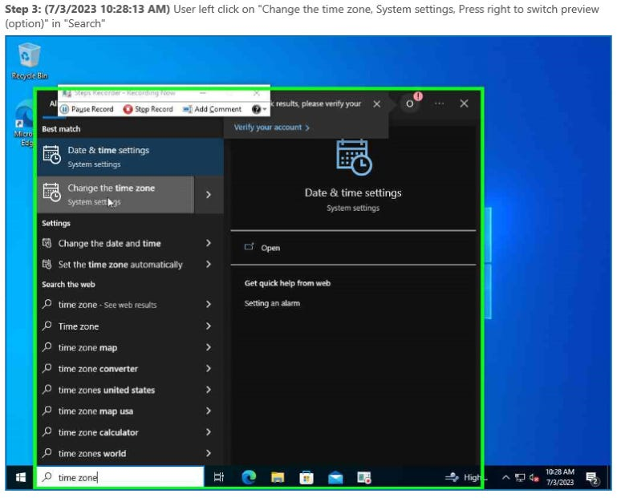
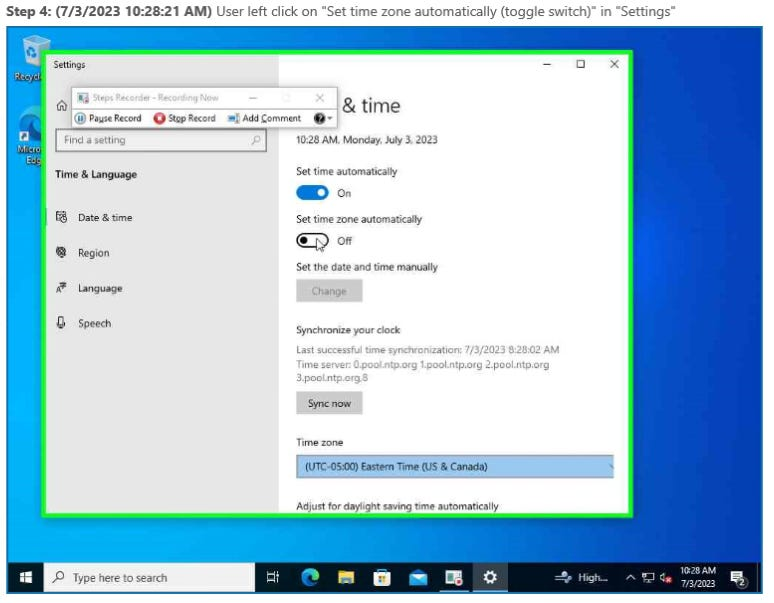
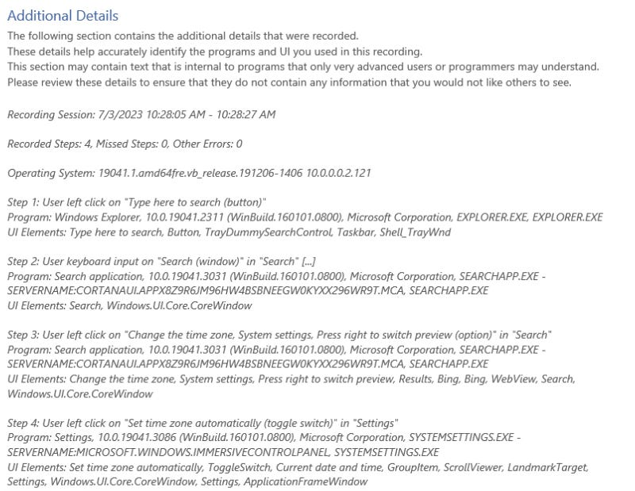
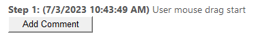
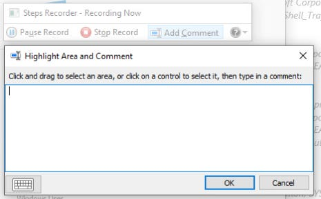

# Record Instructions Using Built-in Windows Tools

*"Steps Recorder" is a must for documentation, or for getting a closer look at a user's problems*

There are two problem areas for IT support that go hand-in-hand: documenting your technology, and helping users when they have trouble with technology. Fortunately, there’s a little-known tool that’s built into Windows that can help with both problems: Steps Recorder.

To find Steps Recorder, you can search for it from the Windows search bar like above.

Upon launching, you’ll find a simple, no-frills interface:

Click on Start Record, and then carry out the workflow you want to capture. In this example, we’ll change the Time Zone setting in Windows from Manual to Automatic. Steps Recorder will grab screenshots of every step you take, and annotate what steps were detected and highlight actions in a green rectangular box.

Next, at the end of the walk-through, there is an Additional Details section that walks through the steps in writing with some additional details about the session and the environment like the time, OS build details, and specific processes.

For me, the most common use case for this is for documenting processes. In my environment, for example, TLS certificates are kind of a pain, partly because every vendor has a different process, and we only do it once a year so by the time we learn the process, we don’t have to use it for another year and promptly forget the nuances. By starting Steps Recorder prior to completing the task, it’s easy to capture what you’ve done both in pictures and in writing. There is also an option to add additional comments. Depending on which Windows version you’re using, this can look slightly different. In Windows 11 22H2, there is an “Add Comment” button like below in the output of Steps Recorder after you’ve finished.

In Windows 11 21H2, there is an “Add Comment” button on the Steps Recorder interface while you’re recording like below:

The second most common use case for me is for getting additional details from a user I’m trying to assist when I can’t remotely access their machine or recreate their problem on my own. Since Steps Recorder is pre-installed in Windows, all you need to do is walk them through launching Steps Recorder, hitting record, and then performing the action they’re having trouble with. The output it provides them is a zip file, which can be problematic based on your security settings. Ideally, zip files shouldn’t be allowed in your mail system, so a work around is to have them save the zip file to their OneDrive or Google Drive and send you a sharing link. If you’re on the same network and have Administrative Shares enabled, you can have them save the zip file to their local machine for you to access.

And that’s Steps Recorder in a nutshell — happy documenting!
