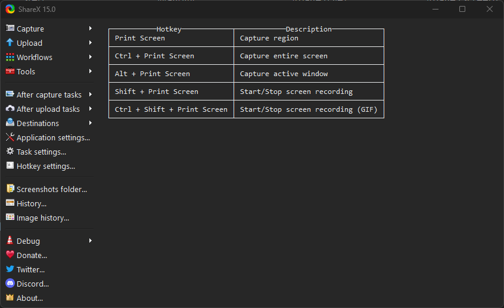
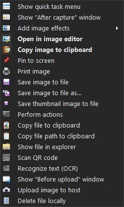
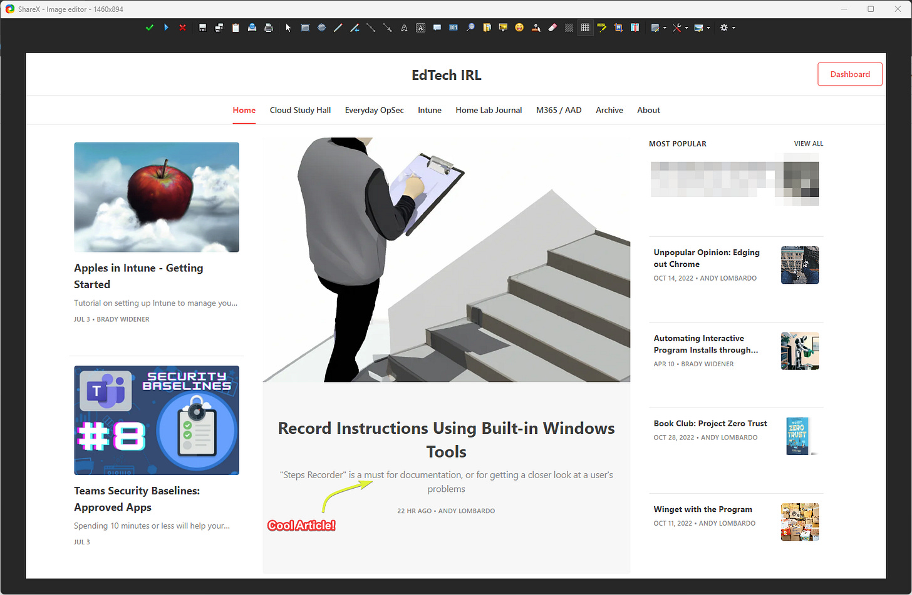
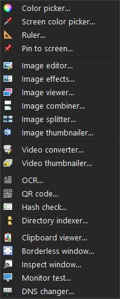

# Handy Tools I wish I knew about sooner - ShareX

*The screenshot tool to end all screenshot tools!*

A common struggle I have in IT is creating good, thorough documentation in a timely manner. Documentation is always important, but at the same time can feel like a pain whenever you have more things on your plate.

Well, ShareX has helped me dramatically with upping my documentation game. ShareX is THE screenshot tool to end all screenshot tools. It is free, open source, and has many handy tools and features built inside of it.

### What makes ShareX stand out?

Many things! My favorites being how granular you can be with the settings to make ShareX meet your needs and the customizable hotkeys.

Most screenshot tools will do a couple of things. After you take a screenshot, you can make small edits, copy the picture to your clipboard, and save it. With ShareX, you have a **list** of things that you can have it do after taking your picture.

The way I have mine set up is to go ahead and copy the image to my clipboard, and then to open in it the built in image editor.

Speaking of the image editor, it is genuinely great. It allows for very simple and fast annotations with a variety of tools (some of my favorites being the text, highlighter, arrows, and pixelate!)

Once you assign your picture taking to a hot key, it cuts down on the time it takes to take the picture you are wanting to add to your instructions.

There is also a screen recorder that allows you to record a video or gif of your screen! Sometimes a picture isn’t enough and being able to send an end user a video/gif of the solution can be a life saver.

All of this together makes for an efficient solution for adding pictures to your documentation.

### Additional Features

Outside of just normal screenshots, ShareX also has a handful of random features under the ‘tools’ section that are also super handy.

My favorites from these are the color picker, OCR (allows for copying text from a picture), QR Code generator and reader, and the quick DNS changer.

Overall, ShareX is a great utility I use every single day. I highly recommend everyone to give it a shot if you have not already.
