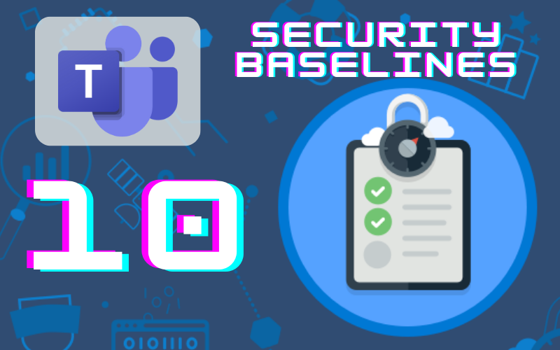
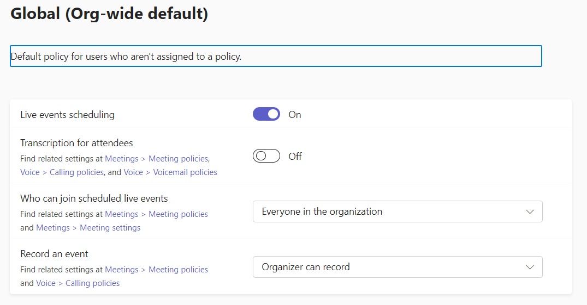

# Teams Security Baselines: Recording Live Events

*Spending 10 minutes or less will help your M365 environment be a little more secure*

In Oct. 2022, CISA released a document called [Microsoft Teams: M365 Minimum Viable Secure Configuration Baseline](https://www.cisa.gov/sites/default/files/publications/Microsoft%20Teams%20M365%20Minimum%20Viable%20SCB%20Draft%20v0.1.pdf). This document outlines 13 steps to take to raise your Microsoft Teams environment to a minimum viable security posture. In this series, we’ll take a look at these 13 steps over a series of articles.

# Baseline 10: Recording Live Events

This baseline reads “Only the Meeting Organizer SHOULD Be Able to Record Live Events.”

## What is it?

By default, live events are recorded.

## Why is it bad?

To increase privacy, meetings should be set to only record if the organizer has decided to record.

## What should you know before enforcement?

If exceptions need to be made to this policy, additional settings can be set up by adding a new Live Events policy. If your organization uses teams and has previously provided all users with the ability to record, the change should be communicated.

## How do you enforce it?

Login to the Teams Admin Center (teams.cmd.ms) and navigate to **Meetings**—> **Live Events Policies**. Select the appropriate policy (Global - Org-wide default) and set the **Record an event** setting to **Organizer Can Record.**

## Resources:

[Live Event Recording](https://docs.microsoft.com/en-us/microsoftteams/teams-live-events/live-events-recording-policies)

Note: The articles in the Security Baselines series aren’t being sent via the subscriber emails. Once the series is complete, I’ll be publishing a single article with links to all of the articles in the series.
