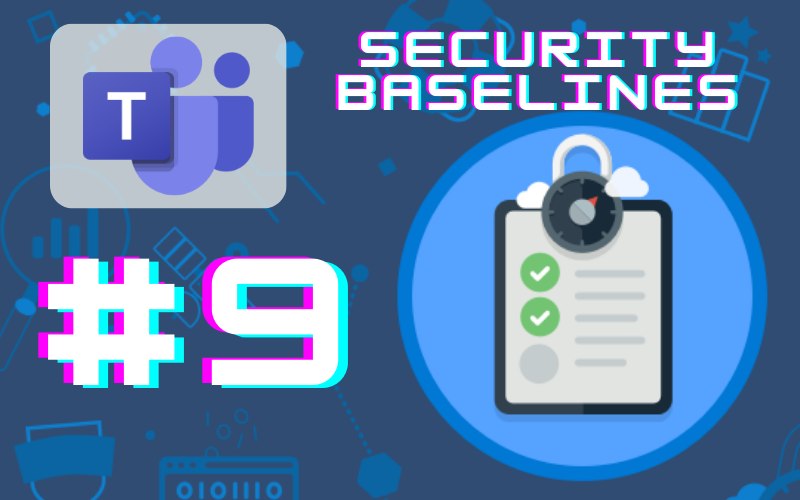
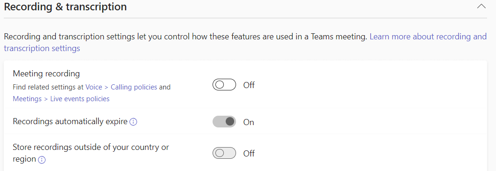

# Teams Security Baselines: Cloud Recording for Unapproved Users

*Spending 10 minutes or less will help your M365 environment be a little more secure*

In Oct. 2022, CISA released a document called [Microsoft Teams: M365 Minimum Viable Secure Configuration Baseline](https://www.cisa.gov/sites/default/files/publications/Microsoft%20Teams%20M365%20Minimum%20Viable%20SCB%20Draft%20v0.1.pdf). This document outlines 13 steps to take to raise your Microsoft Teams environment to a minimum viable security posture. In this series, we’ll take a look at these 13 steps over a series of articles.

# Baseline 9: Cloud Recording for Unapproved Users

This baseline reads “Cloud Recording of Teams Meetings SHOULD Be Disabled for Unapproved Users.”

## What is it?

This setting refers to whether video can be recorded in meetings hosted by a user, during one-on-one calls, and on group calls started by a user.

## Why is it bad?

While not necessarily bad, default settings for user recording in Teams is to allow recording for all users. This baseline suggests explicitly denying the ability to record across the tenant in the Global policy, but creating explicit policies to allow recording for approved users as a way of vetting who should have recording rights.

## What should you know before enforcement?

To make this process going more smoothly, it’s helpful to plan out in advance who should have access to recording meetings, and add them to a M365 group (or re-purpose an existing M365 group). Then, to create a policy for them, go to the Teams Admin Center (teams.cmd.ms) —> Meetings —> Meeting Policies —> Group Policy Assignment.

## How do you enforce it?

Login to the Teams Admin Center (teams.cmd.ms) and navigate to **Meetings**—> **Meeting Policies**, select the appropriate policy (Global - Org-wide default) and then scroll down to **Recording and transcription**. Set the **Meeting recording** toggle to OFF.

Next, go back to Meetings —> Meeting Policies and find any policy groups where you want to allow recording, and use the steps above to make sure Meeting recording is toggled to ON. You should also ensure that the **Store recordings outside of your country or region** toggle should be set to OFF.

## Resources:

[Teams Cloud Meeting Recording](https://docs.microsoft.com/en-us/microsoftteams/cloud-recording)

[Assign Policies in Teams](https://docs.microsoft.com/en-us/microsoftteams/policy-assignment-overview)

Note: The articles in the Security Baselines series aren’t being sent via the subscriber emails. Once the series is complete, I’ll be publishing a single article with links to all of the articles in the series.
