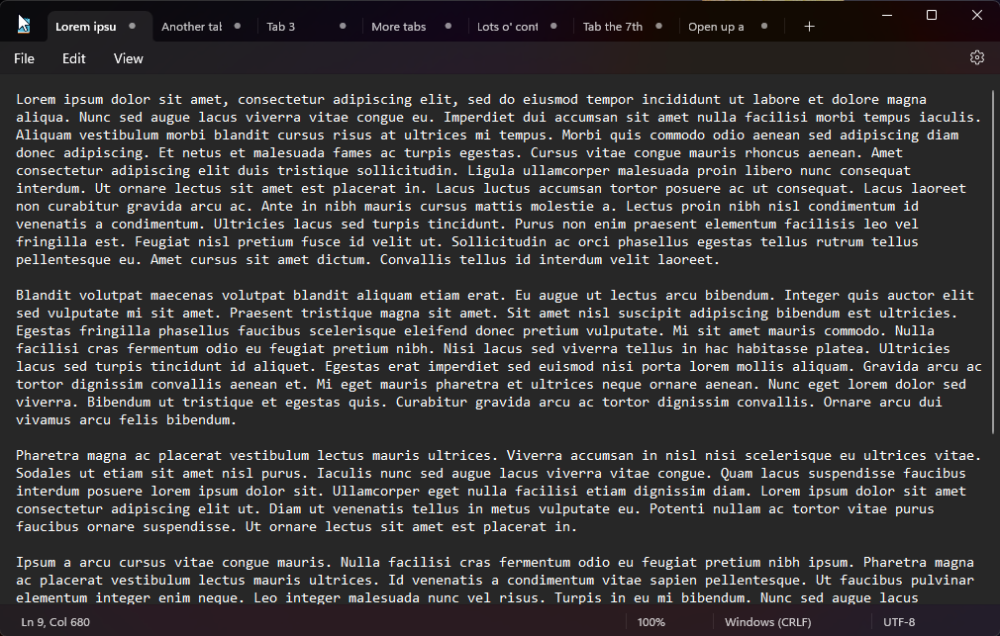
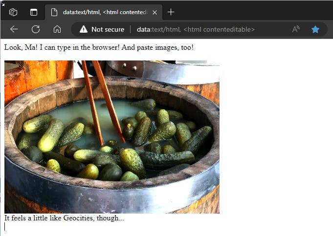

# Quick Tip: Built-in Scratchpad in Chrome/Edge

*Keep ephemeral data at hand without leaving the browser*

If you’re like me, there’s a good chance you have an instance (or 20) of Notepad open on your desktop at any given time. If you don’t like having to jump out of your browser to use Notepad, there’s a built-in feature in both Chrome and Edge that can give you your own personal little offline pastebin to be able to jot down details or paste an image.

To access this, simply type the following into the address bar of your browser window:

> `data:text/html, <html contenteditable>`

It should open up a blank window like below that has a place for editable text or images:

## A couple of caveats:

1. You can add this page to your favorites for easy access, but it doesn’t save content from one session to another. Every time you open the window, it will be a blank workspace.
2. Ditto for refreshing the page or hitting the back button - if you do that, any content will disappear
3. There’s not really a solid way to save the content you put on these pages without copying, pasting, and saving back in good ol’ Notepad.

Taking all of that into account, this is really most useful as a place to keep ephemeral content that you just want to have handy in the short term without having to leave the browser. For that one trick, though, this does the job perfectly.
