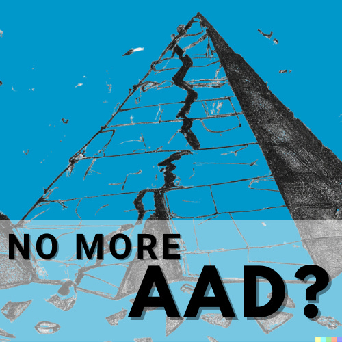
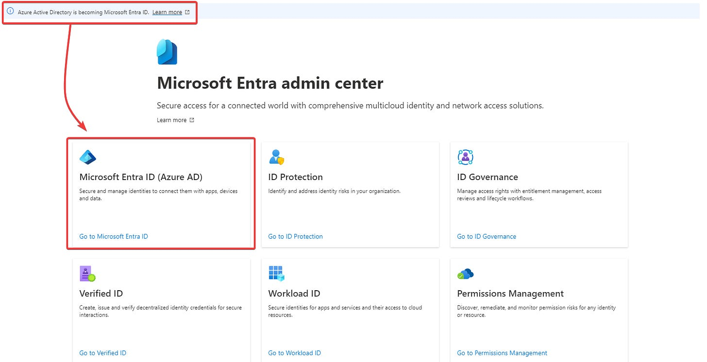
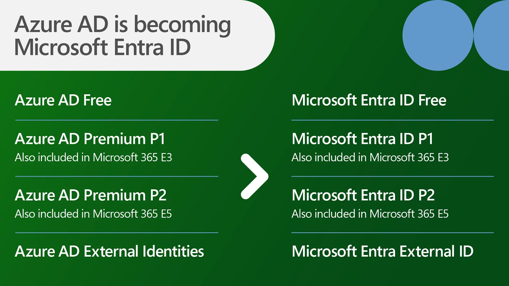

# No More Azure AD?!

*Sorry... this is the clickbaitiest title I could come up with, but it's true*

As of today, Microsoft is beginning the process of rebranding Azure AD as Microsoft Entra ID. While changing product names shouldn’t be a surprise in tech, I have to admit this one is going to take a long time to adjust to (and update documentation for). However, the most important detail you need to know related to the change:

No action is needed on your part.

According to Microsoft:

> To simplify our product naming and unify our product family, we’re changing the name of Azure AD to Microsoft Entra ID. Capabilities and licensing plans, sign-in URLs, and APIs remain unchanged, and all existing deployments, configurations, and integrations will continue to work as before. Starting today, you’ll see notifications in the administrator portal, on our websites, in documentation, and in other places where you may interact with Azure AD. We’ll complete the name change from Azure AD to Microsoft Entra ID by the end of 2023. **No action is needed from you.**

## What else do I need to know?

The real meat of [today’s announcement](https://www.microsoft.com/en-us/security/blog/2023/07/11/microsoft-entra-expands-into-security-service-edge-and-azure-ad-becomes-microsoft-entra-id/) has to do with two new products for securing network access: **Microsoft Entra Internet Access** and **Microsoft Entra Private Access**, both in Preview. Combined with Microsoft Defender for Cloud Apps, these three resources will make up what Microsoft is branding as their **Security Service Edge (SSE)**.

## “Identity Centric”

Each of these products is its own deep dive, but, in short, the goal is to increase the role of identity in network access.

Microsoft describes Entra Internet Access as an “identity-centric Secure Web Gateway that protects access to internet, SaaS, and Microsoft 365 apps and resources,” while Entra Private Access is described as an “identity-centric Zero Trust Network Access that secures access to private apps and resources.”

The key purpose of Entra Internet Access is to unify access controls by bringing the corporate network into Conditional Access, where Microsoft can deliver security through the cloud with web content filtering and cloud firewall. Additionally, the integration of network signals allows for enriched logging, leading to greater visibility and security in M365.

Entra Private Access, on the other hand, is focused on securing access to private resources. It seeks to modernize remote access by replacing VPNs with identity in the Private Access platform. Private Access also provides breach protection through conditional access controls for apps, as well as the ability to segment or microsegment apps at the user, process, or device level.

Combining those features with the existing Defender for Cloud Apps (MS’s Cloud Access Security Broker), and a landscape emerges where access to M365, private networks, SaaS, and private apps and resources are all tied to Microsoft Identities, where conditions, compliance, and permissions can be defined and enforced.

## The Extended Family

With these additions and re-brandings, the Microsoft Entra family starts to take shape:

### Identity and Access Management

Entra ID (AAD) - for managing users, apps, workloads, and devices

Entra ID Governance - for protection, monitoring, and auditing access to critical assets

Entra External ID - for providing access to external customers and partners

### New Identity Categories

Entra Verified ID - for issuing and verifying credentials

Entra Permissions Management - for managing ID permissions across multi-cloud infrastructure

Entra Workload ID - for securely connecting apps and services to cloud resources

### Network Access

Entra Internet Access - for securing access to the internet, SaaS, and M365

Entra Private Access - for helping users connect to private apps and resources regardless of location

This announcement is still fresh, but as an M365 administrator, there are a lot of exciting shifts going on. Even if I have to adjust to new names, the vision that’s being shared is really investing in Zero Trust in a way that isn’t trying to cash in on the buzzword marketability, and its really treating identity like the new perimeter.

## Resources:

[Microsoft Entra expands into Security Service Edge and Azure AD becomes Microsoft Entra ID | Microsoft Security Blog](https://www.microsoft.com/en-us/security/blog/2023/07/11/microsoft-entra-expands-into-security-service-edge-and-azure-ad-becomes-microsoft-entra-id/)

[Azure AD is Becoming Microsoft Entra ID - Microsoft Community Hub](https://techcommunity.microsoft.com/t5/microsoft-entra-azure-ad-blog/azure-ad-is-becoming-microsoft-entra-id/ba-p/2520436)

[Microsoft Entra Internet Access | Microsoft Security](https://www.microsoft.com/en-us/security/business/identity-access/microsoft-entra-internet-access#tabx564acb7df98f47708c2fc832b7944444)

[Microsoft Entra Private Access | Microsoft Security](https://www.microsoft.com/en-us/security/business/identity-access/microsoft-entra-private-access)
