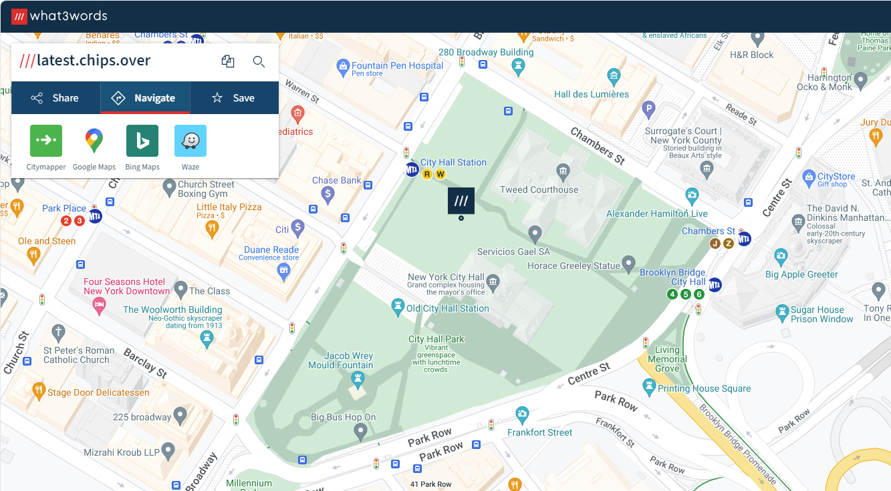

# ///what3words

*Handy Navigation / Documentation Tool*

If you’ve ever tried to find your way to somewhere that isn't exactly an address, what3words is a novel solution.

The premise of the site is simple — every 3 square meters of the planet is assigned a unique combination of 3 words. You can then use the what3words app or website to navigate to that 3 word plot. Want to go to the pitcher’s mound at Wrigley Field? Easy — ///hang.metro.closed. The middle of Stonehenge? ///workbook.remark.galloping. The location of a secret treasure, buried at… you get the idea.

One place this has translated to use in EdTech is in documentation. For example, if we are documenting assets in a network closet, labeling them as School X - Room 15 doesn’t tell someone where to go to find the asset or the closet, but the what3words code will take them straight to it. This is also useful for sending someone to a specific location they haven’t been to before. Their GPS can get them to the front door, but beyond that, it’s difficult. If I’m sending a new technician to work in a classroom that I can give 3 words for, they don’t have to have visited the building before to be able to find it, which is especially helpful if we’re working after hours. When you have an experienced person who knows exactly where the alarm panels, battery backups, and breaker boxes are, with a few clicks they can send out a technician within a few feet of the issue. When being used this way, the main caveat is elevation — what3words is 2 dimensional, so if you have a multi-story building, the same spot on each floor has the same tag. To solve this issue, we include the floor in documentation as appropriate.

One controversial use for what3words is in passwords. While some people worry that using what3words combinations for passwords could lead to a compromise if the what3words wordlists were ever leaked, the fact that there are 57 trillion combinations still provides a large enough dataset to prevent a dictionary attack. And besides, if using the what3words code for where you met your spouse helps you remember your password and prevents you from using a weak password, you’re going to be less attractive to attackers every time. There isn’t a feasible scenario where a password like Password123 or PWSummer23 will ever beat something like financial.employs.surfers.
