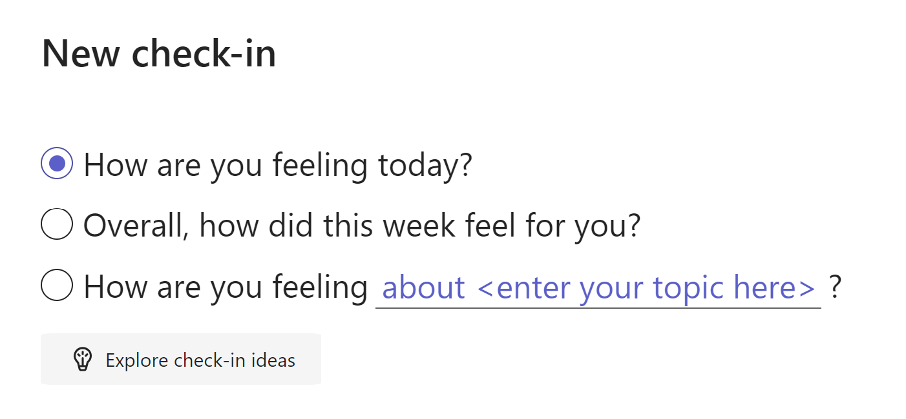
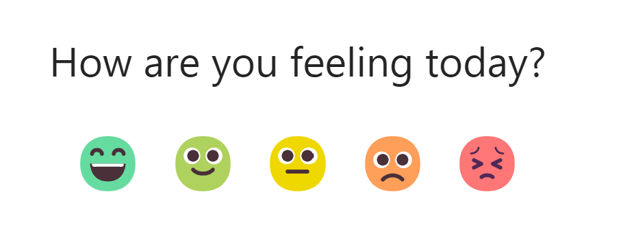
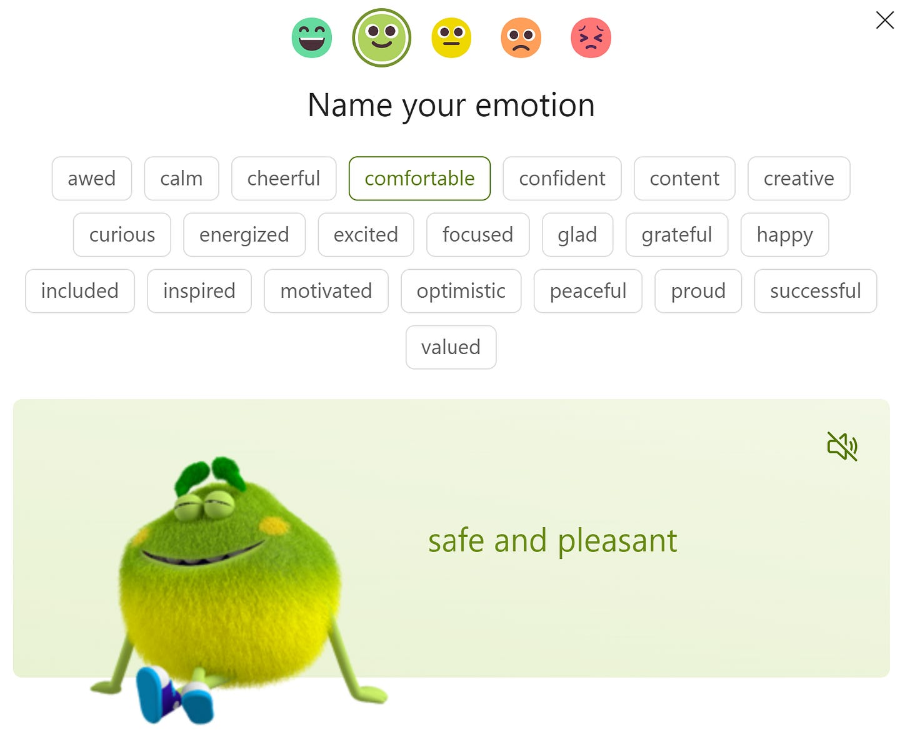
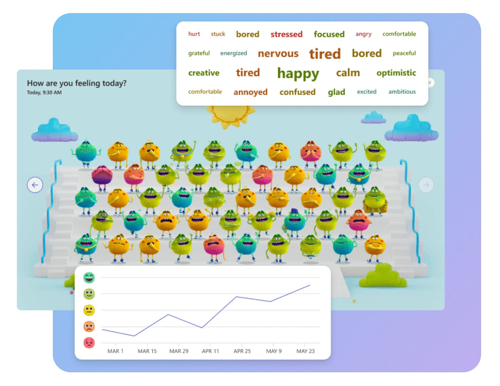
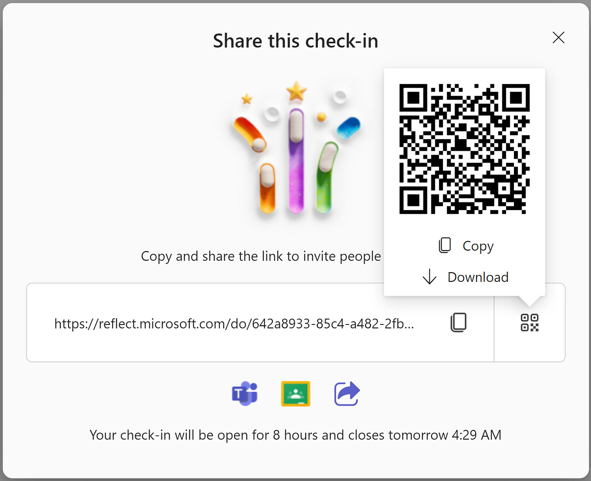
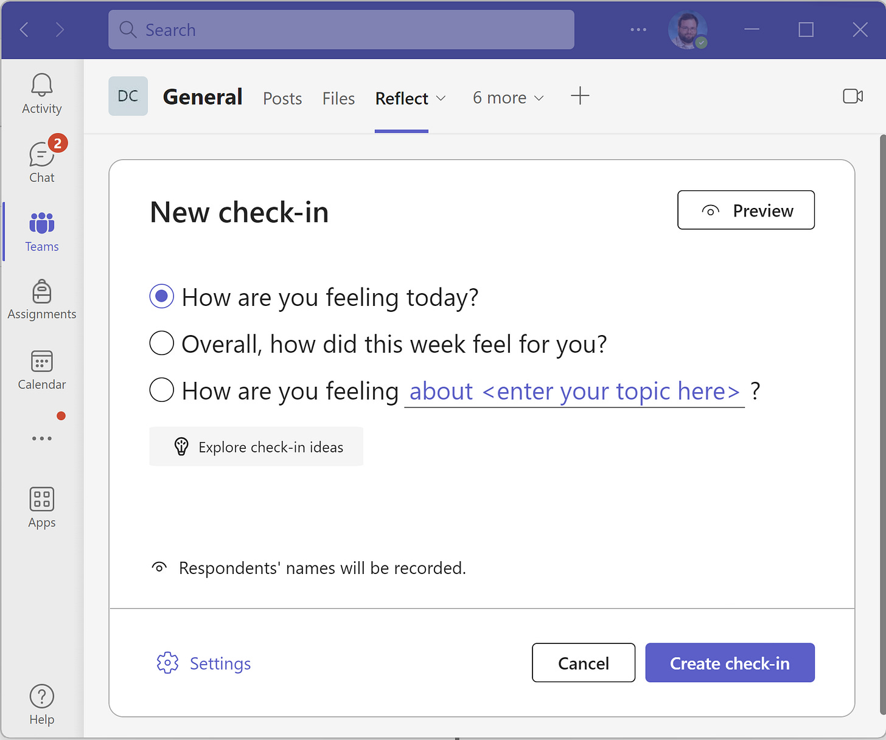
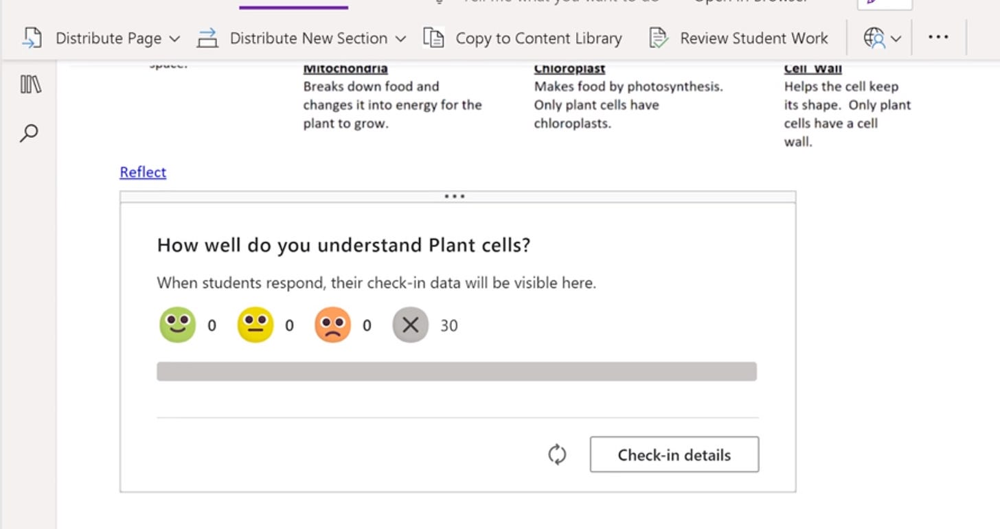

# Monitor Social & Emotional Learning with Microsoft Reflect

Microsoft Reflect is a simple idea with a powerful application. In an increasingly digital environment, Reflect gives you a quick way to gather data on how your students are feeling. Similar to the tried-and-true method of thumbs-up/thumbs-down for understanding, Reflect is a quick pulse-check on a specific area. Unlike thumbs-up/thumbs-down, Reflect is private, and the data is aggregated and tracked over time.

The core component of Reflect is a check-in. As the teacher, you can create a check-in using one of these 3 options: How are you feeling today?, Overall, how did this week feel for you?, or How are you feeling about <enter your topic here>?

As a student, the check-in gives you an opportunity to provide feedback first by selecting an emoji:

Next, the student is prompted to “Name their emotion” by selecting an emotion from a list of pre-selected descriptive words. When hovering over the emotion, a short descriptor and illustration is given. The emotions given are sorted based on the emoji selected in the previous step. The options for the “smiley” emoji are below:

When providing a class or group with a check-in opportunity, the teacher also gets collective feedback regarding their classes check-ins, both for a specific session and over time:

## Where can you access Reflect?

Reflect is accessible in a few areas. First, it can be accessed ad-hoc directly from the web at reflect.microsoft.com. Once the check-in is created, it can be shared via link, QR code, Teams, or Google Classroom like below:

If you use Teams, the Reflect Teams Add-in can be added and made available within any Team.

Reflect check-ins can also be embedded directly in a OneNote Class Notebook:

Finally, check-ins can be integrated with your LMS via an LTI integration. This integration is still in preview, but information for gaining access can be [found here](https://forms.office.com/Pages/ResponsePage.aspx?id=v4j5cvGGr0GRqy180BHbRzbr6ruPdtZFk3nxiNpFT0FUNkNNSTdPQkZQWkpMMFJUTlk5TkI3SU5PRC4u).

## Resources

[Educator Toolkit | Microsoft Reflect](https://reflect.microsoft.com/home/resources/)

[Reflect - All the Feels - YouTube](https://www.youtube.com/playlist?list=PLiluTszfwwMLecvyMkPbYnhB-7RFl_K63)

[Microsoft Reflect | Encourage connection, expression and learning](https://reflect.microsoft.com/)

[Get started with Microsoft Reflect - Microsoft Support](https://support.microsoft.com/en-us/topic/get-started-with-microsoft-reflect-c6cbbacc-5655-450e-bca9-988ddc506017)
