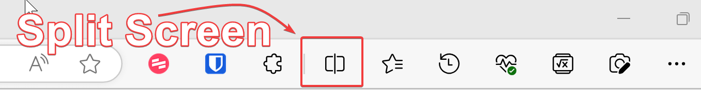
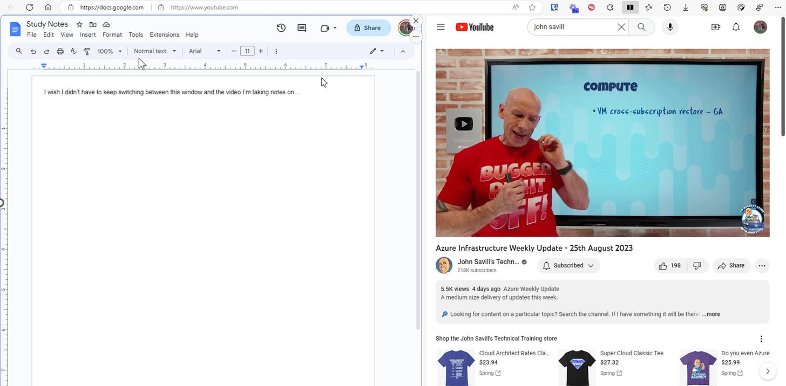

# Quick Tip: Split Screen Browsing in Edge

If you ever find yourself in need of having two of your tabs open on the screen at the same time, hitting the split screen button in Edge is a quick solution:

The most common time I benefit from this is while watching a video or viewing instructions in one pane, while following along in the other. It’s also useful for watching a video while taking notes.

Even though it’s possible to do this by opening two different windows, using the split screen button in Edge makes the task quick and snappy.
