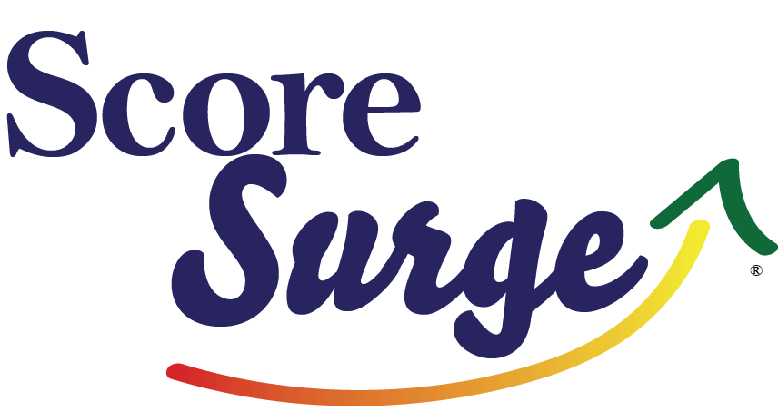
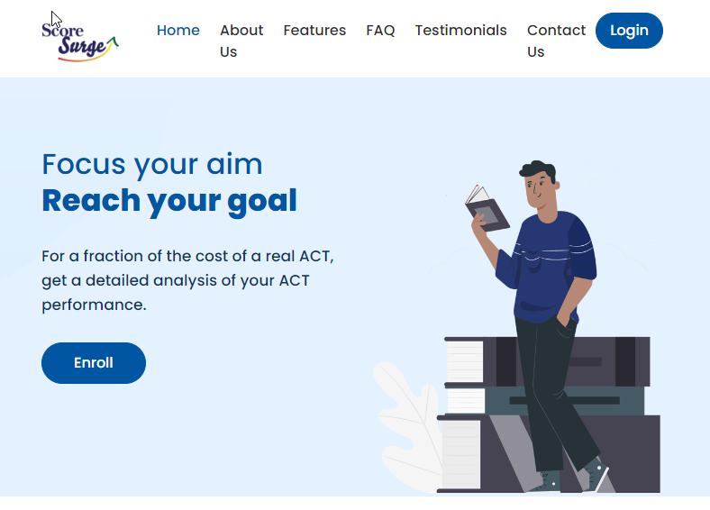

# Guest Post: Starting a Software Company Part 2

*Technical specifications, successes, challenges, and final thoughts*

In [part 1](https://www.edtechirl.com/p/guest-post-starting-a-software-company), I described what ScoreSurge is, why I created it, and how I did it.

Now, I will describe the technical specifications, challenges in the development process, and success for what we have achieved.

## Technical Specifications

I contacted some of the most tech savvy people I knew, and we discussed the idea and their willingness to be involved.

I used my background in data analysis and database design, along with my (extremely limited) knowledge in writing code, as well as 30 years of end-user experience to envision an interface and reporting system that would provide meaningful analysis for both students and educators.

We searched for any access to local programmers but were unsuccessful in locating anyone with the skills we needed and interest in the project. We decided to use Upwork to contract with programmers, which gave us global access. The group we chose was based in India. They consulted with us on the design and created wireframes to mockup the interface, which helped both of us understand what we were trying to achieve. We emailed and met virtually for a few months to develop the plan, and then they created a detailed budget. The positives of working with the group in India were the cost savings and willingness to take on the project. By working with a group that would charge $15/ hour, I was able to create a working product that could generate income. The downside was that I was reliant on a group that I had limited contact with and oversight of. They were professional, but even under the best scenario, there is a lot of trust in the process. In the end, it worked. There were issues with the quality of the programming that I had to go back and clean up, but for the price I paid, it was a tradeoff worth making.

The program is set up as an EC2 instance Ubuntu server in AWS cloud-based services. We are currently set up with an RDS database. I use Stripe to manage payments online and have the ability to work with schools that prefer P.O.s and check payments. We have recently upgraded to a larger server instance and are working to improve the import process to utilize IMS OneRoster standards as well as improve the efficiency of the design. Through a social media post, I had the good luck to have a former student reach out to me. He asked some questions and expressed a willingness to help on the project. As a very accomplished full-stack programmer who now works in a project management role, his skill set and advice have been invaluable as we evaluate the product. He has reviewed the code and prioritized the areas of highest need in order to maintain and improve the product at a high level of service. He has validated the security and enhanced our capacity as we grow.

## Challenges

By far the biggest challenge has been locating and hiring full stack developers. Even with my own skills and tech experts, it is extremely challenging to locate high quality programmers and maintain a budget. I have tried to locate students or inexperienced programmers that could be mentored, and for a variety of reasons, it has not worked out so far. There are thousands of programmers available, but many are skilled in areas outside of what I need, and the majority are at a level where they can work on existing projects, work with guidance, or bug fix a specific task but not necessarily design a project from idea to implementation. There just are not many accessible full stack developers that I could locate and afford that could look at the project holistically and assist with the overall architecture and design. Those with the skills are expensive and in very high demand. (Educators, if you want to meet the needs of the future, get young people interested in coding, but even more importantly, tap into the creative spirit of software architecture and design. Creativity will continue to be in high demand.)

For me personally, the biggest challenge is the sales and marketing. It is not in my personality to sell anything. I am constantly allowing people to add users, extend contracts, etc. because I want people to be successful. I am not comfortable selling myself or the product because I feel like I am bragging. I have always focused on substance over appearance. Therefore, I have little to no experience in marketing because it does not interest me. I have really had to push myself to fully engage in the process.

## Successes & Rewards

Helping students and professional educators meet goals has been a decades-long pursuit for me. In this case, what are the specific goals I hope to help them meet?

1. Helping students and their families earn scholarship money to assist with college expenses and continue a young person’s education at the highest level possible is the number one and most obvious goal.
2. For schools, it not only helps reach the goal of assisting students but also plays into many schools’ accountability ratings. Data Data Data- we get sick of hearing about it, but it is a powerful way to visualize areas of strength and weaknesses. In this case, the software is allowing students and teachers to visualize trends in the data that capture strengths and weaknesses for both individual students and for large groups in a school for ACT preparation, but I am also using data analysis to validate how successful our program is.
3. On a slightly more subtle but important level, this specific software allows students and teachers to visualize how to monitor and transfer specific curriculum standards and goals to the application level. This is a goal that I believe schools need to consider more in their long-term planning. ScoreSurge allows students to learn skills related to goal setting and self-efficacy.

## Have I met these goals?

Yes, I continue to monitor data, but for schools that are using our software, they are routinely beating the national averages for growth in scores. The number of students raising their scores by 2+ points and the amount of scholarship money tied to those gains is significant. It is the success of these goals that has kept me motivated to continue.

## Would I do anything differently?

Honestly, I don’t think I would do much differently. The most frustrating thing so far was that the initial launch was ready for February 2020. Fortunately, since I chose not to take out loans, it did not cause a financial burden to delay sales when schools closed due to COVID. I could not have done this as my primary source of employment and income, but as a supplement to what I already do, it has been rewarding. I am helping students, families, and schools work toward important goals. I get to use the product in some of my classes. It has been an interesting exercise of my intellectual and technical skills. It has gotten me out of my comfort zone. It has not been financially lucrative, but it has over three years begun to pay for itself. Sales have increased, although slowly. It has cost tens of thousands of dollars to cover the development and running of the business. Considering we completed initial development and were ready to launch the product in February of 2020 as the world shut down, we are pleased with the growth the company has shown so far.

## Pleasant surprises?

The program gives me an even more detailed window into how successful students can be with the ACT. I often have to rely on the student to mention the long-term results they achieve on the official test, but it is very rewarding to have students come back to me and tell me that their score went up 8-10 points over a year to 18 months. Occasionally, it even involves screaming and jumping up and down.

I think the most rewarding result was a young man who is autistic and had decided to apply to a college program designed to support autistic students. His ACT was a 15, so he was denied admission. He worked in one of my classes with our program, and he was able to raise his score to a 20. His English score went from a 12 to a 23. He is currently a successful student at college.

## Has it been worth it?

Yes, I would do it again. I would be much more “schooled” this time and wouldn’t be working in the dark. But hindsight is always 20/20.

## Resources:

[ACT Prep Test Online: a fraction of the cost of a real ACT - Score Surge (scoresurgeprep.com)](https://scoresurgeprep.com/)

[ScoreSurgePrep - YouTube](https://www.youtube.com/channel/UC-ybMUXJPSlxQnQs_ZgBaWA)

[ScoreSurge (@scoresurgeprep) • Facebook](https://www.facebook.com/scoresurgeprep)

[ScoreSurge (@scoresurgeprep) • Instagram photos and videos](https://www.instagram.com/scoresurgeprep/)
