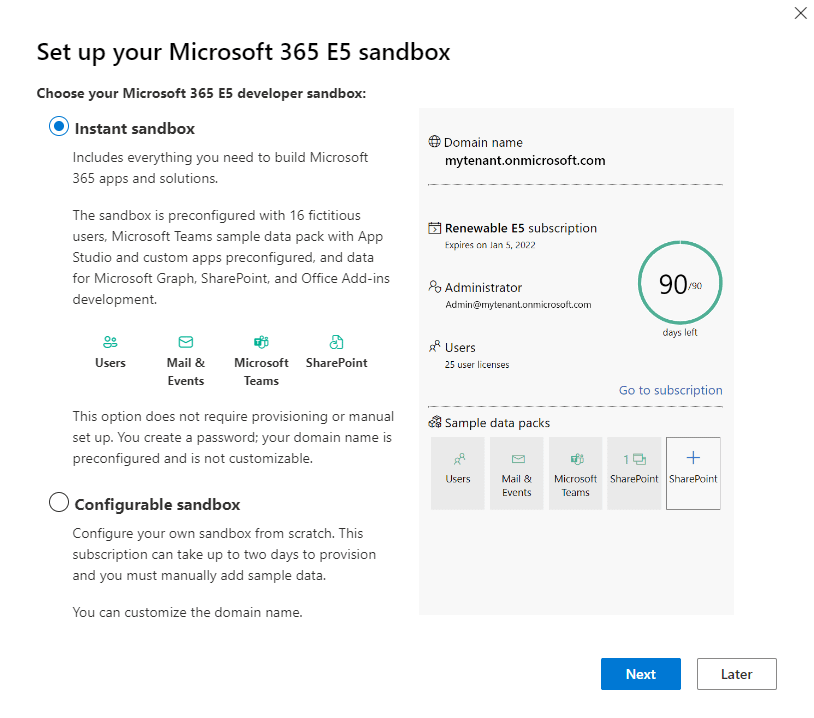
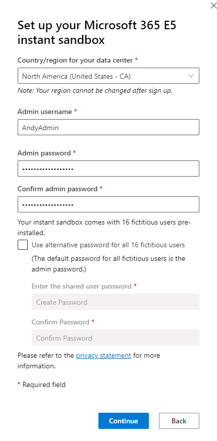
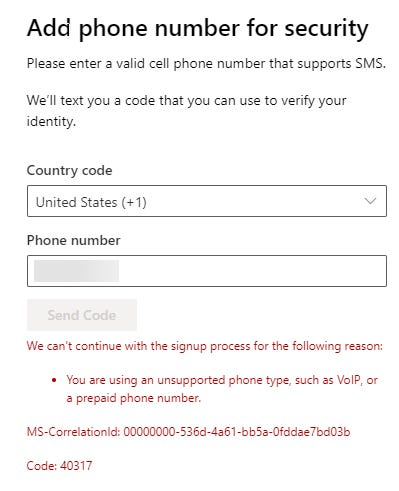
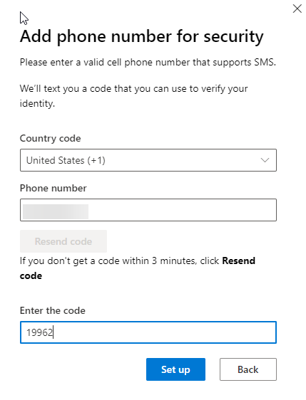
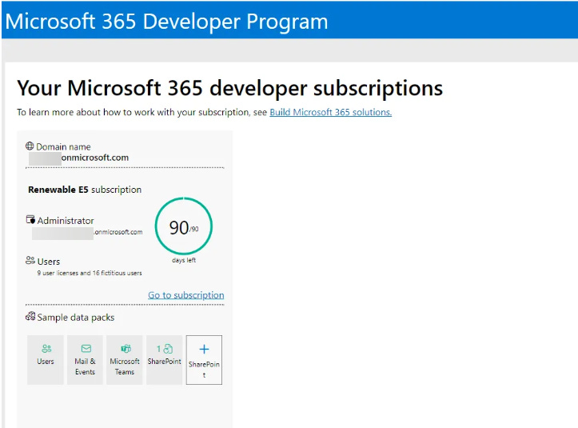
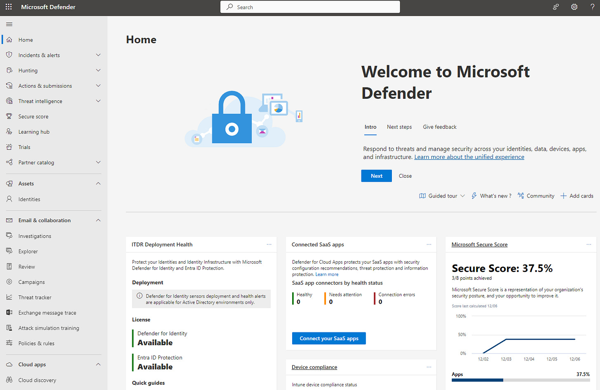

# Free M365 Playground / Test Lab for Work or Play

*A good place to blow up before you move to production, or as a playground while you learn*

Sometimes it’s nerve-racking to hit the “Save” button when you’re working in Microsoft 365. A misconfiguration here and a forgotten Conditional Access exclusion there, and it’s easy to lock yourself out or block your users from receiving their emails. To help feel better about committing changes, it’s great to have a test environment. It’s also nice when you’re planning a big architectural change or policy change and you’re curious about what it really looks like before going live. Sometimes, you just need a place where it’s safe to learn without worrying about breaking things.

The Microsoft 365 Dev Center is the perfect solution for these scenarios.

When you sign up for the FREE M365 Developer Program, you get access to a fully-functional M365 tenant with 25 E5 licenses. The M365 sandbox can also include 16 pre-made accounts with data and usage history attached to them.

## What’s the catch?

There are a few features missing, but none that are critical to a dev, test, or pre-production environment. Namely, you can’t add-on paid subscriptions or trials to the account, and there are no Windows licenses associated with it. Teams voice calling is also not included.

## What do you need?

Aside from those missing features, the primary requirements are that you need a cell phone number to sign up… and it’s picky. Neither landlines nor Google Voice numbers work, so you’ll only ever be able to attach one of these tenants to your cell number. The second requirement to keep you running is that for the account to stay active, you have to perform “Developer Activity” before the 90 day expiration of the tenant. As long as activity is happening, the tenant will auto-renew. On my first tenant, I signed up and didn’t come back for 3 months, and I was locked out, and unable to sign up for a new tenant with the same cell number. To prevent that on take-two, I set up Azure Cloud Sync between my test domain and this tenant. This daily sync is set it and forget it, and it keeps the tenant renewed.

## Getting Started / Set-up Process

The journey starts at the M365 Dev Center at <https://developer.microsoft.com/en-us/microsoft-365/dev-program> . After signing in with a Microsoft 365 account (or creating one if you don’t have one) and clicking the “Join Now” button in the Dev Center, the set up wizard will begin.

When you start set up, you have two options — you can select an Instant Sandbox that includes the preconfigured users, or you can set up a blank sandbox. The primary difference, aside from the pre-provisioned data, is that the Configurable Sandbox can be set up with a custom domain name. The Instant Sandbox cannot. I went the Instant route, and I ended up taking the generic domain they assigned me and registered it as a domain on AWS as a .click domain for $3/year. While this isn’t a necessary step, it helped me more closely mirror my production environment.

There is minimal information to fill out to get started:

The message you get when you try to use a Google Voice number. This is also the last step of Set up:

And a successful cell phone addition:

After submitting a valid cell phone, you’ll end up at the Developer Dashboard like below:

Next, you can open up a new InPrivate/In Cognito window and go to portal.office.com or any other M365 signin location. Microsoft does let you use multiple M365 profiles in Edge, but I’ve found there’s less risk of getting your Dev and Production environments mixed up if you reserve a different browser for the different activities — i.e., Edge for Production and Chrome for Dev.

After logging in with the username and password you set in the sandbox setup process and configuring MFA, you’ll have full run of an M365 tenant with admin access and E5 licensing to play, test, and learn.

