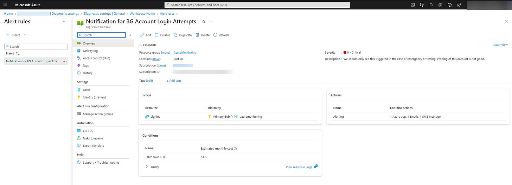

# Prevent Admin Account Lock-out with a Break Glass Account

A break glass account is an account that you create that has the highest level of admin access to a system, but that you don’t use and you keep locked away for safe keeping. It’s something that’s very quick and easy (and basically free) to implement.

This comes in handy in a variety of scenarios:

- A misconfiguration locks you and/or other admins out of your environment and you can’t regain access (crazy easy to do with Conditional Access)
- Account compromise leads to loss of access
- You are the only admin for your org and you ~~get hit by a bus~~ win the lottery and move to an island with pristine beaches, umbrella drinks, and no cell service.

## How do you create a break glass account?

As a global administrator in M365 or Google Workspace, create a generic account that you assign global administrator rights to, as well. Provision it with the highest level of access, because if you have to use the BG account it means you are locked out and you NEED access at the highest level.

## How should it be configured?

- Don’t name it Admin, Administrator, GlobalAdmin, etc. Security through obscurity it your friend — in case of a compromise, you don’t want this to be an obvious target
- Don’t name it with a real user’s name - make up a fictional username that doesn’t stand out. Avoid the temptation to give it a famous name like John Lennon.
- The password should be totally randomized and 20+ characters. It’s not a password that needs to be remembered, only entered in an emergency.
- Make sure the account is Cloud-only, and not connected to your on-prem infrastructure. If the on-prem infrastructure is compromised, don’t make it easy by extending the breach to the cloud.
- A BG account is the rare case where you do NOT want to configure MFA. If you’re ever in a position where you need this account, you don’t want to have the extra layer of possible lockout. The purpose of this account is all about maintaining availability. Because it isn’t protected behind MFA, the visibility afforded by proactive monitoring (as described below) is very important.
- Do not use this account for non-administrative activities. It should only ever be used for it’s purpose — providing access in case of an emergency.

## What should you do with the account?

### Test It

To make sure it’s viable, you should test your BG account quarterly to make sure it works. It should also be a part of any tabletop exercises or incident response preparation - at least to the extent that any stakeholders involved who may need to access it know that it exists and the procedure for gaining access to it.

### Monitor It

In addition to testing, you should also monitor for its usage. In the case of Microsoft 365, if you’re saving sign-in logs, you can configure an alert for sign-in attempts on your BG account (Azure.cmd.ms —> Entra ID —> Monitoring —> Diagnostic Settings or by going straight to the log analytics workspace associated with your signin logs). The cost for this in my Azure environment is $1.50/month. If you’re not already saving sign-in logs there is an additional cost associated with that, but it’s something that should ideally already be happening anyway.

When configuring the alerts, you’re basically setting up and scheduling a query to check for login attempts on the break glass account in your sign in logs. In my instance, if there are more than 0 login attempts to my BG account in 5 minutes, I get notified by an email. If you are keeping your BG account sufficiently obscure, then this notification should only alert when you’re testing the account (and it SHOULD alert when you test). If you receive alerts at any other point, you know that there is a problem. A really solid step-by-step for this process can be found here: Monitor your Azure AD Break Glass Accounts with Azure Monitor – Daniel Chronlund Cloud Security Blog — (<https://danielchronlund.com/2020/01/22/monitor-your-azure-ad-break-glass-accounts-with-azure-monitor/>).

### Exclude It from Restrictive Policies

To get the full protection a break glass account offers, it should be an account that you exclude from Conditional Access policies. In the case of a Conditional Access policy that is misconfigured, there exists a possibility of account lockout from the tenant. Having this one account as a safety mechanism could help prevent a really, really bad day.

As an extra layer of misconfiguration insurance or in the case of a cyber attack where threat actors have removed Conditional Access exclusions and blocked access, a process for automating exclusion group persistence is described in detail [here —> https://github.com/Cyberlorians/Articles/blob/main/AutoExcludeCAP.md](https://github.com/Cyberlorians/Articles/blob/main/AutoExcludeCAP.md)

### Keep It Safe

Keep the username and password safe. Level your paranoia on how important your environment is, and don’t put the credentials somewhere that could be found if another account is breached. For example, if your user account is compromised, don’t have the creds in a password locker or document that the account has access to. It wouldn’t be overkill for your BG account to only exist on paper stored behind a physical lock and key in a building with access controls.

At the end of the day, implementing a break glass account is a quick and easy safeguard you can deploy in your environment with minimal time and effort. Hopefully it will never be needed, but could be priceless in the right circumstances.
