# Setting up FIDO2 (Yubikey) Auth for Phish-Resistant MFA in M365

The first time I tried to set up a hardware authentication token in my M365 environment, I had trouble finding super-clear how-to instructions. Everything I found was either heavily influenced by marketing or leaned hard into the abstract side of setting up MFA. This article is an attempt at making the process clear and simple from purchasing a key to first sign in.

## Enabling FIDO2 Security Keys as an Authentication Method

1. Purchase a FIDO2 hardware token. Yubikey is the brand I’m most familiar with, but as I was wanting to set up a variety of test scenarios and needed a bulk of keys available, I’ve been using the less expensive Identiv uTrust FIDO2 NFC USB key. I was able to purchase these on [Amazon](https://www.amazon.com/Identiv-uTrust-FIDO2-Security-WebAuth/dp/B08BVYJ67J/ref=sr_1_1_sspa) for slightly less than $15 compared to the comparably featured Yubikey for $25.

   [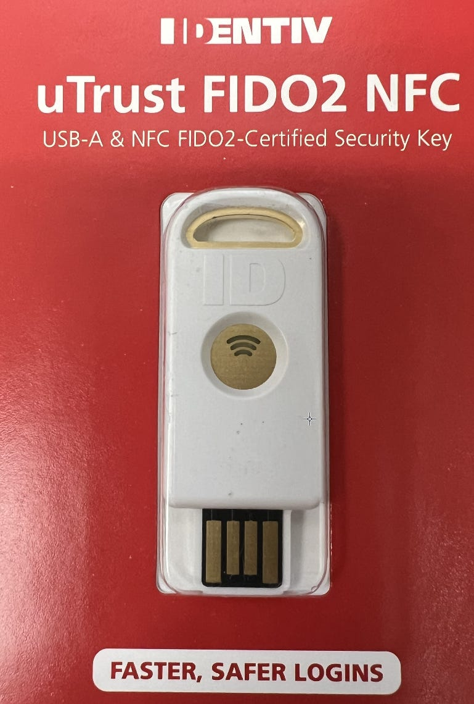](images/799c736d-43e0-4909-9708-7bab00b75648_769x1140.png)
2. To allow the FIDO2 security key for M365 authentication, go to the Authentication Methods blade in Azure and select FIDO2 security key. (

   <https://portal.azure.com/#view/Microsoft_AAD_IAM/AuthenticationMethodsMenuBlade>)

   [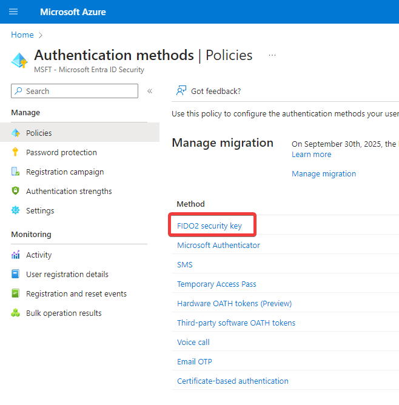](images/57efca13-6b6b-4d30-9945-b5f2eca72aaa_658x668.png)
3. Select a scope of users to target the availability of FIDO2 security keys. This may vary depending on your environment. On a basic level, configuring this is just making the keys available as an option. If you have other configurations set elsewhere in Azure to require the most secure form of MFA by default, or requiring administrators to use Phish-Resistant MFA, there could be additional impacts. If you have a group you target for policy exclusions, scope it under the Exclude tab. For my sake in this test tenant, I’m applying to all users.

   [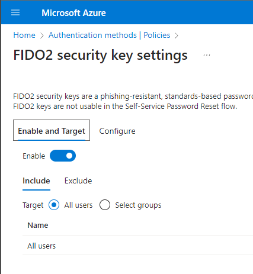](images/e6177ff2-c496-4349-aba9-9ae56aa2bf47_427x463.png)
4. On the configure tab, there are a few options to consider. First, “Allow self-service set up” must be toggled to yes to allow users to enroll their security key. This setting is on by default. The “Enforce Attestation” option is set to No by default. Turning it on requires the security key to pass additional validation testing from Microsoft. Finally, under “Key Restriction Policy” there are two options related to restricting the specific types of security keys that will be allowed. For just starting out with security keys, it’s not something you need to enforce and can stay with the default NO selected. Remember to save the changes you’ve made to the configuration.

   [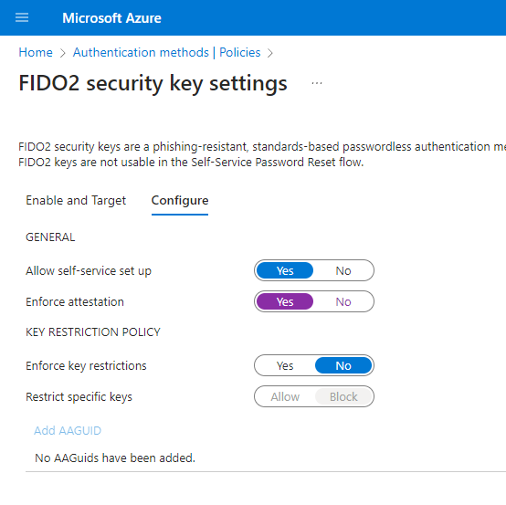](images/7c48c815-39fc-498a-b24e-0a0c0fcc5407_554x553.png)
5. Now that security keys are configured and enabled as an authentication method, users can enroll a security key.

   ## Adding a Security Key to Your User Account

1. Log in to your Microsoft account and go to the account info page at [myaccount.microsoft.com](https://myaccount.microsoft.com) and go to Security Info → Update Info
2. Click on “Add Sign in Method”

   [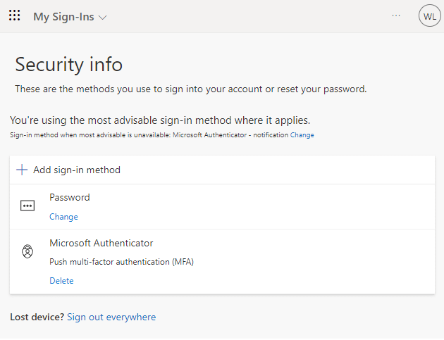](images/a4ff36bd-58a0-4a30-b627-79a7b83f39bb_630x483.png)
3. Select “Security Key” from the drop down and click on the Add button. If prompted to complete MFA, do so as instructed.

[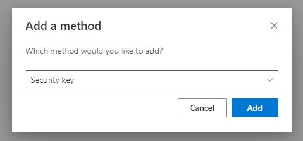](images/e7d33b30-8abc-45da-a164-ba8ed83f9597_518x242.png)

4. Next, you’ll be prompted to choose a security key type — USB or NFC. If you have a key that can be used for either, it doesn’t matter which you choose. The selection here only refers to which way you want to use for the initial set up — after set up, you can use it as USB or NFC interchangeably.

   [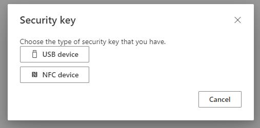](images/5de0e38d-6631-4bcd-bd47-d3946b543b53_507x250.png)

   5. After making a selection, you’ll be prompted to walk through a series of steps to add your key.

   [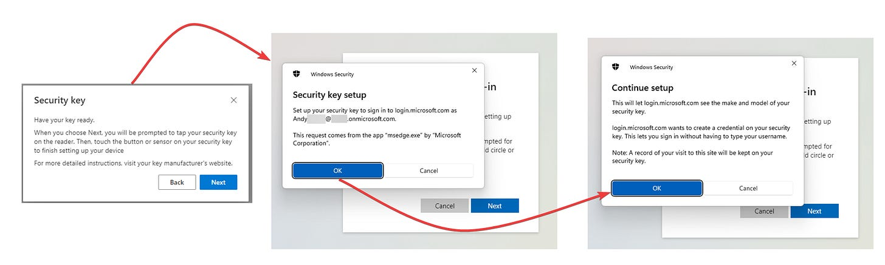](images/895ee322-f71c-4d84-b13b-83dbd8ca65dd_2006x602.png)

   6. When prompted, place your key on the NFC reader or plug it into USB.

   [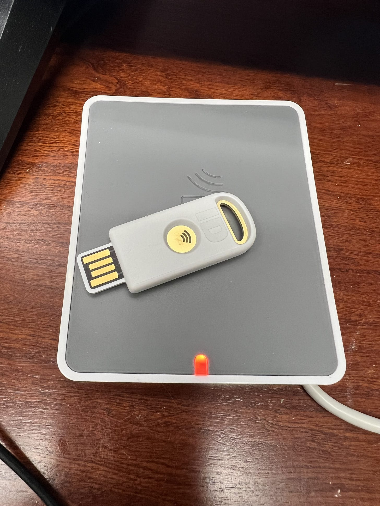](images/86038014-a961-4720-a045-57b06792ddb9_3024x4032.png)
5. You will be prompted to create a PIN. If you’re setting up via USB instead of NFC, you’ll also be prompted to touch the circle in the middle of the key. While a PIN may not feel as secure as a password, the real strength is related to the fact that you have to have physical access to the key (something you have) as well as knowledge of the PIN (something you know) in order for authentication to work. Even if someone knew your PIN, they couldn’t log in unless they had access to the physical USB key. It goes without saying then that you should keep your key secure.

   [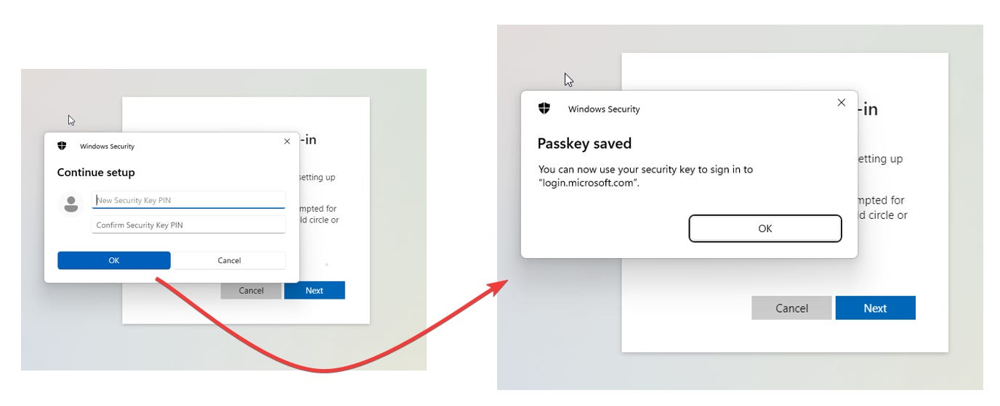](images/fb8d77e7-029c-4034-9c4f-cb2db55bb7e9_1376x560.png)
6. Next, you’ll be prompted to name the key for easy identification in your M365 account information.

   [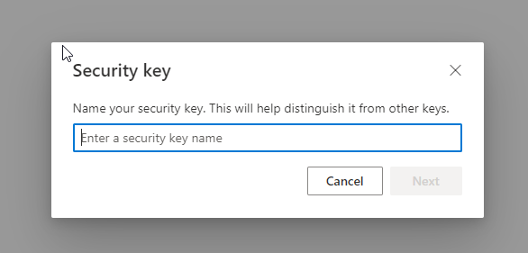](images/c9bd404a-67b5-4859-bbb4-2329a6e76d5e_586x281.png)
7. And now you’re all set:

   [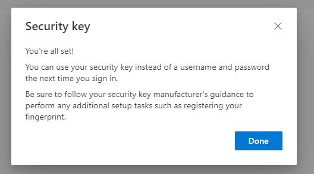](images/2a4b4e62-9a13-4b1d-bac5-63d202a53b61_528x294.png)
8. And your Microsoft Account info should now show the Security Key listed under sign-in methods.

   [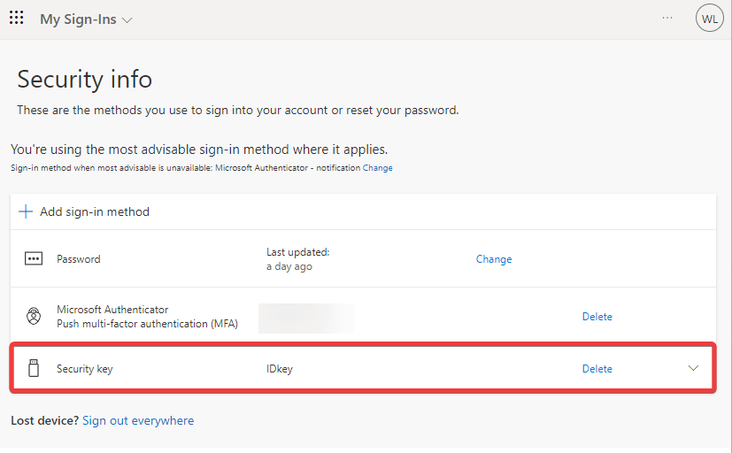](images/4682cb0b-2b7c-4a65-afe1-9b5bcf2eae04_827x512.png)

   ## Signing In with Your New Key

1. The next time you attempt to sign in to your Microsoft 365 account, there should be an option to sign in with a security key.

   [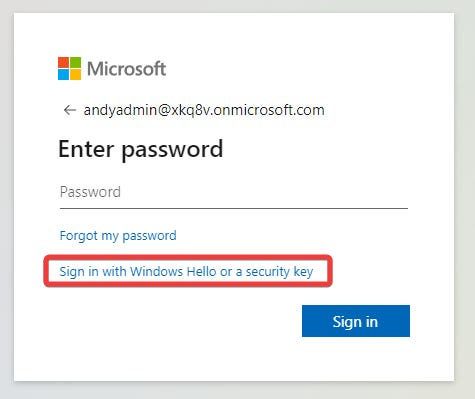](images/dd9d3e02-c4f4-4727-ace9-dfddca2972ae_475x399.png)

   2. When you select that option, you’ll be prompted to use your key for authentication like below:

   [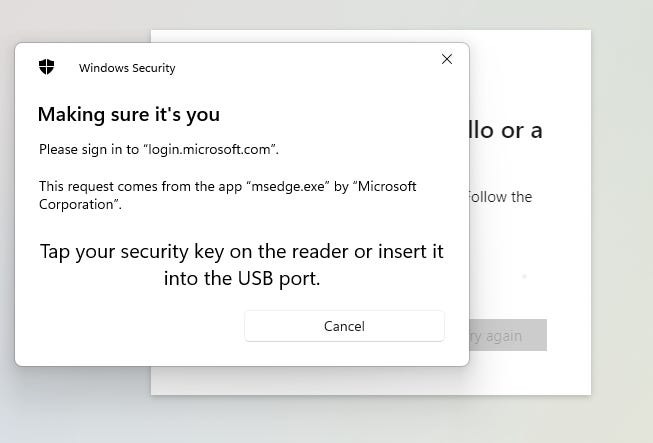](images/42c8ee71-dcb0-49e0-afa6-5012eaf0454b_653x443.png)

   3. You’ll also be prompted for your PIN

   [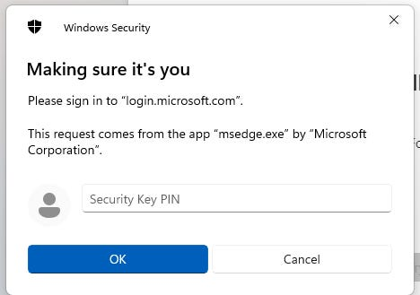](images/e981c2af-0053-4499-8b12-7cfc11175a38_468x329.png)

   And that’s it! You’re now signed in with your freshly configured security key!

## Resources:

[Passwordless security key sign-in - Microsoft Entra ID | Microsoft Learn](https://learn.microsoft.com/en-us/entra/identity/authentication/howto-authentication-passwordless-security-key)
