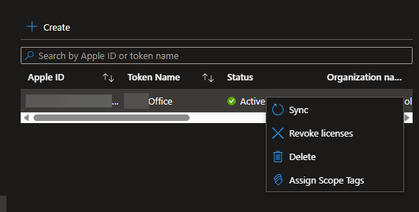
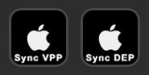

# Syncing VPP and DEP in Intune, using Powershell and Graph API

*Quick scripts for syncing your Apple Apps and Devices!*

### Introduction

One small gripe I have with syncing VPP in Intune is how close the sync button is to the Revoke Licenses and Delete button. I’m sure there’s another user confirmation required if you do click one of these buttons, but the idea of it makes me nervous. It feels like a bad day waiting to happen.

As a solution to this, I went ahead and leveraged Graph API to create scripts that will sync all VPP tokens in a given tenant, and a script that will sync DEP (AKA Enrollment Program Tokens) while we’re at it too.

### The Scripts

Note: you will need to install the modules at the top of each script before running for the first time.

The scripts are fairly simple and work pretty much the same way. First, they call to connect Microsoft Graph to the PowerShell session. When this happens, you’ll be prompted to sign into your Azure account. After you sign in, the script makes a call to get all VPP tokens or your DEP tokens, depending on which one you’re using. Then it will go through each token and attempt to sync it. After it finishes it will disconnect graph and remove the imported modules. Links to the scripts are below.

[Github - Intune\_VPP\_Sync.ps1](https://github.com/bradywidener/Misc-Intune-Scripts/blob/main/Intune_VPP_Sync.ps1)

[Github - Intune\_DEP\_Sync.ps1](https://github.com/bradywidener/Misc-Intune-Scripts/blob/main/Intune_DEP_Sync.ps1)

### Stream Deck Button

Not sure if there’s any other IT Stream Deck users, but if so, these scripts are great as stream deck keys. If you would like to do this, you can use the **System Open** key with the following in for App/File. Be sure to replace the C:\PathtoScript.ps1 with the actual path.

`cmd /c start /min "" powershell -WindowStyle Hidden -executionpolicy bypass -noninteractive "C:\PathtoScript.ps1"`

