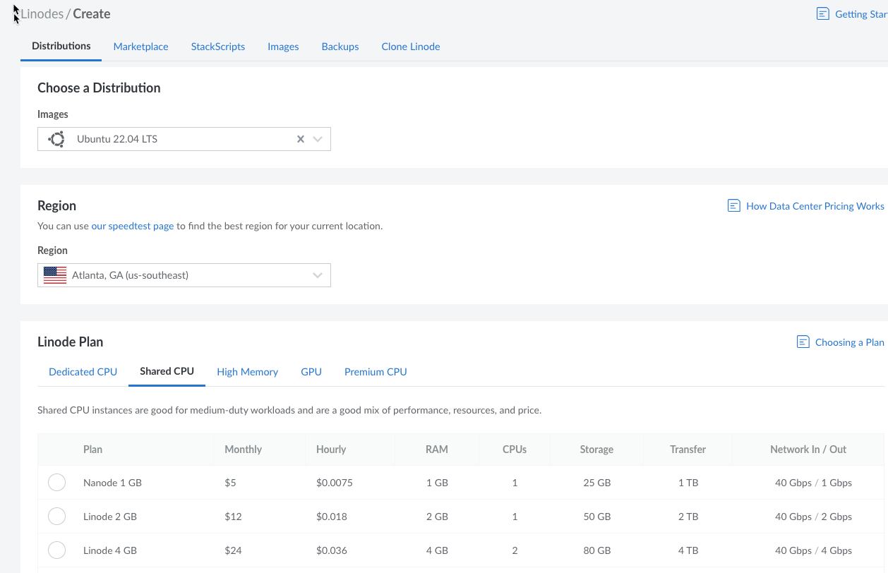
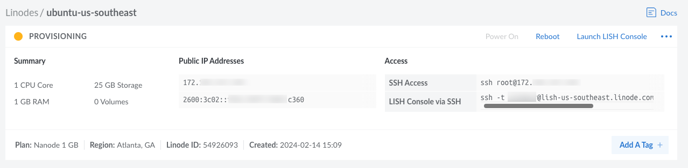
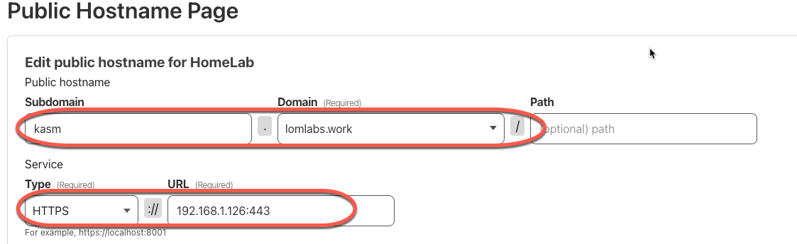
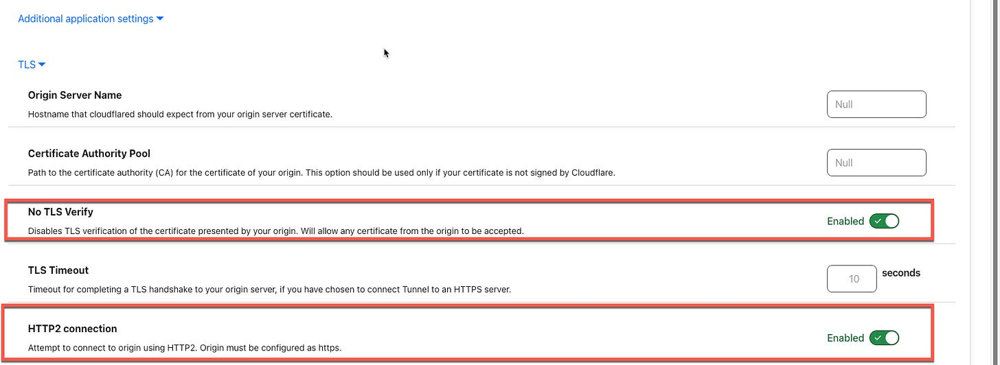
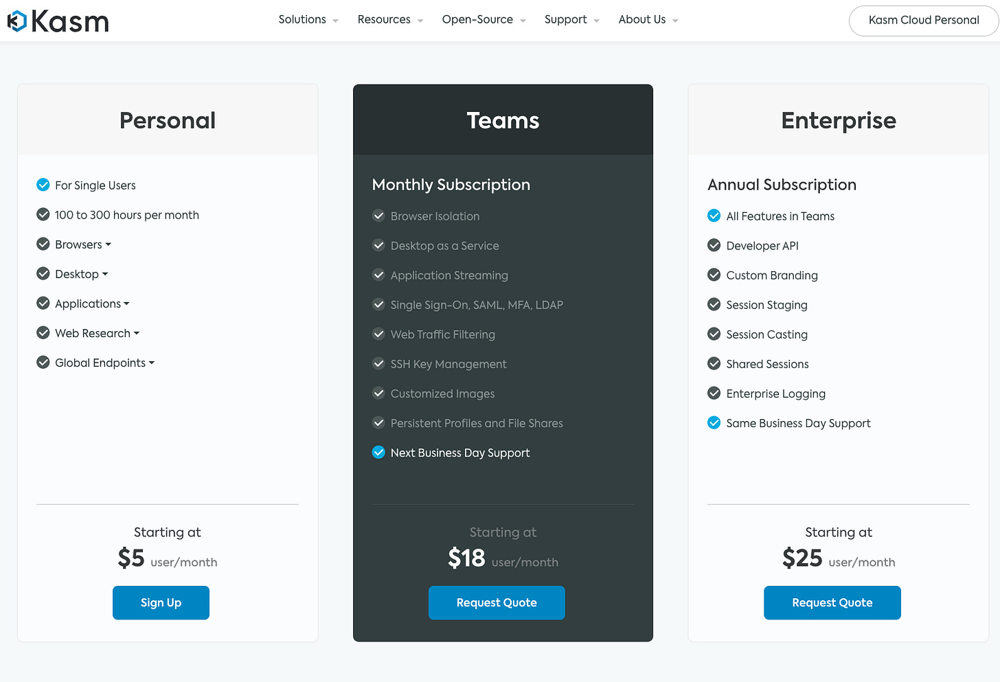

# Kasm in the Cloud

*Accessing your Kasm instance remotely, through a VPS, Cloudflare Tunnel, or SaaS Service*

[Last time](https://www.edtechirl.com/p/creating-a-safe-space-for-web-browsing) we looked in to spinning up your own Kasm server for use on your own network. But what if you want to access Kasm remotely? Today we’ll look at 3 options for accessing your streaming containers from anywhere.

## Virtual Private Server (VPS)

*Hosting Cost: Starting at $5/month*

There are many options available for Virtual Private Servers that you can use to spin up your own cloud server for projects like this. My favorites for user-friendliness are Linode and Digital Ocean, but AWS, Azure, and Google Cloud are also possible. For this example, we’ll use Linode.

After creating or signing into your Linode account, click on Create—>Linode to start configuring your private server.

There are a lot of options, but the main things to focus on are selecting an image (Ubuntu 22.04 LTS is my current preference), a region (somewhere geographically close to you or your users), and a plan. For the best plan pricing, be sure to select Shared CPU. For $5 a month, you can provision a server with 1GB RAM, 1 CPU, and 25GB of storage. This is a great option for testing KASM out, but because browsers are so resource intensive, it may be worthwhile to jump to the 2GB or 4GB versions.

If you aren’t already a Linode user, you can save money while you experiment with sizing by cashing in on $100 in Linode credit that’s good for 60 days by [clicking here](https://www.linode.com/lp/refer/?r=49850bdb651dd7b02402081bdfef8fb8499a5893) for a referral code.

It’s worth noting that when you’re done with your VPS and power it off, it will still accrue billing charges until the machine is deleted. Just powering off does NOT stop billing.

Finally, wrap up your VPS creation by setting your root password (don’t forget it!).

Once the VPS is created, you see a status dashboard like below that will tell you the status of the server’s provisioning process, which should take less than a minute to get fully up and running. With the information on the dashboard, you can then SSH into the server with the SSH client of your choice using the provided IP address along with the root credentials you created when setting up the server, or you can click on the “Launch LISH Console” link in the upper right hand corner, and it will initiate an SSH session from inside your Linode dashboard.

Once you have SSH’ed into the server, the process of getting Kasm up and running will be the same as discussed in the [previous article](https://www.edtechirl.com/p/creating-a-safe-space-for-web-browsing).

## Cloudflare Zero Trust Tunnel

*Hosting Cost: $0*

This is my favorite option, because you’re leveraging your own infrastructure, which can be as simple as running this on a spare laptop in your basement or running it in a rack in a datacenter. In this scenario, you’ll spin up a Kasm instance on an Ubuntu server as directed in the [previous post](https://www.edtechirl.com/p/creating-a-safe-space-for-web-browsing), and build a Cloudflare tunnel to access it like this:

### Create a Cloudflare Account

The first step will be to sign up for a free Cloudflare account. As a bit of editorial, Cloudflare is probably the coolest tool I’ve started using this year. What we’re going to use Cloudflare for in this tutorial is just about the top .001% of the surface of what’s possible.

### Purchase a Domain Name or Add Your Domain to Cloudflare

You can use an existing domain that you already have access to, but for the sake of streamlining this doc, we’re going to do everything in Cloudflare because it saves time with configuration. The .uk domain is the cheapest offering they have at $4.17/year. To purchase a domain with Cloudflare, sign in and navigate to Domain Registration —> Register Domains and walk through the steps. If you want to use an existing domain name, there is a +Add Site button on the top banner of the Cloudflare dashboard where you can go to start the process of adding your existing domain.

### Install Cloudflare Tunnels on your Kasm Server

This is where the magic starts. In Cloudflare, navigate to Zero Trust —> Networks —> Tunnels and click on Create a Tunnel:

Walk through the wizard to name the tunnel. If you’ve followed this guide, you’ll select Debian —> 64-bit and you’ll copy the bit of code under “If you don’t have cloudflared installed on your machine.”

Take this bit of code and run it on the server where Kasm lives. The code snippet is customized and contains a token to access your environment. Please safeguard this token. After the commands complete, finish the tunnel wizard.

### Assign a Subdomain and Domain to Your Site

The last step of the wizard is to make up a subdomain and select the domain you attached to Cloudflare. If you purchased from Cloudflare, all this involves is clicking on the drop down and picking the domain. Finally, enter the IP and port (be sure to use 443) where Cloudflare will access Kasm.

### Gotchas

While the steps above are usually enough to get you going with Cloudflare, Kasm has two additional options to configure for this to work properly. Click on “Additional Application Settings” and expand the TLS section. Next, enable “No TLS Verify” and “HTTP2 connection.” If you set this up and your tunnel is listed as healthy in Cloudflare but you get a Bad Gateway error when trying to access the application, the culprit is probably one or both of these settings.

At this point, your Kasm instance should be accessible on the public internet using the domain name you configured above.

## Hosted by Kasm Cloud

*Hosting Cost: Starting at $5/month*

Finally, the most turnkey solution is to pay for hosting from Kasm. We’re saving this method for last because it’s the most expensive and least fun. Setting up a cloud-hosted Kasm instance is like signing up for any other SaaS offering - pick your pricing model and sign up at [Kasm Workspaces](https://kasmweb.com/).

## Resources

[Kasm Workspaces](https://kasmweb.com/)

[Part 1 of this series](https://www.edtechirl.com/p/creating-a-safe-space-for-web-browsing)

[Linode](https://www.linode.com/)

[Linode Referral Code for $100 credit](https://www.linode.com/lp/refer/?r=49850bdb651dd7b02402081bdfef8fb8499a5893)
