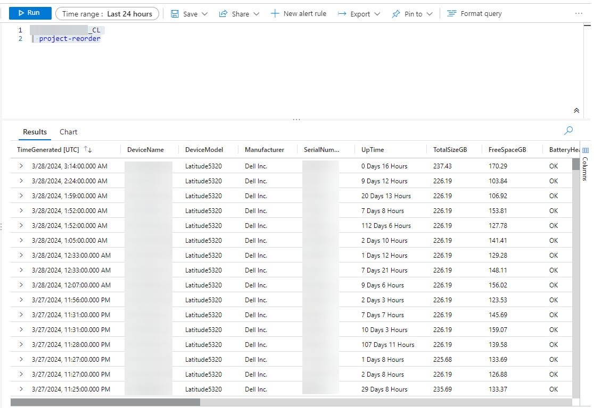
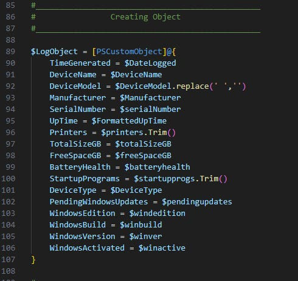
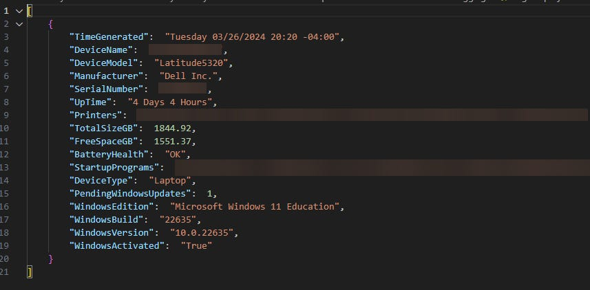

# Device Logs for Anything and Everything using Intune and Logspace Analytics

*Logs for everything, everywhere, all at once.*

[](images/e3ee69e7-1426-4cd1-801f-338f26c8e144_1024x1024.webp)

### Introduction

One thing I adore about Intune is that it has a plethora of device data available. However, sometimes I find a piece of data that I want to be able to query devices for, but just can’t find a clean way to do it.

Then I came across an [Article from Damien Van Robaeys on systanddeploy.com](https://www.systanddeploy.com/2024/01/log-analytics-v2-send-custom-data-with.html) detailing how to send custom logs to a Log Analytic Workspace (Definitely give it read and I highly recommend [his new book](https://www.systanddeploy.com/2024/02/learn-kql-in-one-month-book.html) if you’re looking to learn more about KQL). After seeing this article, it gave me the idea of trying to create a template that allows for easy device querying and then send that information to Log Analytics for centralized, highly customizable, logs. That is what I ended up doing, and I wanted to share my template to make it easier for others in the future.

[](images/c0b46aca-a52e-4300-9da8-ef6b0cd06b77_1116x768.png)

### Prerequisites

This article assumes you have access to creating resources in Azure, and access to deploy proactive remediations through Intune.

It also assumes you have already set up a Log Analytics workspace, Data Collection Endpoint, and an App Registration for Log Ingestion. If you haven’t please refer to Damien’s article mentioned introduction for step-by-step instructions. Please refer back here when you get to the step labeled **Prepare the Data**. This is where you will need to refer back here to create your own custom log.

### Utilizing the script

I have made a sample log you can use if you would like (all scripts are linked at the bottom of this article). My log queries for device name, device model, manufacturer, serialnumber, device type, battery health, uptime, installed printers, Drive Size, Free space on drive, startup programs, a count of pending windows updates, windows edition, windows build, and windows activation status. If you would like to query for your own information, you can use the template. You will want to gather your information in the section of the script labeled **Grabbing Info** and set whatever information you’re querying for equal to variables. After you have all of your variables, you will need to plug them into the PSObject called **$LogObject** in the **Creating Object** section.

[](images/dade89c5-4dff-4107-af1a-6e2312c74dbe_490x462.png)

### Creating a Sample Log

Before we create a table and Data Collection Rule, we need to get a sample of the log. To do this, you can copy your Grabbing Info and Creating Object section of your script and run it in a separate powershell window. After your object is created, you can run the following command to convert it to a JSON format and to save the log to root of your C: drive.

```
$SampleLog = ConvertTo-Json @($LogObject)
$SampelLog | out-file "C:\samplelog.json"
```

Your log file should be in square brackets [ ] and then curly braces { } similar to below.

[](images/aadea81c-b3b5-4228-a3cb-f1f2935d379d_857x422.png)

Once you have this step done, you can continue with Damien’s article at the ‘Create Custom Log’ step. When you get to the point of uploading a script for your DCR, use the script we just made.

### Pushing out to Devices

I am deploying this script to my devices using a proactive remediation in Intune. The tricky part here is figuring out how to get the script to reoccur. My goal is to have the logs generate on devices weekly, so I have the proactive remediation set to run daily on my target group of devices, and the detection script will use get-date to check what day it is. If it is Wednesday, it will show the ‘problem’ as present and run the log script as the remediation. Note that doing it this way will show the devices as ‘issue reoccurring’ when you check the results of the proactive remediation on the targeted day. If it runs on any other day, it should show as no issues.  
  
There is probably a better way to do this, but for my scenario, it works well.

### The Scripts

[Custom\_Device\_Log\_Sample.ps1 on Github](https://github.com/bradywidener/Misc-Intune-Scripts/blob/main/Intune_Custom_Device_Logging/Custom_Device_Log_Sample.ps1)

[Custom\_Device\_Log\_Template.ps1 on Github](https://github.com/bradywidener/Misc-Intune-Scripts/blob/main/Intune_Custom_Device_Logging/Custom_Device_Log_Template.ps1)

[Custom\_Device\_Log\_Detection.ps1 on Github](https://github.com/bradywidener/Misc-Intune-Scripts/blob/main/Intune_Custom_Device_Logging/Custom_Device_Log_Detection.ps1)

### Conclusion

Once you have the script pushing to your devices, go to your Log Analytics workbook and you can see a list of all the data using the following query.

```
TableNameHere_CL
| project-reorder
```

I see lots of potential in this process and hope these scripts help others with leveling up their reporting game. :)  
  
Enjoy!
