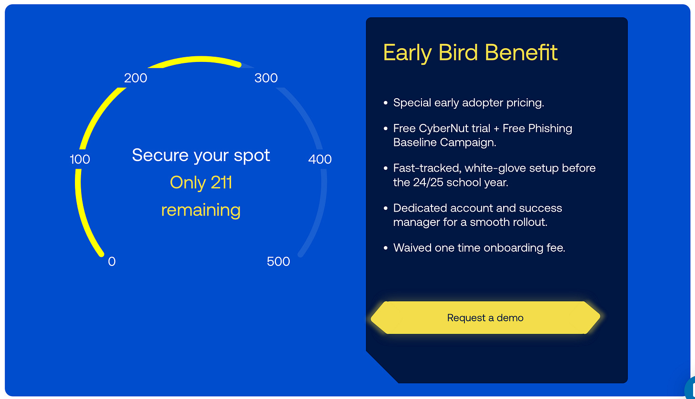
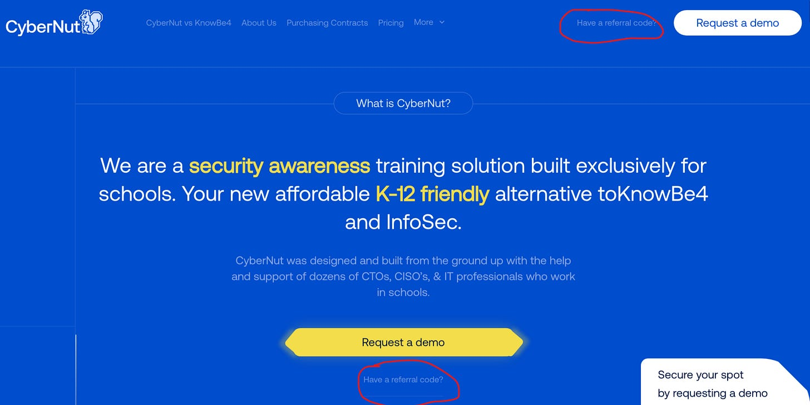
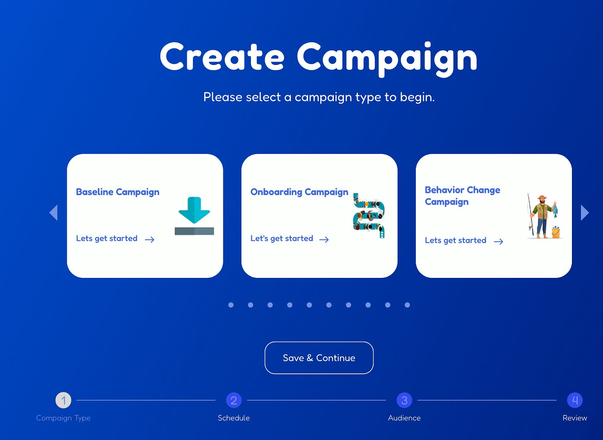
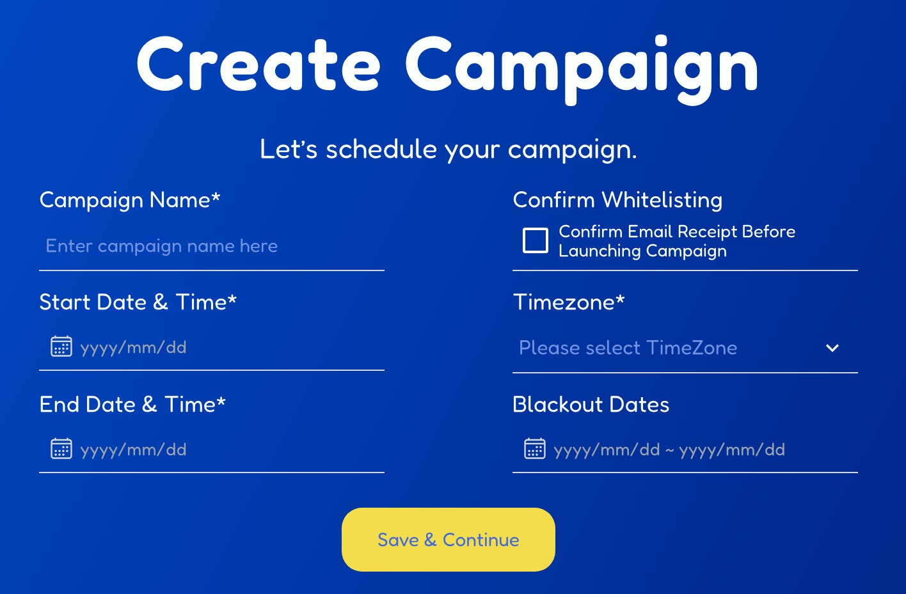
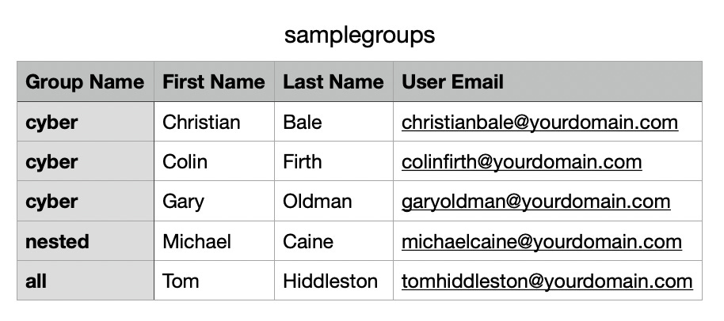
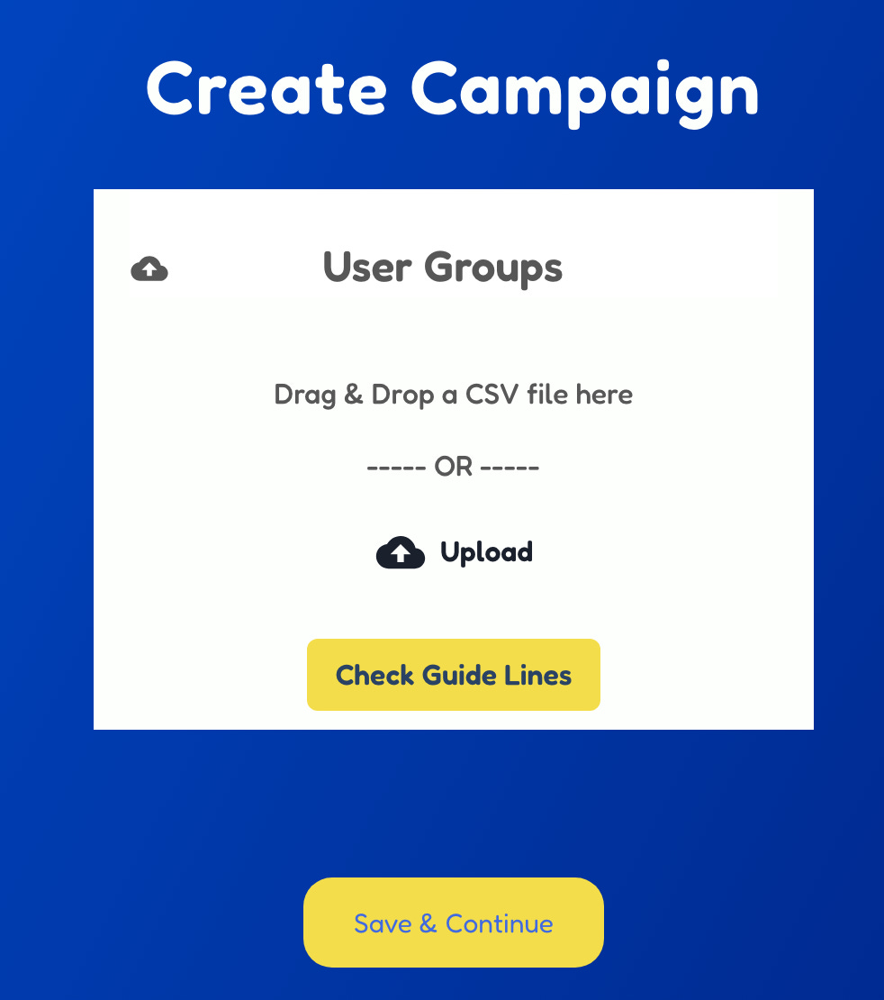
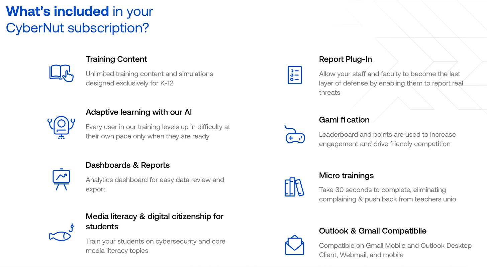

# CyberNut: Phishing Simulation and Security Awareness Training that Doesn't Suck

CyberNut is a new phishing simulation and security awareness platform designed explicitly for K-12. To sign up for a demo and free baseline phishing test, go to [Cybernut.com](https://www.cybernut.com) and click “have a referral code” in the upper right hand corner and use referral code **edtechirl**.

This is NOT a paid advertisement — I just love the product!

In 2017, I belonged to an organization that was hit by a very aggressive round of the Emotet banking trojan that was distributed by phishing emails. I was new in my role and I didn’t have a lot of knowledge or tools on how to stop the attack proactively. My take-away from that attack was that I needed the right tools to be able to respond quickly and efficiently. Fast forward to 2020, and we’d purchased security awareness training, phishing simulations, and phishing response tools from one of the pre-eminent names in the industry.

However, I made a crucial philosophical error in the implementation of that product. While not actively trying to play “gotcha” with the folks we referred to as “happy clickers,” it was a program that, at its core, was designed to be punitive: clicking on a simulated phishing link automatically enrolled you in additional security awareness modules, and the lists of who clicked vs didn’t click were sent to building level supervisors. For users with elevated rights, “failing” the simulations could lead to restricted access.

The most important thing I learned from this process: with a punitive security awareness program, the main thing you teach your users is to hide their mistakes and not report possible malicious activity. We found that if we sought information from users in the face of a legitimate attack, then people were very hesitant and resistant to admitting to opening an attachment or clicking a link, even when their silence put us at a greater risk.

In the years since, I’ve learned from that mistake by trying to implement the simulations more positively by framing the conversation in a few ways:

1. We now refer to the simulations as Phishing Drills — on par with fire drills, tornado drills, etc., emphasizing that it’s something we practice for safety.
2. Instead of calling out happy clickers, we instead praise people who report phishing emails.
3. When the budget allows, we do drawings for prizes for people who reported messages from our phishing drills.

Any time I’ve spoken to a group about security in the past few years, whether teachers, K-12 tech peers, or industry partners, I’ve been an evangelist for more positive experiences around phishing simulations as learning opportunities.

Taking all that into consideration, I was stoked to get introduced to a new start-up called CyberNut. CyberNut was created with the purpose of being a K-12-centric phishing simulation tool and security awareness training platform. The thing that makes this tool special is that it’s designed from the ground up to empower users instead of embarrassing them by gamifying the experience. For instance, in a phishing drill, a simulated phishing email is worth 5 points. If a user identifies and reports the phishing message through the CyberNut plugin (for Google or Microsoft), they earn 3 points. Answering additional questions about what red flags were in the message earns an additional 2 points. If a user mistakenly clicks on a phishing message, they don’t earn the 3 points, but still have an opportunity to earn 2 points in the resulting training module. And don’t let the phrase “training module” scare you off — since it’s designed for schools, the micro-training takes seconds, not minutes, so it doesn’t disrupt your flow.

All these earned points are then compiled into an optional leaderboard. To make the leaderboard meaningful, it can be organized based on custom groups imported by CSV, Azure, or Google. That allows for having a group of similarly-assigned users, like school-level staff, school admin teams, district office, bus drivers, 6th grade students, etc. To prevent the leaderboard from making an example of anyone, each leaderboard only displays your place and the 10 closest people to you on the list. Still yet, if someone doesn’t want to be included in the leaderboard, opting-out is just a click away.

Whereas many phish simulation providers organize their samples thematically (banking, Docusign, delivery notice, etc.), CyberNut provides adaptive scaffolding for users by assigning each simulated message a difficulty level. Users are given messages based on past performance, so if someone is struggling with a low-difficulty message, they will only see lower difficulty messages until they’re able to identify those messages before being promoted to more difficult samples. Another way CyberNut differentiates their service from some of their industry-standard peers is by focusing on continual assessment rather than checkbox compliance. Because the tests and training sessions are so quick and seamless, it’s easier to run more frequent tests. In turn, the more frequent tests add to the gamification by providing more opportunities for users to gain points and move up the leaderboard.

Finally, while most phishing simulation platforms are geared towards enterprise and reflect that through their pricing, CyberNut has K-12 friendly pricing, including licensing for students to be able to conduct phishing tests with students. With my current vendor, I’ve never conducted student phishing simulations, and the reason is 100% budgetary. There’s a prevailing thought that in most cases student accounts should be excluded from phishing exercises because they are usually closed-campus or walled-garden accounts, but student accounts are a sneaky kind of risky because of the trust relationship they have with staff accounts. If a student account is compromised, it has access to the email directory and can send messages to other students and staff. Since it’s from a student account, it’s almost guaranteed that the email will be delivered, and recipients will generally be less skeptical of messages received from an internal sender.

## Getting Started with CyberNut

To get started with CyberNut, they’re currently offering early adopter pricing with onboarding fees waived. The demo they’re providing also includes a free baseline test. For the baseline, implementation is fairly simple as users are uploaded via CSV. Even if you’re working with another phishing vendor, signing up for the free baseline could be a worthwhile exercise to have a comparison to your current program. For the last 8 phishing drills I’ve conducted, my organization’s phishing risk percentage has plateaued at roughly 11% with very little variation. Since that metric is based on the number of simulated phishing emails opened and links clicked, on the one hand that tells a consistent story, but the lack of variation has made me question the accuracy of the story. In my CyberNut baseline, 38% of my users opened the emails and 22% of my users clicked a link.

## Request a Demo

To set up your free CyberNut trial with baseline campaign, go to [www.cybernut.com](https://www.cybernut.com) and click “have a referral code” in the upper-right hand corner of the page. When prompted for a referral code, enter **edtechirl.**

You’ll be walked through a short survey for your contact information and current security awareness posture. After completing the demo request, CyberNut will schedule an onboarding call for your demo and setting up your baseline. In my case, the demo call took about 20 minutes and included configuring my mail tenant to allow messages from the CyberNut platform.

## Simple Setup

I’ve previously set up phishing simulations using KnowBe4, OhPhish, M365, and the self-hosted GoPhish framework. The most consistent theme in setting up phishing drills with these four methods is that none are simple. They contain a multitude of features, but in some cases the features go unused because of the difficulty in setup.

In contrast, setting up a baseline test in CyberNut is a quick 5-10 minute commitment. Inside of the CyberNut admin console, click on Create Campaign —> Baseline Campaign.

Next, you’ll enter a campaign name, start and end dates, timezone, and any applicable blackout dates. There is also a prerequisite to set up allow-listing for a list of about 20 domains that the phishing samples will be sent from, but for me this part of the process was completed during my demo call.

For the baseline, users are uploaded via CSV. Once you’ve been officially onboarded to CyberNut, there is a preferred option to connect directly to Azure or Google to import and sync users. The CSV is pretty barebones — the fields below are all that needs to be completed to kick off the test.

After the CSV is uploaded, it’s just a matter of reviewing the parameters you’ve set and confirming. Prior to the launch of the baseline you’ll receive an email from CyberNut to verify your account. And that’s it — baseline is ready to go!

