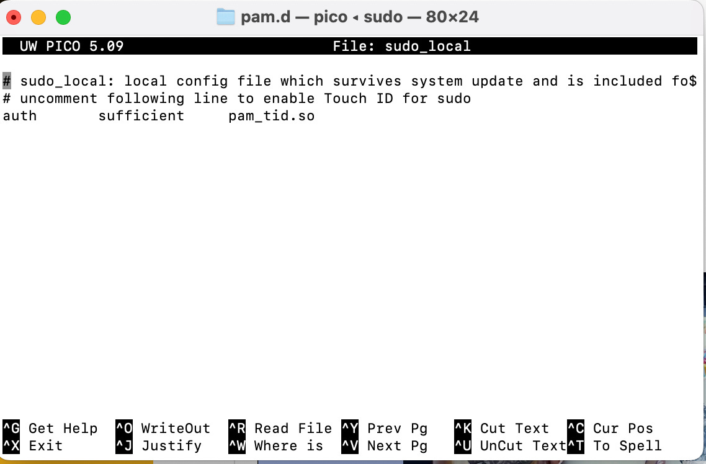
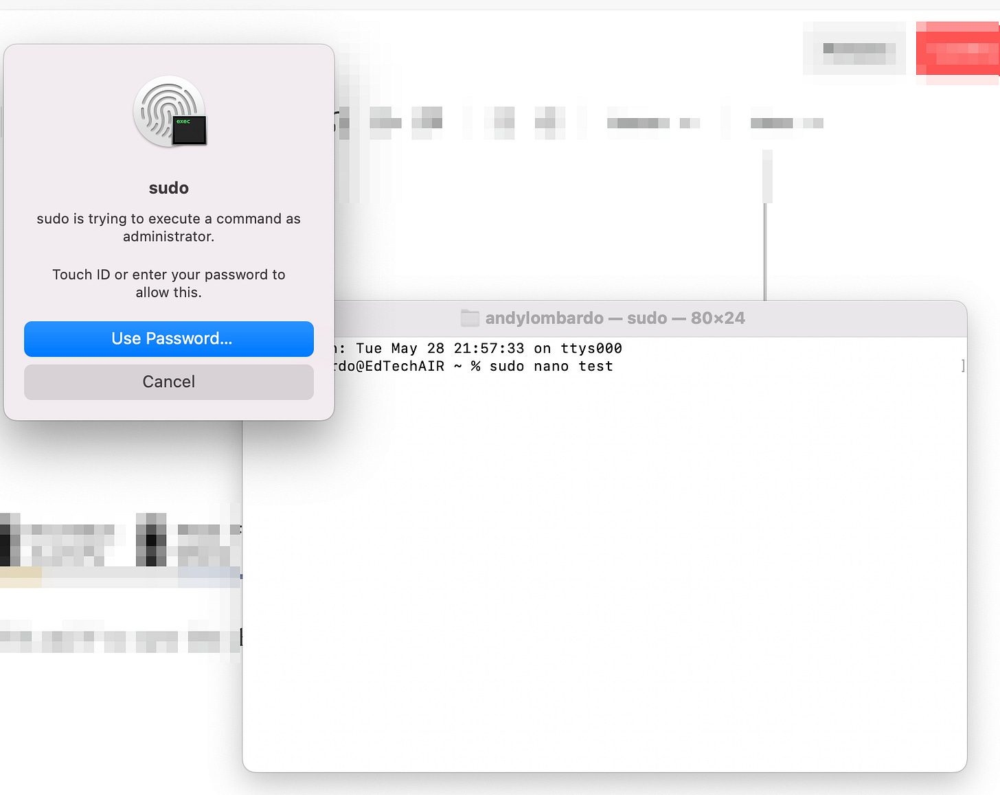

# Escalating Privileges Using Touch ID in the Mac Terminal

As a new Mac user, I’m a stranger in a strange land. Using the Terminal helps provide a thread of continuity for me, but I’m sick of typing in my sudo password. To enable TouchID to allow admin access in the Terminal, start by going to this directory:

> `cd /etc/pam.d`

and then make a new sudo\_local config file from the sudo\_local.template template file:

> `sudo cp sudo_local.template sudo_local`

Next, open sudo\_local and remove the comment from the indicated line by deleting the # at the beginning of the row.

> `sudo nano sudo_local`

The file should look like the example below:

Finally, hit Ctrl-X and Y to save the change. Now, when trying to escalate your privileges to sudo in the Mac terminal, you can use Touch ID. If you want to use your Apple Watch, selecting the Use Password option on the sudo prompt will give you the option of unlocking with Watch.

Note: This (and similar methods) were previously lost when performing macOS updates and upgrades. As of Sonoma, the config change persists through updates.
