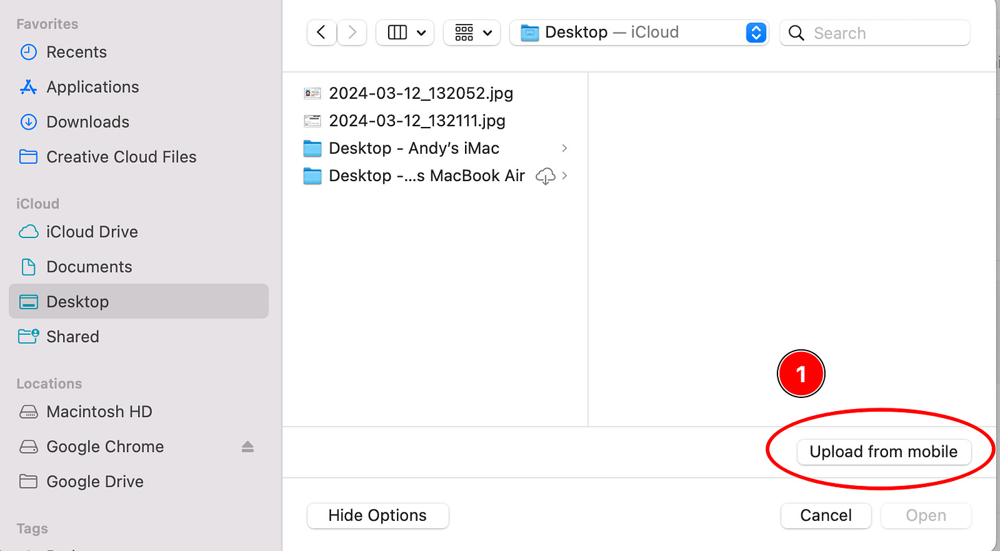
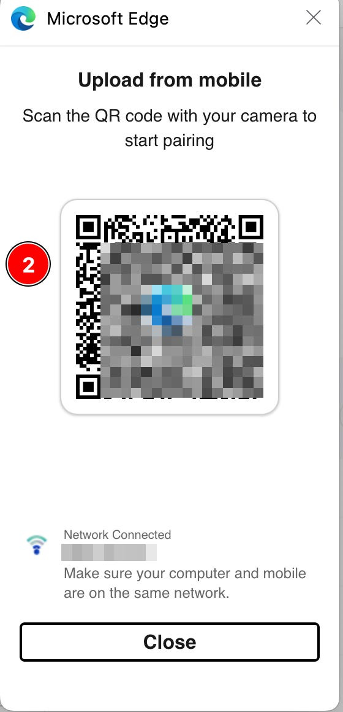
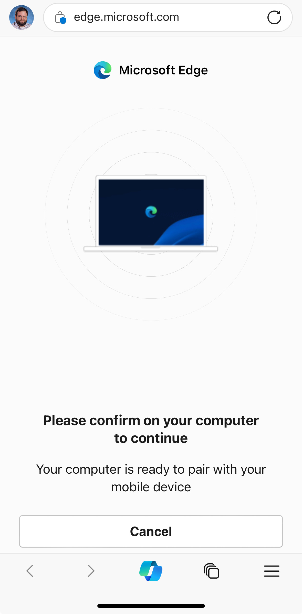
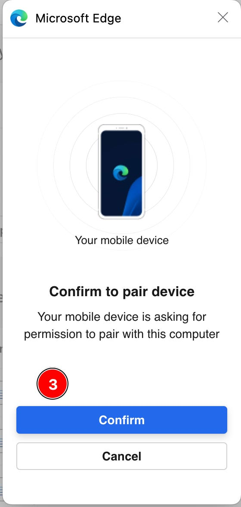
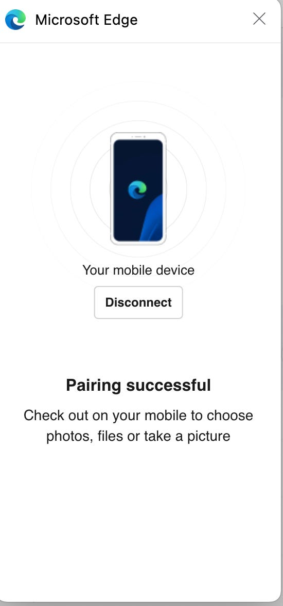
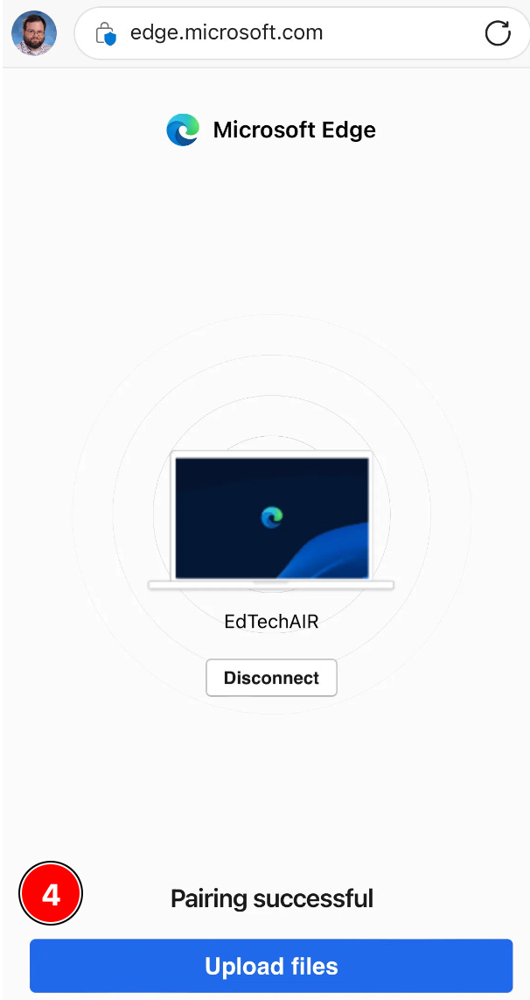
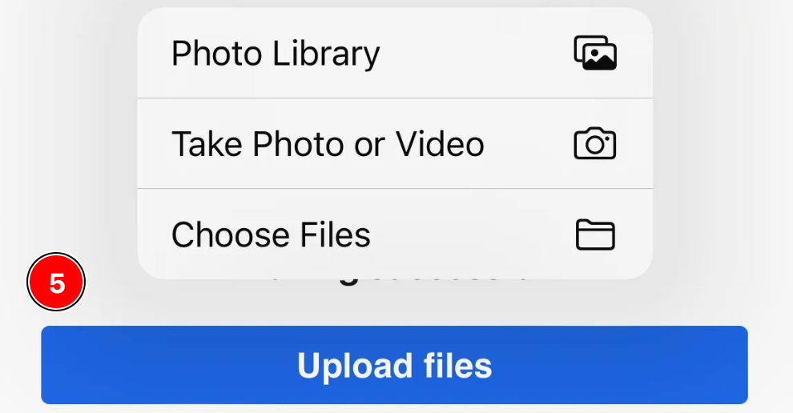
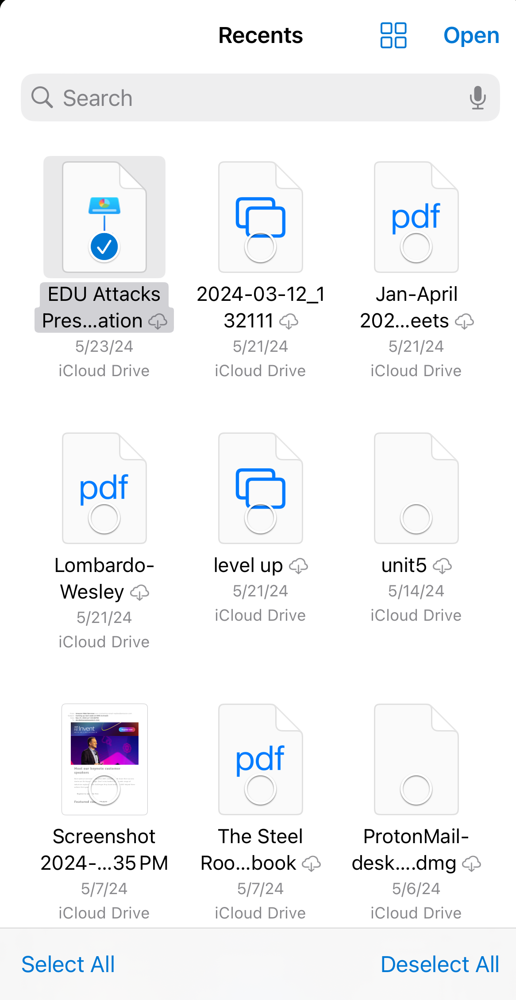
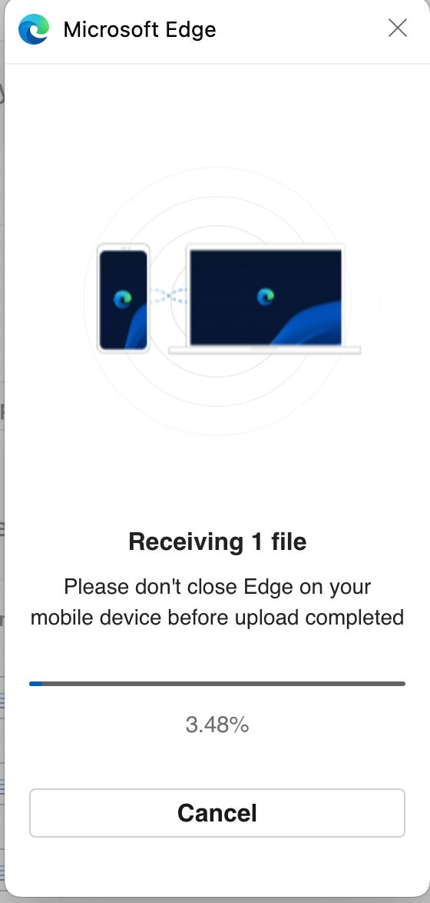

# Using Edge Mobile Upload to Move Files from Your Phone to Websites

One of the most frustrating things is trying to figure out how to move content from your phone to your computer quickly with minimal hoops to jump through. Apple has nailed this with Air Drop, and Edge has some killer features with Drop, but a new Edge feature that was added in February streamlines the process specifically for mobile uploads to 3rd-party sites. When using the Edge browser on your computer, if you’re on a site that you’re trying to upload a file to, there should now be an “Upload from Mobile” button on the upload dialog box, like in the image below:

When you click on Upload from Mobile, you’ll be redirected to a page with a QR code to scan with your phone, like below:

The main catch is that your phone and your computer both need to be on the same network for this to work, since it’s using WiFi to communicate. As long as that condition is met, though, scanning the QR code with your phone will open a browser window on your phone like this

Where you’ll be asked to confirm the connection on your computer:

Once you confirm, you’ll get a pairing confirmation message like below on your computer:

Now, on your phone, there should be an upload button:

When you select Upload files, it will pull up the option to pick from Photo Library, taking a photo or video, or choose files from your phone’s operating system.

You’ll next select your desired file or photo:

After you select your file, you’ll be prompted on your computer again to confirm that you want to receive the file and uploading will begin:

Once complete, Edge will send the file on to its destination

And just like that, you can use your phone as a data source to send content to sites on your computer. It should be noted that you can do this even without using Edge as the browser on your phone as long as you’re using Edge on your computer, but using the Edge mobile browser removes the 10 file upload limit. So if you’re planning to back up a lot of content from your phone (i.e., transferring photos from your camera roll to OneDrive), using the Edge mobile browser is worth the extra effort. If you’re not currently using Edge on mobile and desktop, you’re missing out, because Edge Drop alone is worth the switch. For more info on Drop, [check out our previous article here](https://www.edtechirl.com/p/full-send-moving-pictures-text-and?r=ef58q&utm_campaign=post&utm_medium=web).

## Resources:

[Mobile upload | Microsoft Edge](https://www.microsoft.com/en-us/edge/features/mobile-upload?form=MA13FJ) https://www.microsoft.com/en-us/edge/features/mobile-upload?form=MA13FJ
